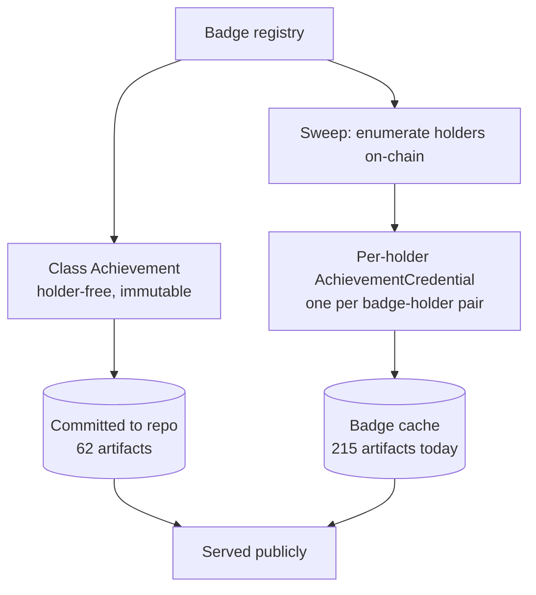

# Fully baked badges — the class artifact and the holder artifact

## Summary

Split the baked credential into two artifacts. Every registered badge gets a signed **Achievement** — holder-free, immutable, committed — so all 62 badges are genuinely baked and OB 3.0 compliant. A scheduled sweep then pre-bakes a signed per-holder **AchievementCredential** for every badge-holder pair into the badge cache.

---

## Problem Frame

Baking shipped as a proven mechanism with a population of one. `tools/bake-signed-vc.ts` embeds a signed credential byte-for-byte into an SVG's `<openbadges:credential>` hook and round-trips exactly, but it has only ever been run against the Flagship Badge. Of 58 committed badge SVGs, 1 carries a signed proof; the other 57 still hold the empty hook the generator emits. No PNG carries anything.

Worse, the one baked badge is wrong for most of the people it belongs to. A badge image is keyed `(course_id, slt_hash)`; a credential is keyed `(course_id, slt_hash, holder)`. The Flagship Badge coordinate has **six** on-chain holders, and the shared file carries a credential naming exactly one of them. Anyone downloading it from another holder's page gets a signed assertion about someone else. The share page's download links point at that shared file, so this is reachable today, not theoretical.

That collision is why "just bake the other 57" cannot work as stated. A shared file has no holder to name, and signing it as though it did would spread the misreporting across the whole set rather than fixing it.

The unbaked files are not empty, though. Each already carries a holder-free description of what the credential means — issuer, achievement name and description, on-chain anchor — typed as a `VerifiableCredential` with no subject and no proof. That payload is an Achievement wearing a credential's label. Recognising it as an Achievement is what lets every badge become fully baked without anyone being misrepresented.

---

## Key Decisions

> **Revised during implementation (2026-07-28).** This section proposed an
> *identityless* credential — `credentialSubject` with no `id` — which the OB 3.0
> implementation guide recommends and the published schema permits. The 1EdTech
> reference validator rejects it (`no id in credentialSubject`). The decision
> below stands in substance: the shared badge carries a holder-free object. What
> changed is that its subject is now the **achievement's own URN** rather than
> absent. Evidence: `spike/signer-spike/validation/README.md`.

**The shared badge carries a signed Achievement, not a credential.** OB 3.0 separates the Achievement (what a credential means — criteria, issuer, anchor) from the AchievementCredential (that a named person earned it). The Achievement has no holder by construction, so Andamio can sign it while attesting only to something true. This is what makes "all badges fully baked" achievable and honest at the same time.

**Per-holder artifacts are pre-baked for the whole set, not generated lazily.** The measured set is small — 215 badge-holder pairs across 59 holders. Pre-baking all of them plus the class artifacts is roughly 277 signatures, which is cheap enough that warmth can be the default rather than an optimisation. This supersedes the earlier lean toward on-demand-only recorded on issue #89.

**Per-holder artifacts live in the cache; class artifacts live in the repo.** Class Achievements are immutable — `badge_id` commits to `slt_hash`, so changed content is a *different badge*, never a changed one — which makes them a natural fit for the committed, deterministic `badges/` pipeline. Per-holder artifacts name real people and grow over time. The repo is public and git history is append-only, so committing them would write holder identity into a permanent public record that no later deletion can undo. A cache can be purged.

**Holder enumeration comes from the chain, not a maintained list.** Course details expose the participant set and each holder's state exposes their exact claimed credentials, so the eligible set is derivable on every run. This removes the objection that pre-generation goes stale: the sweep rediscovers the set each time rather than trusting a snapshot.

**Aliases are adversarial input and get a strict allowlist.** The live holder set contains an alias that is a literal XSS payload and another containing a space that the per-holder route cannot express. Baking writes aliases into SVG — a format browsers execute — so only aliases matching a strict safe charset are baked, and every skip is reported rather than silently dropped.

**The alias is unavoidable in the holder artifact, and that is a disclosure.** `g<alias>` appears in the credential id, the subject id, and the anchor evidence; removing it would leave nothing identifying the earner. Baking does not make the data more *available* — the issuer already serves any holder's credential to anyone — it makes it **permanent and portable**. Explaining that to holders at the moment they share is presentation-layer work, deferred to the next release.

---

## Actors

- A1. **Badge holder** — earned the credential; wants to download it, post it, and have it hold up.
- A2. **Verifier** — an employer or tool that opens the artifact to answer "is this real?", possibly by running an independent OB 3.0 verifier.
- A3. **Curious visitor** — a participant, potential client, or passer-by who wants to understand what the badge is and how it works, and will not run a verifier.
- A4. **Andamio** — the attestation host; signs both artifact types and stands behind the anchoring, not the meaning.

---

## Requirements

**The class artifact**

- R1. Every badge in the registry has a shared SVG carrying a signed Achievement — all 62, including the four that currently have no committed imagery, which are generated so the registry and the committed set agree.
- R2. The class artifact names no holder and asserts that no one earned anything. It describes the achievement, its issuer, and its on-chain anchor. *(Satisfied with `credentialSubject.id` set to the achievement — see the revision note above.)*
- R3. Class artifacts are committed to the repo and regenerate deterministically — the same badge produces byte-identical output on every run.
- R4. No shared badge URL moves. Existing badge addresses keep resolving.
- R5. Class artifacts are suspendable by the existing kill-switch, on the same key-epoch list as holder credentials — a compromised key can disown definitions as well as assertions.

**The holder artifact**

- R6. Every badge-holder pair whose alias is safe has an artifact carrying that holder's own signed credential.
- R7. Holder artifacts are served from cache and are never committed to the repo.
- R8. A pair that is not yet cached still resolves rather than 404ing — warmth is an optimisation, not the source of truth.
- R9. The shared badge stops carrying any holder-specific credential, and the material that cites it as a worked example moves to a holder artifact at the same time.

**Holder set and alias safety**

- R10. The eligible set is derived from on-chain data on every sweep, never from a hand-maintained list.
- R11. Only aliases matching a strict safe charset are baked or routed; anything else is excluded before it reaches a file name, a URL, or rendered output.
- R12. Every exclusion is reported with the alias and the reason, in a form someone can act on.

**Integrity across key events**

- R13. Both artifact types are fully regenerable from scratch with no manual steps.
- R14. A key rotation or a suspension flip re-signs the entire artifact set, and the operational material for those events accounts for the real artifact count.

---

## Acceptance Examples

- AE1. **Covers R6, R11, R12.** Given a holder whose alias contains a character outside the safe set, when the sweep runs, then no artifact is produced for that holder, nothing derived from their alias is written to disk or a URL, and the run's report names them and why.
- AE2. **Covers R1, R2.** Given a registered badge that nobody has earned, when the sweep runs, then its shared SVG still carries a signed Achievement — an unearned badge is a fully baked object, not an empty one.
- AE3. **Covers R8.** Given a holder who earned a badge after the last sweep, when someone requests their artifact, then it is produced and served rather than reported missing.
- AE4. **Covers R2, R9.** Given any shared badge SVG, when its embedded payload is extracted, then it contains no holder identifier of any kind.
- AE5. **Covers R14.** Given a signing key rotation, when the regeneration completes, then every class artifact and every cached holder artifact verifies under the new key, and none still verifies only under the old one.

---

## Key Flows

- F1. **The pre-bake sweep**
  - **Trigger:** Scheduled run, or a manual invocation after a key event.
  - **Actors:** A4
  - **Steps:** Enumerate courses from the registry; read each course's participant set from chain; read each participant's claimed credentials; intersect with the registry to get eligible pairs; filter to safe aliases; bake and cache each artifact; emit a report covering what was produced and what was skipped.
  - **Outcome:** Every eligible pair is warm; every exclusion is named.
  - **Covered by:** R6, R10, R11, R12, R13

- F2. **Someone opens a badge**
  - **Trigger:** A2 or A3 follows a link, or A1 downloads their badge.
  - **Actors:** A1, A2, A3
  - **Steps:** A shared badge URL returns the class artifact with its signed Achievement; a holder URL returns that holder's credential artifact, produced on the spot if not already warm.
  - **Outcome:** Both surfaces return a signed, self-describing object; neither asserts anything untrue about anyone.
  - **Covered by:** R1, R6, R8

---

## Success Criteria

- Every registered badge carries a signed Achievement — currently none do, and the one baked file carries the wrong kind of object.
- Every eligible badge-holder pair is warm after a sweep, and a cold request for a new holder still succeeds.
- No shared artifact names a holder. Extracting any shared badge yields an object with no subject identity.
- The skip report is either empty or actionable — every excluded holder is traceable to a specific alias problem.
- A full regeneration from scratch reproduces the committed class artifacts byte-for-byte.

---

## Scope Boundaries

**Deferred to later releases**

- Issuing authority and per-org issuer identity. Handed to the future deliberately; it needs its own well-vetted design before any code.
- Presentation-layer work, including telling holders what sharing a badge discloses about their on-chain identity. That lands with the portability release.
- PNG baking. 0 of 116 PNGs carry anything today, and this brainstorm scoped to SVG.
- Event-triggered generation on earn, which would shrink the warm gap from a sweep interval to seconds.

**Out of scope entirely**

- Any mechanism letting holders opt into a permanently committed badge. Considered and rejected — it needs product surface that does not exist, and the cache already serves everyone.
- Changing what the credential asserts or who signs it. The multi-party model is settled; this is about artifacts, not authority.

---

## Dependencies / Assumptions

- The chain-derived enumeration surfaces (course participant lists and per-holder claimed credentials) stay available and complete. The sweep depends on both; there is no by-holder claim index to fall back on.
- **Access Token transferability is unresolved.** If `g<alias>` can change hands, then "controls the alias now" is not the same as "controlled it when the credential was claimed", and a permanent baked artifact naming that alias means something subtly different than it appears to. This is not answerable from this repo and also surfaced during the per-org issuer design.
- The registry and the chain are assumed to agree. They currently do not, slightly: one claimed credential points at a badge outside the registry, and 36 registered badges have no holder at all.
- Signing 62 class artifacts plus every holder artifact puts all of them under the existing key regime, which assumes a much smaller blast radius than it will now have.

---

## Outstanding Questions

**Deferred to planning**

- Where the byte-exact splice runs, given the existing bake tooling and the render path are in different languages. The trust-surface consideration is that image serving should stay off the process holding signing permission.
- Sweep cadence, and whether a key event triggers an immediate run.
- How the skip report reaches a human.

---

## Sources / Research

Live probes against the public indexer, 2026-07-28 — recorded so the planner does not have to re-derive them:

- Course details expose `students` and `past_students`; per-holder state exposes `completed_courses[].claimed_credentials`. Together these enumerate the eligible set: **22 courses → 73 aliases → 215 badge-holder pairs across 59 holders**.
- **26 of 62** registered badges have at least one holder; 36 have none.
- Two aliases in the live set are unusable: one is an XSS payload (`'"name123'' onload='alert()'`), one contains a space. Both also fail their own state lookup, so the problem is not specific to badges.
- Committed artifact state: 58 badge SVGs, of which 1 carries a `DataIntegrityProof`; 57 carry the empty hook; 116 PNGs, none baked.
- The identity fields in a live holder credential are the credential id, `credentialSubject.id`, and the anchor evidence — all carrying `g<alias>`.
- Prior context: issue #89 records the artifact-shape conflict and the earlier on-demand lean; `product-circle#154` is the ruling that the badge file should identify the person who earned it; `CONCEPTS.md` defines Baking and Flagship Badge.
