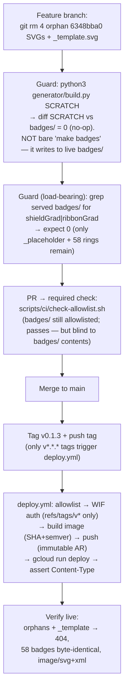

# fix: Remove orphan shield badges from the served set + redeploy `credentials.andamio.io`

**Target repo:** `credential-badges` (Andamio-Platform). Execute in a Claude Code session opened in that repo — this is product-code + deploy work.

---

## Summary

The public site already serves the **Proof Rings** design for all 58 real credentials — the originating handoff's premise ("live serves old shield; regenerate to fix") does **not** hold and was verified false against both the repo and the live site. The only old "shield/ribbon" design still being served is a set of **4 orphan badge SVGs for course `6348bba0…`** (an early "Andamio for Developers" seed set, superseded and never cleaned up) plus the hand-authored **`_template.svg`** — none of which the generator produces or governs. This plan removes those stale shield artifacts from the served set and ships `v0.1.3` so the public endpoint stops serving the old design. Regenerating the badges is a verified **no-op** here; it is used only as a *guard* — and the guard must regenerate into a **scratch directory** (`python3 generator/build.py <scratch>`), never via the bare `make badges` target (which writes into the live `badges/` tree).

---

## Problem Frame

`credentials.andamio.io` serves `badges/*.svg` as `image/svg+xml` from an `nginx:alpine` image, deployed via a tag-triggered GitHub Actions pipeline. The badge directory was assumed to be serving the old shield design and in need of regeneration. Direct verification (Sources & Research below) contradicts that:

- **Live is current.** `v0.1.2` (the live tag) points at `a193034` (`#27`) — the current `main` HEAD. Sampled live badges are **byte-identical** to the repo and contain **0** shield markers.
- **The repo is current.** Regenerating into a scratch directory (`python3 generator/build.py <scratch>`) produced **58/58 byte-identical** SVGs to the checked-in non-FCB badges — a verified no-op. The checked-in badges already *are* the current generator's Proof Rings output. (Note: the bare `make badges` target writes to the live `badges/` tree, not a scratch dir — see KTD1.)
- **The actual defect:** 4 badge SVGs for course `6348bba0…` are **not in `generator/credentials.json`** (0 entries), still carry `shieldGrad`/`ribbonGrad`, and return HTTP 200 from the live site. Because they have no data record, the generator never rewrites them and `git add -A` never removes them — the build is **additive-only** (`generator/build.py` writes, never prunes). They are the only credential-style shield art still public.
- **A second stale served artifact:** `badges/_template.svg` is a hand-authored shield reference (4 shield markers), is not referenced by any generator tooling, and is served publicly (live HTTP 200). It leaks the retired design even though it is not a real credential.

This reframes the work from "regenerate + redeploy everything" to "**excise the retired shield artifacts from the served set + redeploy**." Confirmed with James on 2026-06-25: the current generator design *is* "Proof Rings."

**Not in the defect:** `badges/_placeholder.svg` (0 shield markers; the deploy workflow asserts its content-type — must be retained), the 58 Proof Rings badges (already correct), titles (live and repo already agree), and the FCB course (see Scope Boundaries).

---

## Requirements

- **R1.** The public site must no longer serve the retired shield/ribbon design at any `/badges/*` path.
- **R2.** The 58 correct Proof Rings badges must remain byte-unchanged and continue to serve.
- **R3.** `badges/_placeholder.svg` must remain (deploy-time content-type assertion depends on it).
- **R4.** The change must land via PR and pass the required served-file allowlist check, with no widening of the served allowlist.
- **R5.** The release must go out as a new, unused semver tag (`v0.1.3`) — never a re-push of an existing tag (Artifact Registry tags are immutable).
- **R6.** Post-deploy, the retired artifacts must return 404 and the retained badges must verify (correct `Content-Type`, unchanged bytes).

---

## Key Technical Decisions

- **KTD1 — Remove, don't regenerate.** Regenerating is a verified no-op for the 58. The fix is deleting the 4 orphan `6348bba0…` SVGs (and `_template.svg`), not rebuilding. Regeneration is retained only as a *guard* — and the guard **must** run `python3 generator/build.py <scratch>` against a throwaway directory, then diff. **Do not use the bare `make badges` target as the guard:** its target passes no outdir, so `build.py` defaults to `DEFAULT_OUT = ../badges` and writes into the *live* served tree. Because the build is additive-only, a bare `make badges` after an accidental deletion would silently *re-materialize* a deleted real badge — masking the exact regression the guard exists to catch.
- **KTD2 — `_template.svg`: delete from the served path.** It is shield art, served publicly, and unused by tooling. **Recommendation: `git rm` it** — git history preserves the reference. *Alternative:* relocate to `spike/` or `generator/` if the visual reference is worth keeping out-of-band — both are in `check-allowlist.sh`'s `IGNORED_PREFIXES` and neither is in the `Dockerfile` `COPY` allowlist (verified), so they are genuinely never served. Either way it must leave `badges/`. (Open Question OQ1 if James wants it kept.)
- **KTD3 — No Dockerfile / allowlist change, *and the allowlist does not guard this defect*.** `scripts/ci/check-allowlist.sh` and the `Dockerfile` allowlist operate on **top-level paths** (`badges/` is allowlisted wholesale, via `COPY badges/ …`). Deleting files *within* `badges/` neither requires nor permits an allowlist edit; the required check still passes. **Critically, this cuts both ways:** the allowlist is structurally blind to what lives *inside* `badges/` — it never flagged the orphan shields (that is how they shipped), and it cannot detect an accidental deletion of a real badge either. The load-bearing guard for *this* class of change is the **no-shield-markers grep** plus the **scratch-dir regeneration diff** in U1, not the allowlist. Do not touch the allowlist — widening it is the one thing the check exists to prevent — but do not lean on it as correctness confirmation for these deletions.
- **KTD4 — Version `v0.1.3`.** `v0.1.2` is the current live tag (= HEAD). Existing git tags are `v0.0.1`, `v0.0.2`, `v0.0.3`, `v0.1.0`, `v0.1.2` — there is **no** `v0.1.1` git tag (per `DEPLOY.md`, `v0.1.1` was the first manual Artifact-Registry image deploy and was never git-tagged). `v0.1.3` is the next unused tag above the live `v0.1.2`. Bump, never reuse — AR image tags are immutable.
- **KTD5 — Scope the cleanup to verified-stale artifacts only.** Only files proven to be (a) absent from `credentials.json` *and* (b) carrying shield markup, plus the known `_template.svg`, are removed. The 58 generator-matched badges and `_placeholder.svg` are untouched.

---

## High-Level Technical Design

The deploy pipeline is unusual in three load-bearing ways (tag-only trigger, immutable image tags, served-file allowlist gate). The change rides the existing pipeline unchanged — this is the path the work follows:

*Directional — the authoritative per-step detail lives in the Implementation Units and in `DEPLOY.md`.*

---

## Implementation Units

### U1. Excise the retired shield artifacts from the served badge set

- **Goal:** Remove the only old-design SVGs from `badges/` so they can no longer be baked into the served image.
- **Requirements:** R1, R2, R3, R5 (prep).
- **Dependencies:** none.
- **Files:**
  - Delete `badges/6348bba0f9b7d7e0353715ece5946f3b61de433d314e84dad313a677.a891203913065a08e2c87ea57b808bb0f6efa4e57f36bc1412f7c2cdd846a045.svg`
  - Delete `badges/6348bba0f9b7d7e0353715ece5946f3b61de433d314e84dad313a677.b60b006844447593f8b0b7fe98ccd5c2bf6e363579f4d273521f8037b5ee2e0f.svg`
  - Delete `badges/6348bba0f9b7d7e0353715ece5946f3b61de433d314e84dad313a677.d8322e53d8707b28b85820f849fc58a2244aa4eed1ac669362b3b75f214ac362.svg`
  - Delete `badges/6348bba0f9b7d7e0353715ece5946f3b61de433d314e84dad313a677.f7da674ea5279110d3fdc51faa405134004a5773cbd1cecedbf99a5d081a0964.svg`
  - Delete (or relocate per KTD2) `badges/_template.svg`
  - Do **not** touch `badges/_placeholder.svg`, the 58 credential SVGs, `generator/`, `Dockerfile`, `nginx/`, or `scripts/ci/check-allowlist.sh`.
- **Approach:** A pure deletion on a feature branch (global rule: PR, never push `main`). The 4 orphans are identifiable as `badges/6348bba0*.svg` and are exactly the set that `make badges` does not produce. `_template.svg` is the hand-authored shield reference. No data, generator, or config edits.
- **Patterns to follow:** The repo treats badge art as **mutable, non-identity-bearing** presentation output (README "Badge imagery" section) — removing stale art invalidates no credential. `generator/build.py`'s `SKIP_COURSES` comment is the model for "data record exists but no art is produced"; here the inverse (art exists with no data record) is what we clean.
- **Test scenarios:**
  - *Guard — generator parity:* `python3 generator/build.py <scratch-dir>` then diff `<scratch-dir>` against `badges/`; expect **0** content differences and **0** files-missing-from-working-tree (confirms the deletions only removed non-generated art; regeneration remains a no-op). Use a scratch outdir, never bare `make badges` — see KTD1.
  - *Guard — no shield remains:* `grep -lE "shieldGrad|ribbonGrad" badges/*.svg` returns **empty** after deletion.
  - *Retained-file check:* `badges/_placeholder.svg` still present and still has 0 shield markers; the 58 credential SVGs are unmodified (`git status` shows only deletions, no modifications).
  - *Count check:* `ls badges/*.svg` drops from 64 to 59 (58 credentials + `_placeholder.svg`); exactly 5 deletions staged.
- **Verification:** `git status` shows only the 5 intended deletions (4 orphans + `_template.svg`); both guards above pass.

### U2. Land the change through the served-file allowlist gate

- **Goal:** Merge the deletion to `main` via PR with the required allowlist check green and no allowlist widening.
- **Requirements:** R4.
- **Dependencies:** U1.
- **Files:** none changed in this unit (PR/review activity); explicitly **no** edits to `Dockerfile` or `scripts/ci/check-allowlist.sh`.
- **Approach:** Open a PR from the feature branch. The required `check-allowlist.sh` job runs against `git ls-files` top-level paths; since `badges/` stays allowlisted and no new top-level served path is introduced, it passes unchanged (KTD3). Confirm in review that the diff is deletions-only.
- **Patterns to follow:** `DEPLOY.md` "Served-file allowlist (load-bearing)" — adding served paths is a deliberate reviewed act; removing files within an already-allowlisted dir is not such an act and needs no allowlist edit.
- **What the CI gate does *not* prove (KTD3).** A green allowlist check confirms only that no new top-level served path was introduced. It is blind to `badges/` contents and asserts only `_placeholder.svg` post-deploy — so it would pass even if a real badge were deleted by mistake. Correctness of *these deletions* rests entirely on U1's manual guards (scratch-dir parity diff + no-shield grep), not on CI. Treat the PR review's deletions-only diff check and U1's guards as the real gate; the allowlist check is necessary but not sufficient.
- **Test scenarios:**
  - *CI gate:* the `Enforce served-file allowlist` step passes on the PR (`allowlist OK — only context issuer badges README.md would be served`).
  - *Diff review (load-bearing):* PR diff contains **only the 5 expected file deletions** under `badges/` and **no modifications** to any retained badge; no changes to `Dockerfile`, `nginx/`, `scripts/`, or `generator/`. This human check, not CI, is what catches a wrong deletion.
- **Verification:** PR is green on the required allowlist check and approved; merged to `main`.

### U3. Release `v0.1.3` and confirm the deploy pipeline goes green

- **Goal:** Trigger and complete the tag-driven deploy so the new image (without the stale art) reaches Cloud Run.
- **Requirements:** R5.
- **Dependencies:** U2 (must be merged to `main` first — the tag should point at the merged commit).
- **Files:** none (release action; `.github/workflows/deploy.yml` is the executor, unchanged).
- **Approach:** Tag the merged `main` commit `v0.1.3` and push the tag. Only `v*.*.*` tags trigger `deploy.yml`; the WIF token mint is OIDC-constrained to `refs/tags/v*`. The workflow re-runs the allowlist check, authenticates via WIF, builds the image tagged with both SHA and `v0.1.3`, pushes to Artifact Registry (immutable — `v0.1.3` must be previously unused, KTD4), `gcloud run deploy`s, and asserts content-types on the `*.run.app` URL.
- **Patterns to follow:** `DEPLOY.md` "Deploy = push a version tag."
- **Test scenarios:**
  - *Trigger:* pushing `v0.1.3` starts the `deploy` workflow; pushing to a branch does not.
  - *No tag collision:* `v0.1.3` is not an existing tag (current tags: `v0.1.2`, `v0.1.0`, `v0.0.3`, `v0.0.2`, `v0.0.1`) — AR will not reject the push.
  - *Pipeline success:* all steps (allowlist, auth, build, push, deploy, the three `assert_ct` checks including `/badges/_placeholder.svg image/svg+xml`) complete green.
- **Verification:** `deploy.yml` run for `v0.1.3` is green end-to-end; Cloud Run revision updated.

### U4. Verify the retired design is gone from the public site

- **Goal:** Prove the live endpoint no longer serves the shield design and the retained badges are intact.
- **Requirements:** R1, R2, R6.
- **Dependencies:** U3.
- **Files:** none (verification against the live URL).
- **Approach:** After the deploy is green, query the live site directly. Verify against the **public custom domain `credentials.andamio.io`** — the actual deliverable — not just the `*.run.app` URL the pipeline already asserts internally; the domain mapping is a separate hop and is what external verifiers hit. The 4 orphan paths and `/badges/_template.svg` must now 404; the retained badges must be unchanged and correctly typed.
- **Patterns to follow:** the deploy workflow's own `assert_ct` curl pattern; `DEPLOY.md` rollback note (re-deploy `v0.1.2` if needed — re-serving the orphans is the only regression that buys).
- **Test scenarios:**
  - *Orphans gone:* `curl -sI https://credentials.andamio.io/badges/6348bba0….<each>.svg` returns **404** for all 4; `curl -sI https://credentials.andamio.io/badges/_template.svg` returns **404**.
  - *Rings intact:* a sampled credential (e.g. `203e63…`) returns **200**, `Content-Type: image/svg+xml`, **0** `shieldGrad`/`ribbonGrad` markers, and is byte-identical to the repo copy.
  - *Placeholder intact:* `/badges/_placeholder.svg` returns 200 `image/svg+xml`.
  - *No shield anywhere sampled:* spot-check several live badges → none contain shield markers.
- **Verification:** all four scenarios hold against `credentials.andamio.io`.

---

## Scope Boundaries

**In scope:** removing the 4 orphan `6348bba0…` shield SVGs and `_template.svg` from the served set, landing via PR, and redeploying `v0.1.3`.

### Deferred to Follow-Up Work

- **Make the build self-pruning.** `generator/build.py` is additive-only — it writes badges but never removes art for courses dropped from `credentials.json`. That additive-only behavior is the *root cause* of these orphans. A follow-up could have `make badges` reconcile `badges/` against the data (delete art with no record, behind a guard so `_placeholder.svg` survives). Out of this PR's scope — this PR fixes the symptom; the prune behavior is a generator change worth its own review.
- **FCB / Barça (course `5977af…`, 4 entries).** Already excluded by `SKIP_COURSES` in `build.py` and **has no SVGs in the repo** — it is not serving anything stale and does not block this cleanup. Shipping FCB (with the default palette now, or holding for the custom Barça "Premium" palette) is an independent forward decision, not part of removing the retired design. (The originating handoff framed FCB as "6 of 62" and as a blocker; it is 4 entries and not a blocker.)

---

## Risks & Dependencies

- **Immutable AR tags (R5).** A published tag can never be re-pushed. Confirm `v0.1.3` is unused before tagging. *Mitigation:* tag list verified at plan time — `v0.1.3` is free.
- **The allowlist does not guard this defect (R4 / KTD3).** Do not edit the allowlist or `Dockerfile`; this PR only deletes files inside an already-allowlisted dir, and any allowlist edit here is a red flag in review. But do not treat a green allowlist check as proof the deletions are correct — it is blind to `badges/` contents. The real guards are U1's scratch-dir parity diff and no-shield grep, plus the deletions-only PR-diff review.
- **`_placeholder.svg` must survive (R3).** The deploy workflow asserts its content-type; deleting it would fail the deploy. U1's retained-file check guards this.
- **Deploy is the only externally-visible, semi-irreversible step.** Rollback is fast (`gcloud run deploy v0.1.2` or re-pin in Terraform; <60s) but **re-serves the orphan shields** — there is no clean rollback that both reverts and removes them. If rollback is used, treat it as a temporary state: open a follow-up tracking issue immediately and re-remediate within a short SLA (e.g., next deploy ≤24h) so the retired design does not silently become the steady state again on a forever-public host.
- **Recurrence risk on an immutable, forever-public surface.** The additive-only generator (deferred root cause below) means *any future credential dropped from `credentials.json` leaves its old SVG served forever* — the exact mechanism that produced these orphans (it already recurred once: seeded at `#23`, superseded at `#26`, never cleaned). Until build self-pruning lands, every future `credentials.json` deletion must be paired with a manual orphan sweep + redeploy. A cheap interim guard is a CI check that fails when a served `badges/*.svg` has no matching `credentials.json` entry.
- **Dependency ordering is strict:** U3 must tag a commit that already contains U1's deletions (i.e., tag after U2 merges). Tagging `main` before merge would deploy an image that still contains the orphans.

---

## Open Questions

- **OQ1 — Keep `_template.svg` as an out-of-band reference?** Default (KTD2) is to `git rm` it (history preserves it). If James wants the visual reference retained, relocate to `spike/` or `generator/` (both un-served) instead of deleting. Either satisfies R1; this is a preference, not a blocker — proceed with delete unless told otherwise.

---

## Sources & Research

All claims below were verified directly in the repo and against the live site on 2026-06-25:

- **Live == repo, current design:** `git rev-list -n1 v0.1.2` → `a193034` (= HEAD, `#27`). Sampled live badges byte-identical to repo, 0 shield markers; `203e63…` live ≡ repo.
- **Regeneration is a no-op:** `python3 generator/build.py <scratch>` → "wrote 58 badges"; 58/58 byte-identical to checked-in non-FCB badges; 0 contain `shieldGrad`. (`make badges` with no arg writes to live `badges/` via `DEFAULT_OUT`; the no-op was verified with an explicit scratch outdir.)
- **Orphans:** `ls badges/6348bba0*.svg` → 4 files, all with `shieldGrad`/`ribbonGrad`; `credentials.json` has **0** `6348bba0` entries; live HTTP 200 with shield markup. Added at `#23` ("seed Andamio for Developers per-module badges"), superseded by the V2 set at `#26`, never cleaned.
- **`_template.svg`:** 4 shield markers; not referenced by `generator/` or build tooling; live HTTP 200. `_placeholder.svg`: 0 shield markers; asserted by `deploy.yml`.
- **Pipeline mechanics:** `.github/workflows/deploy.yml` (tag-only `v*.*.*` trigger, WIF, SHA+semver tags, content-type asserts), `Dockerfile` (allowlist COPY of `context/ issuer/ badges/ README.md`), `scripts/ci/check-allowlist.sh` (top-level-path allowlist), `DEPLOY.md`, `Makefile`.
- **Origin handoff (corrected):** `andamio/docs/plans/2026-06-25-credential-badges-proof-rings-redeploy.md` — its "live serves old shield / regenerate everything" premise and its "FCB = 6 of 62 / blocker" framing are both superseded by the findings above.
