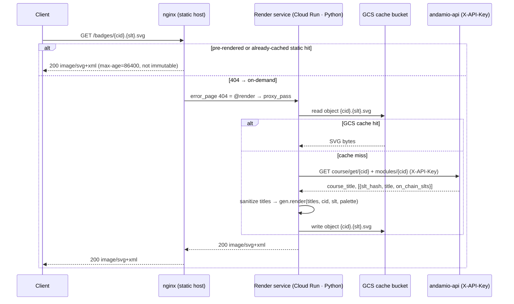
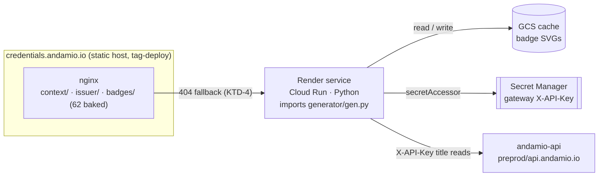

# feat: Dynamic on-demand badge generation (#33)

## Summary

Today the repo serves **only the 62 badges pre-rendered into the Docker image** (`generator/fetch.py` → `credentials.json` → `generator/build.py` → `badges/*.svg`, allowlist-copied at build time). Issue #33 asks for a badge for **any** credential — including ones issued after the last image build — rendered and served **on demand**.

The chosen shape (design fork resolved with the user) is **on-demand render + cache-to-GCS**: on a cache miss, a small Python service reads the course/module titles via a non-interactive gateway key, renders the SVG by reusing the existing `generator/gen.py` (no port), writes it to a GCS cache, and returns it; cache hits are served statically. The static-first model and the 62 pre-rendered badges are preserved.

**Gate first (your Monday no-go):** before building the service, **U1** empirically confirms a non-interactive `X-API-Key` reads course + per-module titles for arbitrary `course_id`s against `preprod.api.andamio.io` — and, critically, that *newly issued* credentials return usable titles (not an empty `source: chain_only` shell). Research already confirmed the endpoints and the key mechanism **exist**; U1 closes the live-behavior + new-credential question. Every other unit is gated on U1 passing.

---

## Problem Frame

`credential-badges` is a **pure-static nginx host** on Cloud Run, tag-deploy only (WIF ref-constrained to `refs/tags/v*`), with a hard served-file allowlist. Badges are build output baked into the image. The consequence: a credential issued today has no badge until someone re-runs `fetch` + `build`, bumps a version tag, and redeploys. Issue #33 (work item 1b — "core, not a stretch") requires badges to exist for **any** credential, on demand, including the freshly issued.

The current title-read step (`fetch.py`) uses the **interactive `andamio` CLI** — it cannot run inside a request-serving service. The missing capability is a **non-interactive, request-time title read** for an arbitrary `course_id`, plus a render-and-serve path that doesn't require a redeploy.

This plan covers **#33 only**. It deliberately does not build #36 (event-triggered generate-on-earn — the stretch), #34 (app-side earned-badge display), or #35 (landing-page preview/builder), though it shares the read path and LB routing the Phase-2 issuer-signing service (deployment plan) already specifies.

---

## Requirements & Traceability

| Req | Source | Description |
|---|---|---|
| R1 | Issue #33 | Render + serve a badge SVG for **any** credential, including newly issued ones, on demand. |
| R2 | Issue #33 + handoff | Title reads use a **non-interactive gateway service key** (no interactive CLI session) that can read course + per-module titles for any `course_id`. **Top risk / Monday no-go — gate before building.** |
| R3 | User directive | The runtime-vs-generate-at-issue **design fork is pinned**: on-demand render + cache-to-GCS (this plan's KTD-1). |
| R4 | `generator/README.md` | Rendered badges must be **byte-identical** to the existing generator output (the art is the proof; `make verify` / `decode.py` round-trip must still pass). |
| R5 | `DEPLOY.md` invariants | Deploy stays **tag-only + WIF ref-constrained**; the served-file allowlist and immutable-artifact rules are not weakened. |
| R6 | Orphan-shield plan (#31) | On-demand generation must not create a new un-prunable staleness surface; the cache needs an invalidation story. |

---

## Key Technical Decisions

### KTD-1 — On-demand render + cache-to-GCS (the resolved design fork)
On a cache miss, render at request time and persist the SVG to a GCS bucket; serve statically on a hit. Chosen over **pure runtime** (re-renders + hits the gateway key on every cold request — weak under load, secret on the hot path) and **generate-at-issue** (keeps serving static but can't satisfy "any credential on demand" without an issue-time trigger, which is #36 — the deferred stretch). On-demand+cache best satisfies R1 while keeping the secret and the render cost on the **cold path only**. See origin: design-fork decision recorded this session.

### KTD-2 — Reuse `generator/gen.py` as a Python library; the render service is Python — do not port
`gen.py` is pure deterministic stdlib Python with no third-party runtime deps. Porting the ring geometry to another language would require byte-for-byte reproduction to keep `decode.py`'s round-trip and the checked-in badges consistent — high cost, zero upside. The render service is therefore **Python** (e.g. Functions-Framework / FastAPI on Cloud Run), `import`-ing the existing `generator/` package. Note this is a *different* service from the Phase-2 **TypeScript issuer-signing** service (deployment plan); the two share infra patterns, not a runtime.

### KTD-3 — Gateway auth = **per-network** shared `X-API-Key` in Secret Manager (P1bis-08 pattern)
Research + the **U1 live probe** confirmed: all `andamio-api` v2 routes require an `X-API-Key` header (a shared developer/service key); "public" routes mean "no user JWT required," not "unauthenticated." Any valid key may read any `course_id` (no per-course scoping at the gateway). Title reads use two endpoints:
- `GET /api/v2/course/user/course/get/{course_id}` → `data.content.title` (course title), `data.source`
- `GET /api/v2/course/user/modules/{course_id}` → `data[].content.title` + `data[].slt_hash` + `data[].on_chain_slts` (per-module titles, hashes, on-chain SLT fallback)

**Keys are network-scoped (U1 finding):** a mainnet-issued key returns **401** on `preprod.api.andamio.io`. One key cannot serve courses across networks — and the deployed *Andamio for Developers* badges are **preprod**. So the service stores a key **per network** (`https://preprod.api.andamio.io`, `https://api.andamio.io`) and routes a `course_id` to the matching gateway; a course's network must be determinable (from `credentials.json`'s `network`, a lookup, or per-deploy config). Each key lives in **GCP Secret Manager** in `andamio-credentials`; the runtime SA gets `roles/secretmanager.secretAccessor` on those secrets only — no cross-project IAM (mirrors the deployment plan's P1bis-08 read path). Prototype posture; production-hardening upgrade is the `dbapi`↔`api` IAM-binding pattern. Use **dedicated service keys**, not a personal CLI key. Provisioning a preprod service key couples to issue #17 (preprod credential mint). See [U1 findings](../spikes/2026-06-25-gateway-key-verification.md).

### KTD-3b — Unresolvable course returns 502 (not 404); never cache non-200
**U1 finding:** a wrong-network course *and* a bogus `course_id` both return `502 BAD_GATEWAY` ("Failed to fetch course") — the gateway does **not** emit a clean 404. The service therefore **cannot distinguish "not found" from "upstream down."** Consequence: the render service must **never persist a non-200 response to the GCS cache**, and needs an explicit policy for unresolvable ids (serve `_placeholder.svg`, or pass through a typed 404/503) rather than caching an error or a placeholder as if it were the badge.

### KTD-4 — Serving topology: nginx `error_page 404 → render service` (static-first), LB path-route as the production alternative
Keep nginx serving `/badges/*` and the 62 pre-rendered badges as today; on a 404, `error_page 404 = @render` `proxy_pass`es to the render service, which checks the GCS cache, renders on miss, persists, and returns. This ships **without** waiting on the private-ops LB. The deployment plan's external HTTPS LB + URL-map (Decision 5) is the production routing alternative (`/badges/*` → render NEG); the LB / NEG / cert / DNS work is **Terraform in the private ops repo, not this repo**. Both topologies use the same render service and GCS cache.

### KTD-5 — `gen.py` globals → parameters refactor, byte-stability guarded by `decode.py`
`gen.build_svg()` reads five module globals (`COURSE_TITLE`, `MODULE_TITLE`, `COURSE_ID`, `SLT_HASH`, `NETWORK`) set by `build.py` before each call — not thread-safe for per-request use. Refactor to a function taking those five as parameters (they are only read), keeping `build.py` working and output **byte-identical**. The round-trip guard (`make verify` / `decode.py`) is the regression test.

### KTD-6 — Newly-issued-credential title availability + font-subset sanitization
The literal #33 requirement is "including newly issued credentials." The merged endpoints return a `source` field (`merged` / `db_only` / `chain_only`); a brand-new credential may be `chain_only` with an empty DB `title`. Fallback order: DB `module.content.title` → first `on_chain_slts` entry (hex-decoded via `clean_title`) → generic `"Credential"` (course title → `"Andamio"`). Separately, `gen.py`'s embedded fonts are subset to printable ASCII + a little punctuation — titles with out-of-subset glyphs render boxes. Sanitize/transliterate titles to the subset (or extend the subset in `embed_fonts.py`) before rendering.

### KTD-7 — GCS cache is the new staleness surface; subsume the orphan-shield deferred guard
On-demand+cache *dissolves* the old orphan class (dropped credentials simply stop resolving) but *introduces* a new one: a cached SVG whose title later changes on-chain. The cache gets a TTL + an explicit invalidation (delete-object) path, and this plan **subsumes** the orphan plan's deferred "no-matching-record / self-pruning" guard rather than re-deferring it.

---

## High-Level Technical Design

**Request flow (the cache-miss render path is the new behavior):**



**Component topology:**



Prose is authoritative where it and a diagram disagree. Out-of-repo pieces (GCS bucket, runtime SA, LB/NEG/cert) are private-ops Terraform — see Dependencies.

---

## Output Structure

```
credential-badges/
  generator/
    gen.py                  # MODIFIED (U2) — build_svg gains a params entry point; byte-identical
    build.py                # MODIFIED (U2) — call the params entry point; unchanged output
    api_client.py           # NEW (U3) — andamio-api X-API-Key title reads (2 endpoints)
    render.py               # NEW (U3) — course_id+slt_hash → titles → sanitized → SVG
  service/                  # NEW (U4) — on-demand render service (Python, Cloud Run)
    app.py                  # HTTP handler: GET /badges/{cid}.{slt}.svg, /healthz
    cache.py                # GCS read/write + key derivation
    Dockerfile             # ships generator/ + fonts.css; NOT served by the static host
    requirements.txt
    tests/
  nginx/default.conf        # MODIFIED (U5) — error_page 404 = @render → proxy_pass
  scripts/
    cache-admin.py          # NEW (U6) — invalidate / reconcile GCS cache objects
    ci/check-allowlist.sh   # MODIFIED (U7) — add service/ to IGNORED_PREFIXES
  .github/workflows/        # MODIFIED (U7) — build/deploy render service (tag-prefix trigger)
  docs/runbooks/
    gateway-key.md          # NEW (U8) — key provisioning + rotation
```

`service/` is build/deploy tooling, **never** served by the static host — it stays in the allowlist's `IGNORED_PREFIXES` (U7).

---

## Implementation Units

### U1. Gateway service-key verification spike — BLOCKING GATE (Monday no-go)
- **Goal:** Empirically confirm a non-interactive `X-API-Key` reads `course_title` + per-module titles for arbitrary `course_id`s against `preprod.api.andamio.io`, and characterize the **newly-issued-credential** case (does a recent credential come back `chain_only` with an empty title?). Produce a go/no-go.
- **Requirements:** R2, R3
- **Dependencies:** none (must pass before U2–U8)
- **Files:** `docs/spikes/2026-06-25-gateway-key-verification.md` (findings + go/no-go); a throwaway probe script (not committed to served paths).
- **Approach:** Obtain/register a **dedicated service key** (not a personal CLI key). Call `GET /api/v2/course/user/course/get/{course_id}` and `GET /api/v2/course/user/modules/{course_id}` with `X-API-Key` for ≥2 course_ids including one recently-active course; record `data.content.title`, each `data[].content.title` / `slt_hash` / `on_chain_slts`, and the `source` field. Confirm rate-limit headroom (Free tier ≈ 20 req/min, 500/day) is acceptable behind a cache. Document the empty-title fallback path KTD-6 must implement.
- **Execution note:** Verify before building — this gate decides whether U2–U8 proceed as designed or need rework.
- **Status (2026-06-25): GO.** Live probe confirmed the mechanism on two courses (`source=merged`, full title + slt_hash + on_chain_slts). Surfaced two refinements now in KTD-3 (keys are **network-scoped** — mainnet key 401s on preprod) and KTD-3b (unresolvable course → **502 not 404**; never cache errors). Remaining small open item: confirm a freshly-issued `chain_only` credential's title once a preprod credential exists (#17). Findings: `docs/spikes/2026-06-25-gateway-key-verification.md`.
- **Test scenarios:** `Test expectation: verification spike — success = documented evidence the key returns usable course + module titles for ≥2 course_ids, with source/network/error behavior characterized.` Covers R2. **Met.**

### U2. Refactor `gen.py` for concurrency-safe, parameterized rendering
- **Goal:** Add a parameterized entry point (course_title, module_title, course_id, slt_hash, network, palette) so the renderer is callable per-request without module-global mutation, with **byte-identical** output.
- **Requirements:** R4
- **Dependencies:** U1
- **Files:** `generator/gen.py`, `generator/build.py`, `generator/tests/test_render_parity.py` (new).
- **Approach:** Introduce `render_svg(*, course_title, module_title, course_id, slt_hash, network, pal)`; keep the legacy globals + `build_svg(pal)` as a thin wrapper so `build.py` is unchanged in behavior. Move palette selection helpers (`palette_for`, `colors.light_interior`) into a place the service can reuse.
- **Patterns to follow:** `build.py:render()` global-setting block; `generator/decode.py` round-trip expectations (radii bands, `gs`/`off`, MSB-first, `--prim`/`--sec`).
- **Test scenarios:** byte-identical output vs current for all 62 records (regenerate to a scratch dir, diff — never bare `make badges` into live `badges/`); `decode.py` round-trip still asserts outer ring == course_id and inner == slt_hash; two concurrent `render_svg` calls with different inputs do not interleave/corrupt; legacy `build.py` output unchanged. Covers R4.

### U3. Render-core library: title lookup + sanitize + render
- **Goal:** Given `course_id` + `slt_hash`, fetch titles via the gateway-key client, apply KTD-6 fallbacks + font-subset sanitization, and return the SVG (reusing U2 + palette selection).
- **Requirements:** R1, R2, R4
- **Dependencies:** U2
- **Files:** `generator/api_client.py`, `generator/render.py`, `generator/tests/test_api_client.py`, `generator/tests/test_render.py`.
- **Approach:** `api_client.get_titles(course_id, network) -> (course_title, {slt_hash: TitleRec})` calling the two KTD-3 endpoints with the **network's** `X-API-Key` against the matching gateway (KTD-3 network-scoping); reuse `fetch.py:clean_title()` hex-decode. Map a non-200 to a typed error carrying the status (so the caller can apply KTD-3b: 502 = unresolvable/upstream, 401 = wrong-network key). `render.render_badge(course_id, slt_hash, network) -> svg_str` applies the fallback order (DB title → on_chain_slts → generic) and `sanitize_title()` (transliterate/strip out-of-subset glyphs).
- **Patterns to follow:** `fetch.py:course_titles()` + `clean_title()`; `build.py:palette_for()`.
- **Test scenarios:** parses `data.content.title` and `data[].content.title`/`slt_hash` correctly; `source: chain_only` / empty DB title falls back to `on_chain_slts` then `"Credential"`; non-ASCII title is sanitized to renderable glyphs (no box artifacts); **502 BAD_GATEWAY → typed unresolvable error (not a crash, not a blank badge)**; **401 → typed wrong-network/auth error**; timeout → typed error; correct gateway + key selected per network; palette selection matches `build.py` for a known course_id. Covers R1, R2.

### U4. On-demand render service with GCS cache
- **Goal:** HTTP service: `GET /badges/{course_id}.{slt_hash}.svg` → GCS cache hit returns; miss renders (U3), writes GCS, returns. Plus `/healthz`.
- **Requirements:** R1, R5, R6
- **Dependencies:** U3
- **Files:** `service/app.py`, `service/cache.py`, `service/Dockerfile`, `service/requirements.txt`, `service/tests/test_app.py`, `service/tests/test_cache.py`.
- **Approach:** Validate the `{cid}.{slt}` path shape (hex lengths: course_id 28 bytes, slt_hash 32 bytes) → 400 on malformed. `cache.get/put` against the GCS bucket keyed `{cid}.{slt}.svg`. Per-network gateway keys read from Secret Manager via env at startup. **Never persist a non-200 render to the cache (KTD-3b).** On a typed unresolvable/upstream error, serve `_placeholder.svg` or a typed 404/503 (chosen policy) — do not cache it. Response headers mirror nginx: `Content-Type: image/svg+xml`, `Cache-Control: public, max-age=86400` (NOT immutable). **Dockerfile must ship `generator/` + `generator/fonts.css`** or self-contained rendering breaks.
- **Test scenarios:** malformed id → 400; valid id cache hit → 200 from GCS without a gateway call; cache miss → renders, writes object, returns 200; **U3 502 (unresolvable / wrong-network) → placeholder-or-typed-error and GCS write is NOT called**; **U3 401 → 5xx, no cache write**; content-type and cache-control exactly match the static host; `/healthz` → 200. Covers R1, R6.

### U5. Serving topology — nginx 404 fallback to the render service
- **Goal:** Route `/badges/*` cache-miss to the render service while preserving static-first serving and the 62 baked badges.
- **Requirements:** R1, R4, R5
- **Dependencies:** U4
- **Files:** `nginx/default.conf`, `docs/plans/2026-06-25-002-...` (LB alternative note inline here).
- **Approach:** In the badge `location`, `try_files $uri @render;` with a `location @render { proxy_pass <render-service-url>; }`; preserve the `types{}` map and the badge `Cache-Control`. Document the production LB path-route alternative (private-ops Terraform) as the hardening path.
- **Patterns to follow:** existing `nginx/default.conf` badge `location` + server-level `types {}` block.
- **Test scenarios:** an existing baked badge is still served from the static file (no proxy hop); a missing badge id proxies to `@render` and returns a rendered SVG with `image/svg+xml`; a non-badge unknown path still returns plain 404 (fallback not over-broad); `Cache-Control: max-age=86400` preserved through the proxy. Covers R1, R4.

### U6. Cache invalidation + orphan-guard subsumption
- **Goal:** Define and implement the GCS cache TTL/invalidation story; subsume the orphan plan's deferred "no-matching-record / self-pruning" guard.
- **Requirements:** R6
- **Dependencies:** U4
- **Files:** `scripts/cache-admin.py`, `docs/runbooks/gateway-key.md` (cache section) or a short `docs/cache.md`.
- **Approach:** Object TTL (GCS lifecycle or app-checked `max-age`) + an explicit `cache-admin.py invalidate {cid}.{slt}` (delete object) and `reconcile` (list cache objects, flag any with no live credential). Because badges are re-derivable on demand, invalidation is non-destructive — a deleted cache object simply re-renders next request.
- **Test scenarios:** `invalidate` removes a cache object and the next request re-renders; `reconcile` flags a cache object whose course_id no longer resolves; `_placeholder.svg` and the 62 baked badges are never targeted by reconcile. Covers R6.

### U7. Deploy + CI wiring for the render service
- **Goal:** Build/deploy the render service under the repo's tag-only + WIF conventions, with its own tag-prefix trigger + distinct runtime SA (secretAccessor on the gateway key), and keep the allowlist green.
- **Requirements:** R5
- **Dependencies:** U4
- **Files:** `.github/workflows/deploy.yml` (or a new `deploy-render.yml`), `scripts/ci/check-allowlist.sh` (add `service` to `IGNORED_PREFIXES`), `DEPLOY.md`, `ROADMAP.md`.
- **Approach:** A tag-prefix trigger (e.g. `render-v*`) builds `service/Dockerfile` and `gcloud run deploy`s the render service; WIF stays ref-constrained. Document the private-ops Terraform delta (GCS bucket + lifecycle, render Cloud Run service + runtime SA + secretAccessor binding, optional NEG/LB path-route) as an out-of-repo dependency. Do **not** introduce any main-push or `workflow_dispatch` deploy path.
- **Test scenarios:** `check-allowlist.sh` passes with the new `service/` dir present (it is ignored, never served); CI smoke-tests the render service `/healthz` + a content-type assertion on a rendered badge; no new served top-level path enters the static image. Covers R5.

### U8. Docs — README / MOC / ROADMAP + gateway-key runbook
- **Goal:** Document the on-demand path, the gateway key, the cache, and update the repo map + roadmap.
- **Requirements:** R2, R6
- **Dependencies:** U5, U7
- **Files:** `README.md`, `MOC.md`, `ROADMAP.md`, `docs/runbooks/gateway-key.md`.
- **Approach:** README "How badges resolve" (static-first + on-demand fallback); runbook for gateway-key provisioning + rotation (Secret Manager, dedicated service key, rotation steps); ROADMAP tick for #33.
- **Test scenarios:** `Test expectation: none — documentation only.`

---

## Alternative Approaches Considered

- **Pure runtime on-demand (no cache):** simplest service, but re-renders + hits the gateway key on every cold edge request — weak under the Free-tier rate limit and puts the secret on the hot path. Rejected for KTD-1; the cache is cheap insurance.
- **Generate-at-issue (stay fully static):** render once at issue time and write to the static set. Preserves the pure-static host, but cannot satisfy "any credential on demand" without an issue-time trigger (#36, the deferred stretch) and a backfill for pre-existing credentials. Rejected as the #33 answer; it is essentially #36's shape.
- **Port `gen.py` to TypeScript** (to share a runtime with the Phase-2 issuer service): byte-for-byte geometry reproduction with no upside, and it would risk the `decode.py` round-trip guarantee. Rejected per KTD-2.

---

## Risks & Mitigations

| Risk | Severity | Mitigation |
|---|---|---|
| Newly-issued (`chain_only`) credentials return empty titles | Medium | **U1 partly closed** (mechanism GO; all probed courses `merged`); KTD-6 `on_chain_slts` fallback confirmed present. One live check pending a fresh preprod credential (#17). |
| **Per-network keys: a mainnet key 401s on preprod (the deployed Developers badges are preprod)** | High | **U1 finding** → KTD-3 stores a key per network + routes by course network; preprod service key provisioning is a named prerequisite (#17). |
| Unresolvable course returns 502 not 404 → risk of caching an error/placeholder as the badge | Medium | **U1 finding** → KTD-3b: never cache non-200; explicit placeholder/passthrough policy (U4). |
| Geometry/render drift breaks "the art is the proof" | High | U2 byte-identical parity test + `decode.py` round-trip in CI (U7). |
| Title glyphs outside the embedded font subset render as boxes | Medium | KTD-6 sanitize/transliterate; option to extend the subset in `embed_fonts.py`. |
| Production LB / Terraform (private ops repo) not live | Medium | KTD-4 nginx-404-fallback topology ships **without** the LB; LB is the hardening path. |
| `andamio-api` rate limit (Free ≈ 20/min) under burst | Medium | GCS cache absorbs repeats (gateway only on cold path); pick an adequate tier. |
| Cache staleness when an on-chain title changes | Low | U6 TTL + `invalidate`; re-render is non-destructive. |
| Secret exposure on the serving path | Low | Secret only on the cache-miss cold path; Secret Manager + secretAccessor-only runtime SA. |

---

## Dependencies / Prerequisites

- **U1 passes** — the gate for everything else.
- **Out-of-repo (private ops Terraform):** GCS cache bucket + lifecycle; render Cloud Run service + dedicated runtime SA; `roles/secretmanager.secretAccessor` on the gateway key; optional external HTTPS LB URL-map path-route for the production topology. These mirror the deployment plan's Decision 5 / P1bis-08 patterns.
- **Dedicated per-network `andamio-api` service keys** stored in Secret Manager in `andamio-credentials` (not a personal CLI key) — at minimum a **preprod** key (the deployed Developers badges are preprod) and a mainnet key. Preprod key provisioning couples to issue #17.

---

## Scope Boundaries

**In scope:** on-demand render+cache path for #33 (U1–U8): gate, `gen.py` refactor, render-core + gateway client, render service + GCS cache, nginx fallback, cache invalidation, deploy/CI wiring, docs.

**Deferred for later (separate issues):**
- #36 event-triggered generate-on-earn (the stretch) — would pre-warm the cache on issue events.
- #34 app-side earned-badge display; #35 landing-page preview/builder.
- Production LB path-routing (vs nginx-404-fallback) — the deployment plan's Decision 5; private-ops Terraform.
- Self-pruning of the **checked-in** `badges/` set (orphan plan's deferred build-prune) — this plan handles the **cache** staleness surface (U6); the static-set prune remains the orphan plan's concern.

**Out of scope (different product):** the Phase-2 OB3 issuer **signing** service (TypeScript) — shares infra patterns, not this runtime.

---

## Sources & Research

- Issue #33 (work item 1b — core); parent product-circle#62.
- **U1 gate live probe (2026-06-25):** `docs/spikes/2026-06-25-gateway-key-verification.md` — GO; network-scoped keys + 502-not-404 findings folded into KTD-3 / KTD-3b.
- Gateway-key path (research, this session): `andamio-api` `internal/middleware/v2_auth_middleware.go` (X-API-Key required on all v2 routes); endpoints `GET /api/v2/course/user/course/get/{course_id}` and `GET /api/v2/course/user/modules/{course_id}` (`internal/handlers/v2/merged_handlers/merged_handlers.go`); base URLs `preprod.api.andamio.io` / `api.andamio.io`; tier rate limits in `internal/config/config.yaml`. CLI uses the same endpoints + `X-API-Key` (`andamio-cli/internal/client/client.go`).
- Repo conventions (research, this session): `generator/gen.py` globals + determinism + font subset; `generator/decode.py` round-trip; `Dockerfile` + `scripts/ci/check-allowlist.sh` allowlist; `.github/workflows/deploy.yml` tag-only + WIF; `nginx/default.conf` `types{}` + badge cache.
- Deployment plan: `docs/plans/2026-05-16-001-feat-andamio-ob3-issuer-deployment-plan.md` (Decision 5 LB/URL-map; P1bis-08 shared-API-key read path, lines ~545-605).
- Orphan-shield plan: `docs/plans/2026-06-25-001-fix-orphan-shield-badge-cleanup-plan.md` (additive-only build; deferred self-pruning guard).
