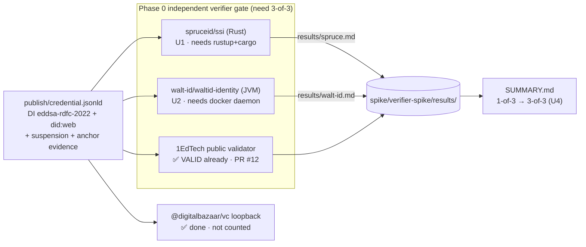

# feat: Rung 1 — prove the multi-verifier gate (spruce + walt-id harness)

**Origin:** the orch slice-ladder (`2026-07-09-credential-badges-ob3-signing-slice-ladder.md`, Rung 1 — *START HERE, fully ungated*). **Grounded spec:** `docs/plans/2026-05-16-001-feat-andamio-ob3-issuer-deployment-plan.md` (P1bis-10 verifier set, Phase 0 evidence gate). This plan does not re-litigate the verifier-set composition — that is locked. It delivers the smallest independently-verifiable slice: turn the Phase 0 multi-verifier gate from **1-of-3 green** into **3-of-3 green** by landing reproducible runner harnesses for the two remaining independent verifiers and capturing their transcripts.

---

## Summary

The Phase 0 pre-flight spike (`spike/verifier-spike/`, PR #12) proved the production-shape OB3 credential passes the **1EdTech public validator** (`VALID, 0 errors, 0 warnings`) and the `@digitalbazaar/vc` self-loopback. Two of the three *independent* verifiers named in the locked P1bis-10 set are still empirically **TBD** — not because of any capability gap the spike surfaced, but because their toolchains were never installed:

- **`spruceid/ssi`** (Rust) — the DI `eddsa-rdfc-2022` + did:web authority (90/91 W3C interop). Blocked on `rustup`/`cargo`. Issue #15.
- **`walt-id/waltid-identity`** (Kotlin/JVM) — the OB3 + `suspension` status primary. Blocked on a local docker/gradle run (the hosted portal is OpenID4VP-only). Issue #16.

This slice closes both. The **durable in-repo deliverable** is a pair of checked-in, reproducible verifier runners (a minimal spruce Rust binary; a docker-based walt-id invocation) plus a harness README — so any contributor with the toolchain can reproduce the gate on demand. The **verification** is the two captured transcripts landing in `spike/verifier-spike/results/` and the viability `SUMMARY.md` graduating from 1-of-3 to 3-of-3.

Rung 1 needs no KMS key, no ops PR, and no coordination — it de-risks every signing rung after it.

---

## Problem Frame

The Phase 0 evidence gate (repo plan) requires **≥3 independent verifiers to verify the credential bytes with zero errors AND zero warnings** before the signer (Unit 3) is unlocked. Today that gate is 1-of-3 empirically confirmed. Until spruce and walt-id are actually run — not assumed — the gate is unproven, and every downstream signing decision rests on an untested premise that the target verifier set handles the full production feature combination (`did:web` + DI `eddsa-rdfc-2022` + `BitstringStatusListEntry`/`suspension` + `OnChainCredentialAnchor` evidence) simultaneously.

The two remaining verifiers were deferred purely on toolchain-install grounds during the spike. This plan removes that block and captures the empirical result — including a finding, if walt-id's documented DI `eddsa-rdfc-2022` gap turns out to be real.

**Environment ground truth (verified 2026-07-09):** `cargo`/`rustup` are **not installed**; `docker` is present but the **daemon is not running**; `gradle`, `java`, `node` are present. This directly shapes sequencing: the harness *code* lands independent of the toolchains (KTD1); the transcript *capture* is gated on toolchain availability and is explicit about it (U4).

---

## Requirements Traceability

| ID | Requirement | Source |
|----|-------------|--------|
| R1 | Run `spruceid/ssi` v0.16.x+ (crate, not archived `didkit-cli`) against the signed sample; capture to `results/spruce.md`; zero errors AND zero warnings | Issue #15, repo plan L446 |
| R2 | Run `walt-id/waltid-identity` v0.20.x+ verify against the signed sample; capture to `results/walt-id.md`; confirm `suspension` surfacing + DI `eddsa-rdfc-2022` empirically | Issue #16, repo plan L439–441 |
| R3 | Both runners target the git-tracked, did:web-resolvable sample `spike/verifier-spike/publish/credential.jsonld` | Issues #15/#16 (explicit path) |
| R4 | Runners are checked in and reproducible, not one-off shell invocations | Repo plan "harness" intent; compound residue |
| R5 | `results/SUMMARY.md` per-verifier table + viability call updated to reflect the new 3-of-3 (or documented findings) | Spike SUMMARY structure |
| R6 | Rung 1 "verified when": both spruce and walt-id return VALID on the DI-signed sample; transcripts committed alongside the 1EdTech ones | Origin ladder, Rung 1 |

---

## Key Technical Decisions

1. **Harness-as-code, transcript-as-verification (split deliverable).** The checked-in runners (U1–U3) are the code deliverable and land regardless of local toolchain state. The captured transcripts (U4) are the verification step and are explicitly toolchain-gated. This is what makes the slice landable as a PR even when an environment lacks Rust or a running docker daemon — the harness is durable; the evidence is reproducible by anyone who runs it. *Rationale: the environment ground truth above means transcript capture cannot be assumed; separating the two keeps the PR honest and the residue reusable.*

2. **spruce used directly as a Rust crate (v0.16.x+), not `didkit-cli`.** The `didkit-cli` is archived; issue #15 and repo plan L446 both mandate the `ssi` crate directly. A minimal `main.rs` loading the credential, resolving `did:web`, and verifying the DI `eddsa-rdfc-2022` proof.

3. **walt-id run via docker (v0.20.x+), single-key did:web doc.** Use a single-key DID document to sidestep walt-id issue #977 (multi-key did:web resolution). The existing `publish/did.json` already pins a single `#key-2026-05` verification method — confirm it stays single-key. Docker is the recommended path (issue #16); gradle-from-source is the documented fallback when the daemon is unavailable.

4. **Target the `publish/` sample, not `out/`.** `spike/verifier-spike/publish/credential.jsonld` is the git-tracked copy whose `did:web:workshop-maybe.github.io:credential-badges-verifier-spike` actually resolves via GitHub Pages; `out/` is local build output. Issues #15/#16 name `publish/` explicitly. Both spruce (offline did:web via the hosted path) and walt-id resolve the DID over the network against the published copy.

5. **Pass criterion = zero errors AND zero warnings.** Any warning is a finding to investigate before the gate closes, matching the bar the 1EdTech pass already cleared. Runners exit non-zero on any error or warning so the result is unambiguous.

---

## High-Level Technical Design

The harness is three independent runners over one shared sample, each writing a transcript. Two are new (this slice); the loopback already exists. The gate closes when all three independents are green.



**Toolchain gate (directional):** U4 runs each runner only when its toolchain is present. Absent toolchain → record the blocker verbatim in the transcript (Empirical: blocked on `<toolchain>`), never a fabricated VALID. The gate closes only when both real transcripts read zero-errors/zero-warnings.

---

## Output Structure

New files land under a `verifiers/` subtree inside the existing spike, keeping runners beside the sample and transcripts they exercise:

```
spike/verifier-spike/
  verifiers/
    README.md                 # U3 — toolchain prereqs + how to run all three + where transcripts land
    spruce/
      Cargo.toml              # U1 — pins ssi v0.16.x
      src/main.rs             # U1 — minimal DI eddsa-rdfc-2022 + did:web verifier
      run.sh                  # U1 — cargo run against publish/credential.jsonld
    walt-id/
      run.sh                  # U2 — docker invocation of waltid verify (gradle fallback documented)
      README.md               # U2 — #977 single-key note, version pin, daemon prereq
  results/
    spruce.md                 # U4 — captured transcript (toolchain-gated)
    walt-id.md                # U4 — captured transcript (toolchain-gated)
    SUMMARY.md                # U4 — updated viability call (existing file)
```

---

## Implementation Units

### U1. spruce (`spruceid/ssi`) Rust verifier harness

**Goal:** A minimal, checked-in Rust binary that verifies the signed sample's DI `eddsa-rdfc-2022` proof and `did:web` resolution using the `ssi` crate directly, printing a structured zero-errors/zero-warnings result and exiting non-zero on any finding.

**Requirements:** R1, R3, R4, R5.

**Dependencies:** none (fully ungated code-wise; the *run* is gated in U4).

**Files:**
- `spike/verifier-spike/verifiers/spruce/Cargo.toml` (create — pin `ssi = "0.16"` or latest 0.16.x/0.17.x that carries DI `eddsa-rdfc-2022`)
- `spike/verifier-spike/verifiers/spruce/src/main.rs` (create)
- `spike/verifier-spike/verifiers/spruce/run.sh` (create — `cargo run -- ../../publish/credential.jsonld`)

**Approach:** Load `publish/credential.jsonld`; use `ssi`'s verification entrypoint for W3C VC Data Integrity with the `eddsa-rdfc-2022` cryptosuite; let the crate resolve `did:web:workshop-maybe.github.io:credential-badges-verifier-spike` over HTTPS (path-form → `/credential-badges-verifier-spike/did.json`). Print outcome, error count, and warning count in a stable format the transcript can quote. Exit `0` only on zero errors AND zero warnings. Keep the binary minimal — no CLI framework beyond a single positional path arg.

**Patterns to follow:** the existing `src/verify-loopback.ts` structured-result shape (top error + nested errors + per-check results) — mirror that reporting granularity so `spruce.md` reads like `onedtech.md`.

**Test scenarios:**
- Happy path: given the valid signed sample, the binary prints `outcome=VALID errors=0 warnings=0` and exits `0`. *Covers R1.*
- Error path: given a credential with a tampered `proofValue` (flip one char), the binary reports a verification error and exits non-zero.
- Warning-as-finding: if the crate surfaces any warning, the binary counts it and exits non-zero (assert exit code, not just text).
- did:web resolution: with network available, resolution of the throwaway DID succeeds; a malformed DID path yields a clear resolution error rather than a panic.
- Test expectation: harness-level assertions live in `run.sh` (grep the outcome line + check `$?`); a Rust unit test is optional given the binary is a thin adapter over `ssi`. Prefer one integration assertion in `run.sh` over mocking the crate.

**Verification:** `cargo build` succeeds against the pinned `ssi`; `run.sh` against the good sample prints the VALID line and exits 0 (when the toolchain is present — see U4).

---

### U2. walt-id (`waltid-identity`) verify runner

**Goal:** A checked-in runner that invokes `walt-id/waltid-identity` v0.20.x+ verify against the signed sample via docker, capturing whether the OB3 credential — including `BitstringStatusListEntry`/`suspension` and the DI `eddsa-rdfc-2022` proof — verifies clean.

**Requirements:** R2, R3, R4, R5.

**Dependencies:** none code-wise (run gated in U4).

**Files:**
- `spike/verifier-spike/verifiers/walt-id/run.sh` (create — docker invocation of the waltid verifier image/CLI at a pinned v0.20.x tag, pointed at `publish/credential.jsonld`)
- `spike/verifier-spike/verifiers/walt-id/README.md` (create — version pin, the #977 single-key note, docker-daemon prereq, and the gradle-from-source fallback)

**Approach:** Pin the waltid-identity version (v0.20.x+). Feed the credential bytes to the verifier and request the OB3 + status-list checks. Confirm the runner passes a **single-key** did:web document (per KTD3 / issue #977). Because walt-id's DI `eddsa-rdfc-2022` support is a documented gap, the runner must faithfully surface whatever walt-id reports — a clean pass, or a warning/error that becomes a Rung-1 finding (see Risks). Do not mask a walt-id DI failure; independence-by-coverage (spruce + 1EdTech carry DI) is the repo plan's explicit fallback.

**Patterns to follow:** issue #16 scope list (docker recommended, gradle fallback); repo plan L439–446 verifier notes.

**Test scenarios:**
- Happy path: given the valid signed sample, walt-id reports the credential verifies and `suspension` status is surfaced; runner records `errors=0 warnings=0`. *Covers R2.*
- Status surfacing: assert the transcript explicitly shows the `BitstringStatusListEntry` / `statusPurpose: suspension` was read (not silently ignored).
- DI gap probe: if walt-id cannot verify the `eddsa-rdfc-2022` proof, the runner captures the exact message as a finding and exits non-zero rather than reporting a false pass.
- Daemon-down path: with the docker daemon unavailable, `run.sh` fails fast with a clear "docker daemon not running — see README fallback" message, not a hang.
- Test expectation: assertions live in `run.sh` (grep outcome + status-surfacing lines, check exit code). No mock — the whole point is the real verifier's behavior.

**Verification:** with a running docker daemon, `run.sh` produces a transcript stating outcome, error count, warning count, and status-surfacing confirmation (see U4).

---

### U3. Verifier harness README (reproducibility doc)

**Goal:** One document that ties the three independent runners together: toolchain prerequisites, how to run each (including the already-done loopback and 1EdTech), the exact sample path, and where transcripts land — so the gate is reproducible by any contributor, not tribal knowledge.

**Requirements:** R4, R6.

**Dependencies:** U1, U2 (documents their invocation).

**Files:**
- `spike/verifier-spike/verifiers/README.md` (create)

**Approach:** Short, operational. Table of the three independents + loopback with status and toolchain. Copy-run commands for spruce (`verifiers/spruce/run.sh`) and walt-id (`verifiers/walt-id/run.sh`). State the pass criterion (zero errors AND zero warnings; any warning is a finding). Point to `results/` for captured transcripts and to `results/SUMMARY.md` for the viability call. Cross-link the origin ladder Rung 1 and issues #15/#16.

**Patterns to follow:** the top-level `spike/verifier-spike/README.md` "What this tests" + verifier table style.

**Test scenarios:** `Test expectation: none — documentation. Verified by U4 following the README's own commands and reproducing the transcripts.`

**Verification:** a reader following only this README can run both new verifiers and locate the transcripts without consulting the plan.

---

### U4. Capture transcripts and graduate the viability SUMMARY (rung close)

**Goal:** Run both new verifiers against the signed sample, write their transcripts, and update the viability summary from 1-of-3 to 3-of-3 (or record honest findings). This is the "verified when" step that closes Rung 1.

**Requirements:** R1, R2, R5, R6.

**Dependencies:** U1, U2, U3.

**Files:**
- `spike/verifier-spike/results/spruce.md` (create — spruce transcript)
- `spike/verifier-spike/results/walt-id.md` (create — walt-id transcript)
- `spike/verifier-spike/results/SUMMARY.md` (modify — per-verifier table: spruce and walt-id rows move from ⏸ Blocked to ✅ Done or ⚠ Finding; update the "verifier-set viability call" and empirical count)

**Approach:** **Toolchain-gated.** For each runner, if its toolchain is present, run it and capture stdout/stderr verbatim into the transcript with the outcome line, error count, warning count, and (walt-id) status-surfacing confirmation. If a toolchain cannot be made available in-session — `rustup`/`cargo` not installed, or the docker daemon not running and no gradle fallback run — write the transcript with `Empirical: blocked on <toolchain>` stating exactly what is missing, and leave that verifier's SUMMARY row as ⏸ Blocked. **Never fabricate a VALID result.** Update `SUMMARY.md` to reflect the real state: 3-of-3 green closes the rung; any warning/error is logged as a finding with the fallback reasoning (independence-by-coverage) noted; a still-blocked toolchain keeps the rung open and names the precise install still needed.

**Execution note:** Installing `rustup`/`cargo` is a user-scoped toolchain install and starting the docker daemon are environment actions outside normal code edits — if this runs unattended, surface the exact blocker in the transcript rather than performing an unprompted global install. The harness (U1–U3) is complete and mergeable regardless; U4's transcripts are reproducible by anyone with the toolchains.

**Patterns to follow:** `results/onedtech.md` (transcript shape) and the existing `results/SUMMARY.md` per-verifier table + viability-call structure.

**Test scenarios:**
- 3-of-3 green: both transcripts read zero errors/zero warnings → SUMMARY viability call states the Phase 0 independent gate is empirically met (3-of-3). *Covers R6.*
- Finding path: a walt-id DI warning is recorded in `walt-id.md` and reflected as ⚠ Finding in SUMMARY, with the independence-by-coverage fallback stated (spruce + 1EdTech carry DI).
- Blocked path: an absent toolchain yields a `blocked on <toolchain>` transcript and a ⏸ row — SUMMARY count stays honest (does not claim 3-of-3).
- Test expectation: assertion is the consistency of the three artifacts — each transcript's outcome matches its SUMMARY row and the headline count equals the number of ✅ independent rows.

**Verification:** `results/` contains `spruce.md` and `walt-id.md`; `SUMMARY.md`'s per-verifier table and viability call match the transcripts; the headline empirical count reflects reality (3-of-3 on success). Report the rung's "verified when" outcome back to orch so the owning task's Rung 1 box is ticked.

---

## Scope Boundaries

**In scope:** Reproducible spruce + walt-id runner harnesses, a harness README, and captured transcripts closing the Phase 0 independent-verifier gate on the *existing* signed spike sample.

**Out of scope (later rungs, per origin ladder):**
- KMS Ed25519 sign key (Rung 2 / repo plan Unit 1).
- Production `did:web:credentials.andamio.io` resolution + `/.well-known/did.json` (Rung 3).
- Issuer Profile → AttestationHost (Rung 4).
- Minting a real preprod credential + `block_time` source (Rung 5, issues #17/#18).
- Signing a live VC and baking `verify=` into badges (Rungs 6–7).

**Deferred to follow-up work:**
- Tearing down the throwaway `workshop-maybe/credential-badges-verifier-spike` GitHub Pages host — keep it live until the spike fully closes (walt-id resolves the DID over the network against it).
- Drafting `docs/verifier-guidance.md` (issue #19) — a separate Phase-0 item, gates Unit 3, not this slice.

**Already done (do not redo):** 1EdTech public validator pass (PR #12) and `@digitalbazaar/vc` loopback — both green and committed.

---

## Risks & Dependencies

| Risk | Likelihood | Impact | Mitigation |
|------|-----------|--------|------------|
| `rustup`/`cargo` not installed (confirmed absent 2026-07-09) | High | Med | Harness (U1) lands independent of the run; U4 records `blocked on rustup` honestly. Install is user-scoped (`~/.cargo`, `~/.rustup`) but heavyweight — surface as blocker if unattended, don't auto-install globally. |
| docker daemon not running (confirmed 2026-07-09) | High | Med | Start the daemon when attended; else use the documented gradle-from-source fallback; else U4 records `blocked on docker daemon`. Harness (U2) still merges. |
| walt-id DI `eddsa-rdfc-2022` documented gap is real → warning/error | Med | Med | Record as a Rung-1 finding, not a failure of the plan. Independence-by-coverage holds: spruce + 1EdTech carry DI (repo plan L437, L1415). SUMMARY notes the composition rationale. |
| walt-id #977 multi-key did:web resolution bug | Low | Med | Use the single-key `publish/did.json` (already single `#key-2026-05`); U2 README documents the workaround. |
| `ssi` crate API churn across 0.16.x/0.17.x | Med | Low | Pin the exact version in `Cargo.toml`; keep `main.rs` a thin adapter so a version bump is a localized change. |
| Network flakiness resolving the throwaway did:web host | Low | Low | GitHub Pages is stable; retry. Both verifiers need the host live (see deferred teardown). |

**Prerequisite for full rung close (U4 only):** Rust toolchain + running docker daemon (or gradle fallback). U1–U3 have no such prerequisite.

---

## Sources & Research

- Origin slice-ladder (Rung 1): `2026-07-09-credential-badges-ob3-signing-slice-ladder.md`.
- Grounded spec: `docs/plans/2026-05-16-001-feat-andamio-ob3-issuer-deployment-plan.md` — P1bis-10 verifier set (L434–447), Phase 0 evidence gate, risk table (L1412–1420), changelog (L1616–1655).
- Issues: #15 (spruce/rustup), #16 (walt-id/docker), #17/#18/#19 (later-rung Phase 0 items, out of scope here).
- Existing spike: `spike/verifier-spike/README.md`, `results/SUMMARY.md`, `results/onedtech.md`, `src/verify-loopback.ts`; signed sample `publish/credential.jsonld` (DataIntegrityProof, `eddsa-rdfc-2022`, single-key did:web).
- Environment ground truth verified live 2026-07-09: `cargo`/`rustup` absent; docker present but daemon stopped; gradle/java/node present.

## Lifecycle

When both transcripts read zero-errors/zero-warnings and SUMMARY reads 3-of-3, report the "verified when" outcome to orch so the owning task's Rung 1 box is ticked, then advance to Rung 2 (KMS key). This plan's residue lives in the checked-in harness + committed transcripts; it is disposable once Rung 1 is green and hardened.
