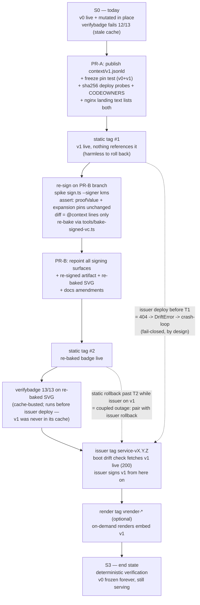

# fix: Context v0 -> v1 bump + re-sign — make 1EdTech verification deterministic

## Summary

Publish the full Andamio vocabulary at a never-before-seen URL (`context/v1.jsonld`, bytes identical to the current post-mutation v0), freeze v0 byte-for-byte with a CI sha256 pin, repoint every signing surface at v1, and re-sign + re-bake the one signed badge so verifybadge.org (1EdTech) verifies it deterministically instead of by cache luck. Delivered as two PRs and three ordered tag deploys (plus an optional render tag) — the repo's fail-closed drift gates make the origin doc's single-PR shape impossible (see Assumptions).

---

## Problem Frame

`context/v0.jsonld` was mutated in place on 2026-07-21 (PR #59 added `courseOwner` and the flat evidence terms `network`/`policyId`/`asset`/`claimTxHash`) while served `Cache-Control: public, max-age=86400, immutable`. verifybadge.org's JSON-LD document cache is effectively unbounded — ~38h later it still holds the pre-mutation copy, canonicalizes the badge credential with those five terms silently dropped, computes a different hash than the signature covers, and fails 12/13 on a correctly signed badge (report 82863657, 2026-07-23). Spruce, which fetches contexts live, verifies the same credential clean; the served SVG is byte-identical to the repo copy, so no stale-artifact explanation exists.

The repo's own convention record (`docs/solutions/conventions/never-mutate-published-jsonld-context.md`) prescribes exactly this remediation: a fresh version URL is a guaranteed cache miss for every verifier, so verification becomes deterministic again. The record's closing claim that the earlier incident "self-healed once the cache expired" is now disproven and must be amended. The caching policy was never the bug and does not change.

---

## Requirements

**Context publishing and freeze**

- R1. `/context/v1.jsonld` serves live with bytes identical to the current `context/v0.jsonld` (sha256 `1823b3d6fe67dc271b702e899f53db6cbd0a3171baa50cb1336706768ab6932d`, 3594 bytes), content type `application/ld+json`, `Cache-Control: public, max-age=86400, immutable`.
- R2. `/context/v0.jsonld` keeps serving 200 with byte-identical content forever. CI fails any PR that changes the bytes of v0 or (once published) v1.

**Signing surfaces**

- R3. All signing and credential-emitting surfaces reference v1: issuer service constants and baked context, spike signer path, badge generator, and the hosted `/issuer` profile `@context`. After the issuer service deploy, no production surface emits a v0-referencing credential.
- R4. The flagship badge (`badges/ae192632aabe00ed2042eaef596bc15f3887fa32e75e8f9b8fa516df.e9b5343186f83ed804a9fd87293a7378e3b237743b76d56da73b111d855631db.svg`) is re-signed against v1 via the hardened KMS path and re-baked; `spike/signer-spike/signed-credential.json` and the SVG update in the same commit (expansion-pin same-commit rule). Because v1 bytes equal v0 bytes, the canonical N-Quads, both expansion-pin hashes, and the `proofValue` must be unchanged — the artifact diff is exactly the `@context` URL lines. A changed `proofValue` is a stop-the-line failure, not a pin update.

**Verification**

- R5. Loopback (`@digitalbazaar/vc`) and spruce verify the re-signed credential clean while resolving `context/v1.jsonld` live.
- R6. verifybadge.org passes 13/13 on the re-baked SVG downloaded from production (cache-busted fetch — `/badges/` serves `max-age=86400`).
- R7. Deploy probes assert served bytes, not just reachability: static post-deploy verify asserts sha256 of both v0 and v1; the issuer post-deploy credential probe asserts the signed credential's `@context` includes the v1 URL.
- R8. CI is green including the new freeze guard, with a negative "guard bites" case proving the pin actually fails on mutation.

**Untouched surfaces**

- R9. `.well-known/did.json`, the KMS key (`#key-2026-07`), `status/key-epoch-2026-07.json`, `credentialStatus` URLs, and the ~58 existing unsigned badge SVGs are byte-unchanged. The status list is explicitly excluded from the freeze pin (mutable by design — the Rung 8.6 kill-switch flips it during an emergency).

**Documentation**

- R10. The convention record is amended: the "self-healed" claim replaced with the observed behavior (verifier document caches are unbounded; the only deterministic remedy after an in-place mutation is a version bump + re-sign), and its related claims reconciled. `DEPLOY.md` documents the new static-rollback coupling rule.

---

## Assumptions

Un-validated bets made while planning unattended; each deviates from or extends the origin handoff and is cheap to redirect before implementation starts.

- **Two PRs, three tags — not the origin's "one PR + tag deploy."** The issuer CI job boots the real container, whose startup drift check treats a 4xx on `ANDAMIO_CONTEXT_URL` as refuse-to-boot (tested behavior, no fallback), so a PR that repoints to v1 before v1 is live fails its own CI. The spike re-sign path likewise throws on any non-200 for the live context, so the re-signed artifact cannot even be produced while v1 404s. Weakening either fail-closed gate for a one-time event was rejected. Sequence: PR-A publishes v1 → static tag #1 → re-sign locally → PR-B repoints + re-signed artifacts → static tag #2 → issuer service tag.
- **Render service deploy is in scope (fourth tag, `vrender-*`).** `generator/gen.py` also feeds the on-demand render service; without a render deploy, on-demand-rendered badges keep embedding v0 in their unsigned presentation JSON indefinitely. Impact is cosmetic (no signature involved), so this tag can trail the others without risk — de-scope it if a fourth deploy is unwanted.
- **The ~58 existing unsigned badge SVGs stay as-is.** They embed v0-referencing unsigned JSON (twice each) but carry no proof, so nothing can fail verification; regeneration would churn 58 files for zero verification benefit. The generator repoint fixes all future output.
- **Status list is not added to the freeze pin**, despite the convention doc suggesting `/status/*` immutability is analogous — byte-pinning it would make the key-compromise kill-switch a CI-red event mid-emergency.
- **Doc prose updates are limited to statements describing the current signing context** (`README.md`, `MOC.md`, `CONTRIBUTING.md`, `DEPLOY.md`, `ROADMAP.md` line-level mentions); historical statements in dated plans, spike transcripts, and the rung-1 throwaway spike code stay untouched.
- **Empirical preflight before re-signing:** confirm what is actually live (served v0 bytes, the signed SVG's current `@context`) rather than trusting the incident narrative — the handoff's quoted v0 sha256 prefix (`ec1cbb…`) did not match the computed hash (`1823b3d6…`), which is exactly the class of premise drift the preflight catches.

---

## Key Technical Decisions

- **Version bump, not cache change.** The URL is the cache key; a never-before-seen URL is a guaranteed cache miss for every verifier. `max-age=86400, immutable` on `/context/*` stays — the convention record explicitly endorses it. The nginx `.jsonld` regex location and whole-directory `COPY context/` mean v1 inherits correct headers, content type, image bake, and allowlist with zero infra edits.
- **Freeze guard as a dep-free `tools/` pin test** (`tools/context-freeze.test.ts`), mirroring the established `did-pin.test.ts` invariant pattern — picked up automatically by the existing did-pin CI job glob and `tools/` `npm test`. Pins v0 and v1 to the same sha256 with a comment explaining why the status list is excluded.
- **Close the repo-vs-served gap in the deploy probe.** The freeze test proves repo bytes; a manual deploy of a stale image or a tag cut from a red branch would still serve wrong bytes. Upgrading the static post-deploy verify from content-type asserts to sha256 asserts (v0 + v1) closes the loop on every future deploy.
- **Hard determinism assertions on the re-sign.** `created` derives from the claim-tx block time (same value either way), `@context` URLs emit no canonical triples, and v1 bytes equal v0 bytes — so unchanged expansion-pin hashes and byte-identical `proofValue` are requirements, not hopes. Any drift means the pipeline changed in a way this exercise exists to prevent.
- **Deploy ordering is fail-closed by construction.** The issuer's boot drift check makes deploying the issuer before v1 is live an automatic crash-loop, so the static tag must land first; the same mechanism makes the reverse (issuer-only rollback) safe.
- **Rollback coupling documented as a rule.** After static tag #2, rolling the static host back past it while the issuer runs the v1 build is a coupled outage (running instances sign credentials referencing a 404 URL; new instances refuse to boot). Static rollback past tag #2 requires simultaneous issuer rollback; static tag #1 is the safe rollback floor.

---

## High-Level Technical Design

Between static tag #2 and the issuer tag, the live issuer still signs v0-referencing credentials — those continue to verify against frozen v0 everywhere except verifybadge's stale cache, which is the status quo. The 13/13 acceptance therefore runs against the re-baked SVG, not the issuer endpoint.

---

## Implementation Units

### Phase A — publish v1 (PR-A, then static tag #1)

### U1. Publish context/v1.jsonld and list it

- **Goal:** v1 exists in the repo as a byte-copy of current v0 and is discoverable.
- **Requirements:** R1
- **Dependencies:** none
- **Files:** `context/v1.jsonld` (new, byte-copy of `context/v0.jsonld`); `nginx/default.conf.template` (landing-page text near line 179 — list both v0 and v1); `.github/CODEOWNERS` (add a v1 line beside the v0 gate).
- **Approach:** Literal byte copy — no reformatting, no trailing-newline drift. No Dockerfile, allowlist, or nginx location edits are needed (whole-directory copy + `.jsonld` regex location already cover v1); verify rather than re-add.
- **Test scenarios:**
  - Happy path: `context/v1.jsonld` sha256 equals `1823b3d6…` (covered by the U2 freeze test).
  - Integration: CI docker-build smoke asserts `/context/v1.jsonld` serves `application/ld+json` (added in U3).
- **Verification:** repo v1 bytes identical to v0; nginx landing text names both files; CODEOWNERS diff shows v1 gated.

### U2. Freeze guard for v0 and v1

- **Goal:** Any PR that mutates a published context version fails CI — the convention record becomes an enforced invariant.
- **Requirements:** R2, R8
- **Dependencies:** U1
- **Files:** `tools/context-freeze.test.ts` (new, dep-free).
- **Approach:** Pin both files to sha256 `1823b3d6…` following the `tools/did-pin.test.ts` invariant-pin pattern (picked up by the existing did-pin CI job glob — no workflow edit). Include a comment stating the status list is deliberately excluded (kill-switch mutability) so a future "pin everything" PR doesn't re-add it. New context versions get appended to the pin set in the same PR that publishes them.
- **Patterns to follow:** `tools/did-pin.test.ts` (pin + "guard bites" negative case), `tools/` dependency-free policy.
- **Test scenarios:**
  - Happy path: both files hash to the pinned value.
  - Guard bites: a tampered byte stream (in-memory, not on disk) produces a hash mismatch and the assertion fires.
  - Error path: a missing file fails loudly (readFileSync throw), not as a skip.
- **Verification:** `npm test` in `tools/` passes; deliberately flipping a byte locally makes it fail.

### U3. Deploy and CI probes know about v1 — and assert bytes

- **Goal:** Every future static deploy proves the served context bytes match the pins; CI smoke covers v1.
- **Requirements:** R1, R2, R7
- **Dependencies:** U1
- **Files:** `.github/workflows/ci.yml` (docker-build smoke: add v1 content-type assert beside v0); `.github/workflows/deploy.yml` (post-deploy verify: add v1, upgrade both context asserts from content-type-only to sha256-of-body equals pin).
- **Approach:** Keep the v0 probes (frozen v0 must keep serving forever) and add v1. The sha256 upgrade closes the repo-vs-served gap the freeze test cannot see (stale image, LB misroute, tag cut from a red branch). The root `Dockerfile` HEALTHCHECK and nginx-fallback poll stay on v0 — valid forever.
- **Test scenarios:** Test expectation: none — CI/deploy workflow config; proven by the tag #1 deploy run itself.
- **Verification:** static tag #1 deploy goes green with the new asserts; `/context/v1.jsonld` live with correct bytes, headers, content type; `/context/v0.jsonld` byte-identical to before.

### Phase B — repoint + re-sign (PR-B after static tag #1, then static tag #2 → issuer tag)

### U4. Repoint the issuer service to v1

- **Goal:** The live issuer signs v1-referencing credentials and drift-checks against v1.
- **Requirements:** R3, R7
- **Dependencies:** U1 deployed (static tag #1) — the repointed container refuses to boot in CI otherwise.
- **Files:** `issuer-service/src/config.ts` (`ANDAMIO_CONTEXT_URL`); `issuer-service/src/map-credential.ts` (`PRODUCTION_CONTEXTS`); `issuer-service/src/document-loader.ts` (`REPO_CONTEXT_FILE` → `context/v1.jsonld`); `issuer-service/Dockerfile` (COPY v1); `issuer-service/test/server.test.ts` (served `@context` assertion); `issuer-service/test/drift-check.test.ts` (`CTX_URL` fixture key); `.github/workflows/deploy-issuer.yml` (credential probe: add `@context` contains v1 assertion beside the existing cryptosuite + verificationMethod checks).
- **Approach:** Constants move together — loader URL, loader file, and `PRODUCTION_CONTEXTS` must agree or the drift check fails by design. Decide in-diff whether the image keeps a v0 copy too; nothing in the issuer needs v0 once repointed, so v1-only is the clean default.
- **Test scenarios:**
  - Happy path: served credential's `@context` array is exactly `[credentials/v2, ob3, v1]`.
  - Error path: drift-check test still refuses on live-vs-bundled mismatch and on 404 — now keyed on the v1 URL.
  - Integration: CI issuer container smoke boots clean (proves v1 resolves live — this is the assertion that forced the PR split).
- **Verification:** issuer CI job green; after the service tag, the deploy probe's new `@context` assertion passes.

### U5. Repoint the spike signer path to v1

- **Goal:** The hardened re-sign path (the tool that produces the artifact in U7) signs and loopback-verifies against v1.
- **Requirements:** R3, R4
- **Dependencies:** U1 deployed (static tag #1) — the spike loader throws on non-200 for the live context.
- **Files:** `spike/signer-spike/map-credential.ts` (`PRODUCTION` contexts); `spike/signer-spike/document-loader.ts` (`REPO_CONTEXT_FILE`, `ANDAMIO_CONTEXT_URL`); `spike/signer-spike/document-loader.test.ts`; `spike/signer-spike/expansion-pin.dep-test.ts` (loader override mapping moves to v1; pinned hashes stay).
- **Approach:** The `CONTEXT_AHEAD_OF_LIVE_OK` additive-superset escape hatch existed only to enable the in-place mutation this plan retires; leave it but note it should never fire again under version-URL discipline. Expansion-pin hashes are expected byte-stable (context URLs emit no triples) — do not touch the pins.
- **Test scenarios:**
  - Happy path: hermetic loader tests pass with the v1 mapping.
  - Determinism: expansion-pin dep-test passes with **unchanged** pinned hashes after U7's re-sign.
- **Verification:** signer-spike hermetic CI job and `test:expansion-pin` both green with no pin edits.

### U6. Repoint generator and issuer profile

- **Goal:** Future generated badges and the hosted `/issuer` profile reference v1.
- **Requirements:** R3
- **Dependencies:** U1
- **Files:** `generator/gen.py` (`credential_json`, the embedded `@context`); `issuer/profile.jsonld` (third `@context` entry); `tools/issuer-profile.test.ts` (both constants — `SERVED_CONTEXT_URL` and `CONTEXT_PATH` — plus the term-shape assertions now read the v1 file).
- **Approach:** The profile is the documented mutable exception, so an in-place edit is legitimate; it must reference a context defining `AttestationHost`, which v1 does identically.
- **Test scenarios:**
  - Happy path: profile test asserts the exact three-entry `@context` ending in v1, and `AttestationHost` term shape resolves from the v1 file.
  - Regression: generated badge JSON (a fresh `gen.py` run) embeds v1, not v0.
- **Verification:** `tools/` tests green; a locally generated badge SVG contains no v0 URL.

### U7. Re-sign and re-bake the flagship badge

- **Goal:** The one signed badge verifies deterministically at every verifier, resolving v1.
- **Requirements:** R4, R5, R6
- **Dependencies:** U5 (spike path on v1), static tag #1 live.
- **Files:** `spike/signer-spike/signed-credential.json`; `badges/ae192632aabe00ed2042eaef596bc15f3887fa32e75e8f9b8fa516df.e9b5343186f83ed804a9fd87293a7378e3b237743b76d56da73b111d855631db.svg` — same commit.
- **Approach:** Preflight first (verify live v0 bytes and the SVG's current embedded `@context` match the incident narrative). Then the hardened path: anchor gate → single KMS call (`did:web:credentials.andamio.io#key-2026-07`) → atomic write; re-bake with `tools/bake-signed-vc.ts` (byte-transparent CDATA embed, round-trip self-check).
- **Execution note:** Treat determinism as the acceptance gate: the diff of `signed-credential.json` and of the SVG's extracted VC must be exactly the `@context` URL change; `proofValue` byte-identical; expansion-pin hashes unchanged. Any other drift: stop, diagnose, do not commit.
- **Test scenarios:**
  - Happy path: loopback verification passes resolving v1 (committed-bytes/loader-override mode pre-deploy; live mode after static tag #2).
  - Determinism: `bake-signed-vc.ts extract` of the new SVG is byte-identical to the new `signed-credential.json`; expansion-pin dep-test green with old pins.
  - Error path: signing with the anchor gate failing, or against a non-200 context, aborts without output (existing hardened behavior — confirm it still bites on the v1 URL).
- **Verification:** spruce verifies clean; after static tag #2, verifybadge.org 13/13 on the SVG fetched from production with a cache-buster (R6 — the point of the exercise).

### U8. Documentation amendments

- **Goal:** The institutional record matches observed reality and the new operational constraint is written down.
- **Requirements:** R10
- **Dependencies:** none (ships in PR-B)
- **Files:** `docs/solutions/conventions/never-mutate-published-jsonld-context.md` (replace the "self-healed once the cache expired" sentence with the observed unbounded-document-cache behavior and the version-bump + re-sign remedy; promote the "unbounded for app-level document caches" parenthetical at line ~39 to the primary mechanism; correct the line ~61 claim — credentials signed against post-mutation v0 bytes never converge for verifiers holding pre-mutation v0; link this incident, report 82863657); `DEPLOY.md` (rollback section ~line 130: static-rollback coupling rule, static tag #1 as safe floor; line 131 deliverable mention); `MOC.md` (line 10: drop the now-false "edits propagate in ≤24h… harmless" claim, describe v0 frozen + v1 current); `README.md` (lines 41-42, 112: v1 as current, v0 frozen); `CONTRIBUTING.md` (line 49: remove the "only fix typos" allowance — published versions never change at all); `ROADMAP.md` (line 32 historical mention may stay).
- **Approach:** Amend statements describing current state; leave genuinely historical statements alone.
- **Test scenarios:** Test expectation: none — documentation-only.
- **Verification:** convention record contains no "self-healed" claim; DEPLOY.md states the coupling rule; no doc describes v0 as the current signing context.

---

## Scope Boundaries

**Untouched (verify no drift, R9):** `.well-known/did.json` and the DID key material; KMS key and version; `status/key-epoch-2026-07.json` (its `@context` is `credentials/v2` only — no re-sign, no freeze pin); `credentialStatus` URLs; the ~58 unsigned badge SVGs; nginx cache headers; historical spike code (`spike/src/`, `spike/verifier-spike/`), transcripts, and dated plan docs.

**Out of scope:** walt-id verifier support (deferred post-1.1 per the verifier-gate decision); regenerating the existing unsigned badges; any change to the fail-closed drift gates or the `CONTEXT_AHEAD_OF_LIVE_OK` escape hatch beyond commentary.

### Deferred to Follow-Up Work

- Compound records for two undocumented areas surfaced during research: the issuer deploy-probe lessons (PRs #62/#63) and the KMS re-sign path itself — both strong `/compound` candidates after this ships.
- Re-running the v1.1 verifier gate (spruce + 1EdTech + loopback) — blocked on this plan landing; recorded in orch memory.

---

## Risks & Dependencies

- **KMS access at re-sign time (U7).** The spike signs via `gcloud` CLI; the session needs authenticated access to project `andamio-credentials`. Single external dependency on the critical path.
- **verifybadge.org behavior is third-party.** The deterministic argument (v1 never in its cache) is strong but the 13/13 outcome is only provable empirically at R6 time. If it still fails, the failure is a *new* diagnosis, not this plan's known one — stop and investigate before touching anything else.
- **Mid-window issuer output (between static tag #2 and the service tag).** Live issuer still signs v0-referencing credentials; these verify everywhere except verifybadge's stale cache — status quo, acceptable for a short window. Don't run the verifier gate mid-window.
- **Rollback:** pre-deploy, plain revert. Post static tag #1: harmless (v1 unreferenced). Post static tag #2 / service tag: issuer-only rollback is safe (old build drift-checks v0, still serving); static rollback past tag #2 must be paired with issuer rollback (see KTDs); redeploying prior tags restores the exact prior state — no key, DID, or status-list surface moves in either direction.

---

## Sources & Research

- Origin handoff: andamio orch repo, `docs/plans/2026-07-23-cb-context-v1-bump-and-resign.md` (diagnosis 2026-07-23; verifybadge report 82863657).
- Convention record: `docs/solutions/conventions/never-mutate-published-jsonld-context.md` — prescribes this remediation; amended by U8.
- Fail-closed gates that force the PR split: `issuer-service/src/drift-check.ts` (4xx → DriftError, no fallback; tested in `issuer-service/test/drift-check.test.ts`), `spike/signer-spike/document-loader.ts` (throws on non-200 live fetch).
- Invariant-pin pattern: `tools/did-pin.test.ts`; expansion pin: `spike/signer-spike/expansion-pin.dep-test.ts` (header rule: pins change only with a legitimate re-sign — this re-sign legitimately changes nothing).
- Bake/extract round-trip: `tools/bake-signed-vc.ts`; re-sign determinism: `spike/signer-spike/resign-check.ts`, `spike/signer-spike/sign.ts` (`created` pinned to claim-tx block time).
- Serving/infra: `nginx/default.conf.template` (`.jsonld` regex location, headers), root `Dockerfile` (whole-directory `COPY context/`), `scripts/ci/check-allowlist.sh` (context dir already allowed).
