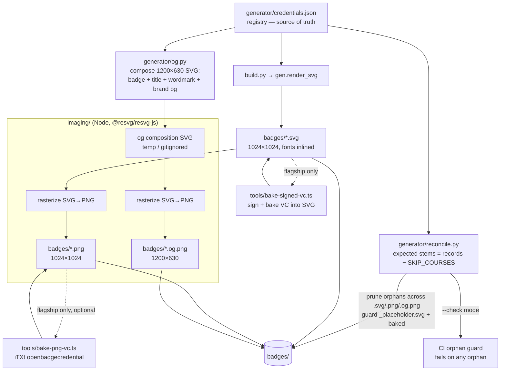

# feat: v1.2 PNG + Open Graph card pipeline (build-time) + self-pruning generator

## Summary

Add a **build-time, registry-driven image pipeline** to the badge generator that emits, per credential, a rasterized **download PNG** (badge SVG → PNG at native 1024×1024) and a **1200×630 Open Graph card** (badge art + credential title + issuer wordmark on a brand background) for social unfurls. Optionally **bake the signed VC into the PNG** (OB 3.0 §5.3.1 iTXt chunk, keyword `openbadgecredential`) for the one signed Flagship Badge, mirroring the byte-transparent SVG bake.

Because v1.2 multiplies the number of generated artifact types living under `badges/`, this issue also **resolves #31**: make the generator **self-pruning across all artifact types** (reconcile every generated artifact against `credentials.json`, delete orphans, guard `_placeholder.svg` and baked badges) and add a **CI orphan guard**. Per the issue, the new artifact types must not ship before self-pruning lands.

No new runtime service. Everything runs at build time (`make pngs` / `make og-cards`), is committed alongside the SVGs, and is served by the existing static nginx host.

---

## Problem Frame

Two drivers, one issue:

1. **Presentation gap (v1.2 Track A).** Badge display/share pages (#70), share actions (#71), and web-component embeds (#74) all need raster assets the current pipeline does not produce: a downloadable PNG and a 1200×630 OG card for social unfurls. Social crawlers do not run JS and expect a raster `og:image` at an absolute HTTPS URL — the SVG alone will not unfurl. This resolves **#11 open decision 2** (PNG raster fallback): the answer is *yes*, and this issue pins the sizes and has the generator emit PNG + card alongside SVG.

2. **Orphan surface (generalized #31).** `generator/build.py` is additive-only — it writes one SVG per record and never prunes. A credential dropped from `credentials.json` leaves its artifacts served **forever** on the immutable public host; the served-file allowlist is structurally blind to files *inside* `badges/`. This already recurred once (the shield-orphan incident, #29). v1.2 adds three more generated artifact types under `badges/`, multiplying the orphan surface. Self-pruning across all artifact types + a CI guard is a hard prerequisite for shipping any of them.

**Scope of THIS issue:** the image pipeline (PNG + OG card) and self-pruning. The badge display page (#70), share actions (#71), explainers (#72), holder viewer (#73), and web component (#74) are downstream and out of scope — this issue produces the raster substrate they consume.

---

## Requirements

Traced from issue #69 and its reconciliation notes:

- **R1** — `make pngs` produces one download PNG per non-skipped registry badge, rasterized from the badge SVG, fonts rendered correctly.
- **R2** — `make og-cards` produces one 1200×630 Open Graph card per non-skipped registry badge: badge art + credential title + issuer wordmark on a brand background.
- **R3** — The renderer is deterministic, offline, and correct on the SVGs' embedded/custom fonts (no Chromium, no system-font dependency). resvg / resvg-js is the recommended renderer; spot-check 2–3 real badge SVGs before committing.
- **R4** — The generator is **self-pruning across ALL artifact types**: reconcile every generated artifact under `badges/` against `credentials.json`, delete orphans, guard `_placeholder.svg` (and never mis-delete baked badges). Resolves #31.
- **R5** — A CI guard fails on any orphan artifact (any `badges/` file with no matching, non-skipped `credentials.json` record) — for SVG, PNG, and OG card alike.
- **R6** — Dropping a credential from `credentials.json` prunes **all** of its artifacts (svg, png, og.png); CI fails if any orphan remains.
- **R7** — Existing `.svg` image URLs are byte-for-byte unaffected; the SVG byte-identity parity guarantee (`test_render_parity.py`) still holds. Credentials reference the image URL forever, so `.svg` URLs must not move.
- **R8** (optional) — PNG-baking: the downloadable PNG for a signed/baked badge carries the signed VC via an uncompressed iTXt chunk (keyword `openbadgecredential`), round-tripping byte-identical, mirroring `tools/bake-signed-vc.ts`. Read OB 3.0 §5.3.1 directly before implementing.
- **R9** — New content types are verified on the served host: nginx serves `.png` as `image/png` (not `application/octet-stream`); the docker smoke test asserts it.

---

## Key Technical Decisions

### KTD-1 — Rasterizer: `@resvg/resvg-js` in a new, isolated `imaging/` Node package
resvg is the issue's recommendation and fits the generator's stated ethos (deterministic, offline, no Chrome). This is the **first raster dependency in the repo** — isolate it in its own npm package (`imaging/`, mirroring `issuer-service/`'s structure and the `type: module` + `--experimental-strip-types` Node 24 convention), **not** in `generator/` (which is deliberately stdlib-only, no pip install) and **not** in `tools/` (deliberately dependency-free). This keeps the hermetic `generator-tests` CI job untouched and gives the raster dep its own `npm ci` CI job, exactly as `issuer-service` does. resvg-js ships prebuilt native binaries; pin the exact version via `package-lock.json` for determinism.

### KTD-2 — Artifacts live under `badges/` with suffix naming; no new nginx prefix, no Dockerfile change
- Download PNG: `badges/{course_id}.{slt_hash}.png` (native 1024×1024).
- OG card: `badges/{course_id}.{slt_hash}.og.png` (1200×630).

`badges/` is already allowlisted and `COPY`'d into the image wholesale, and the `location ^~ /badges/` prefix already serves `.png` from disk (png resolves from stock `mime.types`). So PNGs/OG cards need **no** Dockerfile or allowlist edit and **no** new nginx location for the happy path. The `.svg` URLs are untouched (R7). (`course_id` is the on-chain course policy id — issue #11's "policy_id"; the code and registry field is `course_id`, 56 hex chars; `slt_hash` is 64 hex chars.)

### KTD-3 — Self-pruning reconciler in Python, modeled on `scripts/cache-admin.py reconcile`
Add `generator/reconcile.py` whose source of truth is `credentials.json` (offline, deterministic) minus `SKIP_COURSES` (imported from `build.py`, the existing single source of truth). It computes the expected **stem** set (`{course_id}.{slt_hash}`) and, for each file in `badges/`, deletes it iff its stem (after stripping a known suffix: `.svg`, `.png`, `.og.png`) is not an expected stem. Carry over cache-admin's safety rails verbatim: (1) a **protected set never deleted** — `_placeholder.svg` and any `_`-prefixed file; (2) **strict key match** — a file whose name doesn't parse to `<56-hex>.<64-hex>.<known-suffix>` is skipped, never deleted; (3) prune only what the registry proves orphaned. Baked badges are never at risk because they match a real record. `reconcile.py` exposes both a prune mode (used by `make`) and a `--check` mode (used by CI, exits non-zero on any orphan, deletes nothing).

### KTD-4 — OG card composition SVG built in Python (`generator/og.py`), rasterized by `imaging/`
The 1200×630 composition (scaled badge + title + issuer wordmark + palette-derived brand background) is authored as an **SVG in Python**, reusing `colors.palette_for` and the inlined `fonts.css` so palette and font determinism stay in one place and inside the existing byte-parity discipline. The Node `imaging/` layer only rasterizes SVG→PNG. Composition SVGs are build intermediates (temp dir, gitignored) — only the `.og.png` is committed. Titles are sanitized to the embedded glyph subset the same way `render.py:sanitize_title` does (the woff2 subset is bounded to printable ASCII + a few punctuation glyphs).

### KTD-5 — Rasterize from the (possibly baked) committed SVG; bake sequence preserved
The PNG is rasterized from the committed SVG. Baking only affects the `<openbadges:credential>` element, not the visual, so rasterizing from a baked SVG yields the correct image. For the Flagship Badge the lifecycle order is: **bake SVG → rasterize PNG from the baked SVG → (optional) bake VC into PNG iTXt → commit together**. Regenerating a badge un-bakes it (per CONCEPTS *Baking*); treat any flagship regeneration as re-opening the signed-badge lifecycle. PNG-baking (R8) is optional and flagship-scoped; unsigned badges' PNGs are labelled "for display; the SVG is the verifiable credential" by the consumer (#71).

### KTD-6 — PNG CI parity = existence + count + dimensions, not byte-identity (pending spot-check)
Cross-platform raster output (fonts, libc) may not be byte-deterministic across CI runners, whereas the SVG byte-identity guarantee is exact and stays the guarantor of visual correctness (R7). So the PNG/OG CI check asserts, per non-skipped record: the artifact exists, the count matches, and dimensions are correct (1024×1024 / 1200×630) — **and this limit is stated explicitly in the check output, not silent**. During U2's spot-check, if `@resvg/resvg-js` proves byte-deterministic on the CI runner (pinned version), upgrade to byte-identity parity with a **baked-artifact carve-out** (a baked PNG's iTXt VC chunk normalized out of both sides, exactly as `test_render_parity.py` does for the SVG credential block).

### KTD-7 — `@render` fallback stays SVG-only; PNG/OG misses return a clean 404
The `location ^~ /badges/` block falls a disk miss through to `@render`, which proxies to the on-demand **SVG** render service (`service/app.py`, `BADGE_RE` matches `.svg` only). A `.png` miss would proxy to a service that cannot serve it. Since PNGs/OG cards are committed and pruned to match the registry, a miss should not occur for a valid badge — but scope the fallback to `.svg` so a `.png`/`.og.png` miss returns a clean 404 instead of a confusing proxy error. Keep the existing `.svg` fallback behavior byte-identical (the CI fallback test must still pass).

### KTD-8 — Font fidelity: verify resvg honors base64 `@font-face`, else pass font buffers
Several SVG rasterizers ignore CSS `@font-face` or require system-installed fonts, silently falling back to a default font and producing wrong-looking PNGs. Spot-check `@resvg/resvg-js` against a known badge first. If it does not honor the inlined `data:font/woff2;base64` `@font-face`, load the font buffers explicitly via resvg-js's `font.fontBuffers` option (from the same subset `embed_fonts.py` produces). Glyph fidelity against a real badge is the acceptance gate, not "a PNG was produced."

---

## High-Level Technical Design

The pipeline extends the existing offline generator with a raster stage and a reconcile stage. Python owns all vector authoring + the registry-driven reconcile (deterministic, byte-parity-guarded); the new Node `imaging/` package owns only rasterization.



*Directional guidance for reviewers, not implementation specification.*

**Make orchestration (dependency order):**
`make badges` (svg) → *(flagship: sign + bake)* → `make pngs` (svg→png) → *(flagship: bake png, optional)* → `make og-cards` (compose + rasterize) → `make reconcile` (prune). CI runs `reconcile --check` and the raster existence/dimension checks.

---

## Output Structure

```
imaging/                      # NEW — Node raster package (isolated dep)
  package.json                #   @resvg/resvg-js pinned; type: module
  package-lock.json
  tsconfig.json
  rasterize.ts                #   SVG file → PNG at a target size (font-fidelity aware)
  compose-og.ts               #   drive og.py composition → rasterize → badges/*.og.png
  rasterize.test.ts           #   dimensions, font-fidelity spot-check assertions
generator/
  reconcile.py                # NEW — registry-driven self-pruner (prune + --check)
  og.py                       # NEW — 1200×630 OG composition SVG (reuses colors + fonts)
  build.py                    # MODIFIED — call reconcile after writing svgs
  tests/
    test_reconcile.py         # NEW — orphan/protected/skip/strict-key cases
    test_og.py                # NEW — composition SVG shape (size, title, wordmark)
tools/
  bake-png-vc.ts              # NEW (optional, R8) — iTXt bake, dependency-free
  bake-png-vc.test.ts         # NEW (optional) — round-trip, refuse-unsigned, single-chunk
scripts/ci/
  check-orphans.sh            # NEW — thin wrapper calling reconcile.py --check
Makefile                      # MODIFIED — pngs, og-cards, reconcile targets + help
.github/workflows/ci.yml      # MODIFIED — orphan-guard job, imaging job, png smoke assert
nginx/default.conf.template   # MODIFIED — scope @render fallback to .svg (KTD-7)
generator/README.md           # MODIFIED — document the new artifact types + pipeline
.gitignore                    # MODIFIED — ignore og composition temp dir
```

---

## Implementation Units

### U1. Self-pruning reconciler + CI orphan guard (resolves #31)

**Goal:** Make the generator self-pruning across all artifact types and add a CI guard that fails on any orphan. This lands **first** — the new artifact types (U2–U4) must not ship before it (issue reconciliation).

**Requirements:** R4, R5, R6, R7.

**Dependencies:** none.

**Files:**
- `generator/reconcile.py` (new)
- `generator/build.py` (modify — invoke reconcile after writing SVGs)
- `generator/tests/test_reconcile.py` (new)
- `scripts/ci/check-orphans.sh` (new)
- `.github/workflows/ci.yml` (modify — add `orphan-guard` job)
- `Makefile` (modify — add `reconcile` target + help line)

**Approach:**
- `reconcile.py` imports `SKIP_COURSES` from `build.py` and loads `credentials.json`. Compute `expected_stems = {f"{r['course_id']}.{r['slt_hash']}" for r in records if r['course_id'] not in SKIP_COURSES}`.
- Define `KNOWN_SUFFIXES = (".og.png", ".png", ".svg")` (longest-first so `.og.png` matches before `.png`). For each entry in `badges/`: skip protected (`_placeholder.svg`, any `_`-prefixed name); parse `stem` + `suffix`; if suffix unknown OR stem doesn't match `^[0-9a-f]{56}\.[0-9a-f]{64}$`, **skip** (never delete a file we don't understand); if stem not in `expected_stems`, it's an orphan.
- Two modes: prune (delete orphans, print a summary of what was removed) and `--check` (print orphans, exit 1 if any, delete nothing).
- Wire `build.py main()` to call the prune after writing SVGs, so `make badges` reconciles the tree. `make reconcile` runs it standalone.
- `check-orphans.sh` is a thin wrapper: `python3 generator/reconcile.py --check`.

**Patterns to follow:** `scripts/cache-admin.py`'s `reconcile` (protected-set + strict-key-match discipline); `service/app.py` `BADGE_RE` for the hex shape; `build.py`'s `SKIP_COURSES` import pattern.

**Test scenarios (`test_reconcile.py`, stdlib-only, runnable directly):**
- Happy path: a `badges/` fixture dir containing exactly the expected `.svg`/`.png`/`.og.png` for a couple of records → prune deletes nothing; `--check` exits 0.
- Orphan SVG: a `.svg` whose stem is not in the registry → prune deletes it; `--check` exits 1 and names it.
- Orphan across types: a stem present as `.svg` + `.png` + `.og.png` but dropped from the registry → all three pruned (R6).
- Protected guard: `_placeholder.svg` and an `_other.svg` are never deleted even though no record matches.
- Skipped course: a file for a `SKIP_COURSES` course is treated as an orphan (matches `build.py`'s filter) — deleted / flagged.
- Strict-key safety: a malformed name (`notes.txt`, `abc.png`, a `.svg` with a 40-hex stem) is skipped, never deleted.
- Baked badge safety: a `.svg` containing `proofValue` whose stem IS in the registry is kept (baked badges are never orphans).
- `--check` is read-only: after `--check` on a dir with orphans, the orphan files still exist on disk.
- `Covers R6.` Registry drop → prune removes every artifact type for that stem.

**Verification:** `make badges` on a clean tree is a no-op prune; deleting a record from `credentials.json` and running `make badges` removes all of that credential's artifacts; the CI `orphan-guard` job fails when an orphan is committed and passes otherwise; `_placeholder.svg` survives every run.

---

### U2. `imaging/` package + SVG → PNG rasterization (`make pngs`)

**Goal:** Rasterize each non-skipped badge SVG to a native-ratio 1024×1024 PNG, with correct font rendering, via a new isolated Node package.

**Requirements:** R1, R3, R7, KTD-8.

**Dependencies:** U1 (the `.png` artifact type must be prunable/guarded before it ships).

**Files:**
- `imaging/package.json`, `imaging/package-lock.json`, `imaging/tsconfig.json` (new)
- `imaging/rasterize.ts` (new)
- `imaging/rasterize.test.ts` (new)
- `generator/reconcile.py` (modify — `.png` already in `KNOWN_SUFFIXES`; confirm)
- `Makefile` (modify — `pngs` target + help)
- `.gitignore` (modify if any temp output)

**Approach:**
- `imaging/` mirrors `issuer-service/` conventions: `type: module`, Node ≥ 24, `@resvg/resvg-js` pinned, run via `node --experimental-strip-types`.
- `rasterize.ts` reads a badge SVG, renders to PNG at a fixed pixel size (1024), writes `badges/{stem}.png`. **Spot-check first** (KTD-8): render 2–3 real badges (including a text-heavy title and the flagship) and visually confirm Archivo/Spline glyphs render. If `@font-face` base64 is ignored, load `font.fontBuffers` from the subset fonts and re-verify.
- `make pngs` iterates the non-skipped registry (drive from `credentials.json` so skipped courses are excluded) and rasterizes each committed SVG.

**Patterns to follow:** `issuer-service/` package layout + CI shape; `build.py`'s registry-iteration + `SKIP_COURSES` filter (mirror the record filter in the Node driver, or have Python emit the work-list).

**Test scenarios (`rasterize.test.ts`):**
- Happy path: rasterizing a known badge SVG produces a PNG whose header decodes to 1024×1024 and non-zero byte length.
- Font fidelity: assert the rasterizer path used to honor fonts is exercised (e.g., fontBuffers provided when required) — document the visual spot-check result in the PR (glyphs render, not tofu).
- Determinism probe: rasterize the same SVG twice → byte-identical output on this runner (records whether KTD-6 can upgrade to byte parity).
- Error path: a nonexistent input path fails loudly; a malformed SVG fails with a clear error, not a silent empty PNG.
- `Covers R1.` One PNG per non-skipped badge after `make pngs`.

**Verification:** `make pngs` writes exactly one `.png` per non-skipped record; spot-checked PNGs render with correct fonts; `reconcile --check` stays green (every PNG maps to a record).

**Execution note:** Spot-check the renderer's font handling on real badge SVGs **before** committing any PNGs (KTD-3/KTD-8 in the issue). Clear `generator/__pycache__` / set `PYTHONDONTWRITEBYTECODE=1` before any local build so stale bytecode can't ship wrong bytes.

---

### U3. Open Graph card composition + rasterization (`make og-cards`)

**Goal:** Produce one 1200×630 Open Graph card per non-skipped badge — badge art + credential title + issuer wordmark on a brand background — for social unfurls.

**Requirements:** R2, R3, R7.

**Dependencies:** U1 (`.og.png` prunable/guarded), U2 (`imaging/` rasterizer exists).

**Files:**
- `generator/og.py` (new — composition SVG author)
- `generator/tests/test_og.py` (new)
- `imaging/compose-og.ts` (new — drive composition → rasterize → `badges/*.og.png`)
- `Makefile` (modify — `og-cards` target + help)
- `.gitignore` (modify — ignore the og composition temp dir)

**Approach:**
- `og.py` builds a 1200×630 SVG: brand background derived from the badge's palette (`colors.palette_for(course_id)` + light-interior transform), the badge SVG placed and scaled on the left, credential title (`module_title`, sanitized to the glyph subset) and course title as supporting text on the right, and an "ANDAMIO" issuer wordmark. Reuse `gen.py`'s `FONT_FACE`, `esc`, and title-fitting helpers (`lay_title`/`fit_title`) so text fits and fonts stay embedded.
- Composition SVGs are written to a temp/intermediate dir (gitignored); `compose-og.ts` rasterizes each to `badges/{stem}.og.png` at 1200×630. Only the `.og.png` is committed.
- `make og-cards` drives the non-skipped registry.

**Patterns to follow:** `gen.py` (self-contained SVG authoring, palette-driven, fonts inlined); `render.py:sanitize_title` (map arbitrary titles into the embedded glyph subset).

**Test scenarios (`test_og.py`, stdlib-only):**
- Happy path: `og.py` emits a well-formed SVG with `viewBox="0 0 1200 630"` (or `width=1200 height=630`) for a sample record.
- Content presence: the composition SVG contains the sanitized module title, the course title, and the "ANDAMIO" wordmark.
- Long-title fit: a very long `module_title` is wrapped/shrunk to fit (no overflow past the text box) via the reused fit helpers.
- Palette coherence: the background/accent tokens come from `palette_for(course_id)` (same palette the badge uses) — assert the token values match the badge's palette.
- Glyph-subset safety: a title with a character outside the embedded subset is sanitized (no un-renderable glyph reaches the SVG).
- `Covers R2.` One 1200×630 card per non-skipped badge after `make og-cards`.

**Verification:** `make og-cards` writes one `.og.png` per non-skipped record at 1200×630; spot-checked cards show badge + title + wordmark with correct fonts and a coherent brand background; `reconcile --check` stays green.

---

### U4. (Optional, R8) Bake the signed VC into the PNG — iTXt `openbadgecredential`

**Goal:** For a signed/baked badge, embed the signed VC into its downloadable PNG via an uncompressed iTXt chunk (keyword `openbadgecredential`), round-tripping byte-identical — the PNG analog of the SVG bake. Optional and flagship-scoped; may land in a follow-up PR without blocking U1–U3.

**Requirements:** R8.

**Dependencies:** U2 (the PNG exists to bake into). Logically after the flagship SVG is baked (KTD-5).

**Files:**
- `tools/bake-png-vc.ts` (new — dependency-free, `node:zlib` `crc32` + `node:fs`)
- `tools/bake-png-vc.test.ts` (new)
- `tools/README.md` (modify — document the new dependency-free tool)

**Approach:**
- **Read OB 3.0 §5.3.1 directly before implementing** (iTXt chunk, keyword `openbadgecredential`, no compression). PNG = 8-byte signature + chunks; insert an uncompressed iTXt chunk carrying the signed VC JSON immediately before `IEND`, with a correct CRC-32 (`zlib.crc32`, available in Node 24).
- Mirror `tools/bake-signed-vc.ts`'s byte-transparency contract exactly: the signed VC is inserted byte-for-byte, never reparsed/reformatted; `extract(png)` returns the VC byte-identical; refuse to bake an unsigned credential (no `proof`); refuse rather than transform trust-critical bytes on any ambiguity.
- The signed VC source is the same bytes baked into the flagship SVG (`extractVc(svg)`). resvg does not write the chunk — this is a post-render step (KTD-5).

**Patterns to follow:** `tools/bake-signed-vc.ts` (locate/replace/round-trip discipline, refuse-unsigned, self-check the round-trip before writing); `tools/*.test.ts` (dependency-free `node --test`).

**Test scenarios (`bake-png-vc.test.ts`):**
- Round-trip: `extract(bake(png, vc)) === vc` byte-identical for a real signed VC.
- Single chunk: baking twice does not produce two `openbadgecredential` iTXt chunks; exactly one credential chunk exists (mirrors OB3's single-credential rule).
- Refuse unsigned: baking a credential with no `proof` throws.
- CRC correctness: the written iTXt chunk has a valid CRC-32 (a generic PNG reader accepts the file; `IHDR`/`IEND` intact, image still decodes to 1024×1024).
- Idempotent visual: the pixel data (`IDAT`) is untouched — only metadata added.
- `Covers R8.` The flagship PNG carries the signed VC and round-trips.

**Verification:** `node --experimental-strip-types tools/bake-png-vc.ts extract <flagship.png>` returns the signed VC byte-identical to `signed-credential.json`; the baked PNG still renders as a valid image.

---

### U5. Wire the pipeline into CI, Docker smoke test, and nginx; docs

**Goal:** Make the new artifacts and guards enforced in CI, verify the served content type on the public-host image, scope the `@render` fallback to SVG, and document the pipeline.

**Requirements:** R5, R7, R9, KTD-6, KTD-7.

**Dependencies:** U1, U2, U3 (U4 wiring folds in if U4 lands in the same PR).

**Files:**
- `.github/workflows/ci.yml` (modify — `imaging` job with `npm ci`; PNG/OG existence+dimension check; `.png` content-type smoke assertion; ensure `orphan-guard` from U1 is present)
- `nginx/default.conf.template` (modify — scope the `@render` fallback to `.svg`; KTD-7)
- `scripts/ci/test-nginx-fallback.sh` (verify still passes; adjust only if the fallback scoping requires it)
- `generator/README.md` (modify — document `make pngs`/`make og-cards`/`make reconcile`, the artifact types, and the self-pruning contract)
- `Makefile` (modify — help text reflects the full pipeline)

**Approach:**
- New `imaging` CI job mirrors `issuer-service`: `npm ci` in `imaging/`, run `rasterize.test.ts`, then a **regeneration check** — rasterize a scratch set (or all) and assert one PNG + one OG card per non-skipped record with correct dimensions; **print explicitly** that this is an existence/dimension check, not byte-identity (KTD-6). If U2's determinism probe showed byte-stability, upgrade to byte parity with the baked-artifact carve-out.
- Extend the `docker-build` smoke test: `assert_ct /badges/<a-real-stem>.png image/png` (and `.og.png`), proving nginx serves `image/png` on the public-host image (R9). Optionally assert sha256 of the served body against the checked-out bytes (static-lane convention since #64).
- nginx: scope the `@render` fallback so only `/badges/*.svg` misses proxy to the render service; `.png`/`.og.png` misses return a clean 404 (KTD-7). Keep the existing `.svg` fallback behavior byte-identical — the `test-nginx-fallback.sh` check must still pass.
- Docs: `generator/README.md` gains the new targets and the self-pruning contract; note that PNGs/OG cards are committed build output living inside the already-allowlisted `badges/` tree.

**Patterns to follow:** `ci.yml` `issuer-service` job (npm ci + tests + docker build/smoke); the existing `assert_ct` smoke helper; `check-allowlist.sh` (no change needed — `badges/` already allowlisted).

**Test scenarios:**
- CI orphan guard (from U1) runs on PRs and fails on a planted orphan of each type.
- `imaging` job: fresh `npm ci` + `rasterize.test.ts` pass; regeneration check asserts correct counts/dimensions and prints the parity-scope note.
- Docker smoke: `/badges/<stem>.png` returns `Content-Type: image/png`; `/badges/<stem>.og.png` returns `image/png`; `/badges/_placeholder.svg` still `image/svg+xml`.
- nginx fallback: a `.svg` miss still proxies to `@render` (existing test green); a `.png` miss returns 404 (new assertion).
- `Covers R7 / R9.` `.svg` content-type and fallback behavior unchanged; `.png` served as `image/png`.

**Verification:** All CI jobs green on a clean tree; planting an orphan (any type) turns `orphan-guard` red; the docker image serves `.png` as `image/png`; `test-nginx-fallback.sh` passes with the SVG-scoped fallback.

---

## Scope Boundaries

**In scope:** build-time PNG rasterization, 1200×630 OG card composition, optional flagship PNG-baking, self-pruning across all artifact types, CI orphan guard, CI/nginx/docs wiring for the new artifacts.

**Out of scope (separate v1.2 issues):**
- Badge display/share page + server-delivered OG tags (#70) — consumes the OG card produced here.
- Share actions: downloads, copy, social, Web Share, embed, LinkedIn (#71).
- The two explainers (#72), holder viewer (#73), web component (#74).

### Deferred to Follow-Up Work
- **Byte-identity PNG parity** — deferred pending U2's determinism spot-check (KTD-6). If resvg-js is byte-stable on CI, a follow-up upgrades the existence/dimension check to full byte parity with the baked-artifact carve-out.
- **U4 (PNG-baking)** may land as its own follow-up PR — it is optional (R8) and does not block the presentation artifacts U1–U3 produce.
- **On-demand PNG rendering** — explicitly out of scope; the issue mandates build-time only, no new runtime service. PNGs/OG cards are committed; there is no `@render` path for them (KTD-7).
- **`/ce-compound` the self-pruning + iTXt-bake learnings** after this lands — the additive-only orphan class and its remediation are durable-pattern material.

---

## Risks & Mitigations

- **Rasterizer ignores embedded `@font-face` → wrong-looking PNGs.** *Mitigation:* KTD-8 — spot-check on real badges before committing; fall back to explicit `font.fontBuffers`. Glyph fidelity is the acceptance gate, not "a PNG exists."
- **PNG non-determinism across CI runners → flaky byte-parity.** *Mitigation:* KTD-6 — assert existence/count/dimensions (not bytes) until determinism is proven; pin the resvg-js version; state the parity scope in the check output (no silent cap).
- **Stale `__pycache__` ships wrong bytes from a local build** (documented in `docs/solutions/runtime-errors/stale-pycache-bytecode-masks-source-edits.md`). *Mitigation:* clear `__pycache__` / `PYTHONDONTWRITEBYTECODE=1` before local builds; hash-check generated artifacts (`git status` file count is the tell); CI is immune (fresh checkout).
- **Regenerating the flagship un-bakes it** (CONCEPTS *Baking*). *Mitigation:* KTD-5 ordering — rasterize from the baked SVG; treat flagship regeneration as re-opening the signed lifecycle with the deterministic-re-sign gates; a PNG bake follows any regeneration, committed together.
- **`.png` miss proxied to the SVG render service.** *Mitigation:* KTD-7 — scope `@render` to `.svg`; `.png`/`.og.png` misses 404 cleanly. Keep the existing `.svg` fallback test green.
- **New raster dep erodes the hermetic `generator-tests` job.** *Mitigation:* KTD-1 — isolate the dep in `imaging/` with its own `npm ci` job; keep Python generator tests stdlib-only.
- **Image content mistaken for identity.** *Mitigation:* the PNG is presentation-only; the iTXt VC is a transport convenience, never a new identity surface (per `spike/credential-imagery.md`). Re-rasterizing a PNG is never re-issuing a credential. The JSON-LD context freeze invariant is consciously out of scope here.

---

## Dependencies / Prerequisites

- Node ≥ 24 in CI (already present for `tools/`, `issuer-service/`, `did-pin`); `@resvg/resvg-js` prebuilt native binary (pinned).
- Python 3 stdlib only for `reconcile.py` / `og.py` (no new pip deps; keeps `generator-tests` hermetic).
- `credentials.json` + `SKIP_COURSES` remain the single source of truth for the registry (imported, not duplicated).
- `fonts.css` (committed) provides the embedded subset the rasterizer must honor.

---

## Sources & Research

- Issue **#69** (this plan's origin); reconciliation of **#11** open decision 2 (PNG raster fallback) and **#31** (additive-only orphans).
- `generator/build.py`, `generator/gen.py` (`render_svg`, 1024×1024 viewBox, `<openbadges:credential>` hook, inlined `FONT_FACE`), `generator/colors.py`, `generator/embed_fonts.py`, `generator/credentials.json` (4-key records; `course_id` 56-hex, `slt_hash` 64-hex).
- `generator/tests/test_render_parity.py` (byte-identity + baked-badge exception via `_CRED_BLOCK`) — the model for KTD-6.
- `scripts/cache-admin.py` + `docs/cache.md` (`reconcile [--delete]`, protected-set + strict-key-match) — the model for KTD-3; cache.md notes static `badges/` self-pruning is #69's concern.
- `tools/bake-signed-vc.ts` (byte-transparent SVG bake, refuse-unsigned, round-trip self-check) — the model for U4.
- `nginx/default.conf.template` (`location ^~ /badges/`, `@render` fallback, generic image block), `Dockerfile` + `scripts/ci/check-allowlist.sh` (allowlist model — `badges/` already allowlisted), `.github/workflows/ci.yml` (`generator-tests`, `docker-build`, `issuer-service` job shapes), `service/app.py` (`BADGE_RE`, `SKIP_COURSES` import).
- `docs/plans/2026-06-25-001-fix-orphan-shield-badge-cleanup-plan.md` (the deferred self-pruning this issue completes; scratch-dir regeneration rule).
- `docs/solutions/runtime-errors/stale-pycache-bytecode-masks-source-edits.md`, `docs/solutions/workflow-issues/unwired-test-suites-silently-rot.md` (bc012ef, #68), `docs/solutions/conventions/cloud-run-deploy-verification-probes.md`.
- `spike/credential-imagery.md` (imagery is non-identity-bearing; Option E personalized-card antecedent), `CONCEPTS.md` (Baking, Version Freeze, Deterministic Re-sign, Flagship Badge).
- OB 3.0 §5.3.1 (PNG iTXt baking, keyword `openbadgecredential`) — read directly before implementing U4.
