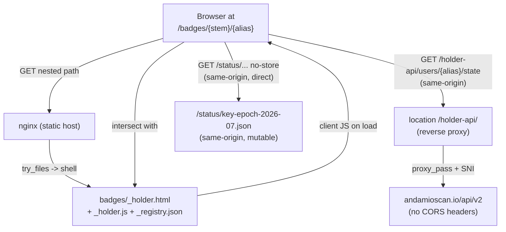
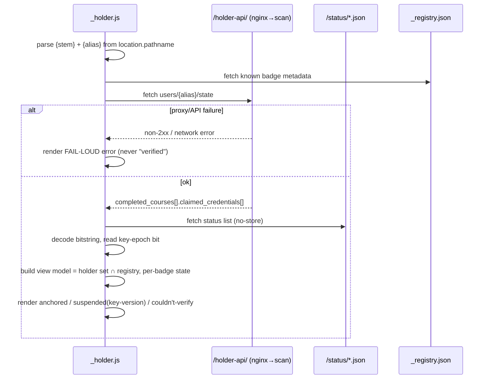

# feat: Standalone holder credential viewer with live verified/suspended state (#73)

## Summary

A per-holder credential view at `/badges/{policy_id}.{slt_hash}/{alias}` — the holder-grain surface that lists a holder's badges with **live** verified/suspended state and owns the human-facing suspension-rendering UX (v1.1 tradeoff P1bis-02). It nests under the badge-class page URL scheme reserved for it (KTD-7 of the #70 plan), so it is not a separate build from the badge page.

The host is static nginx. "Live state" is achieved with a **committed static shell + inline-referenced client JS**, not render-time HTML — the only way to keep state actually live without standing up new per-request server infrastructure, and it matches the repo's dependency-free ethos.

**Pivotal empirical finding (verified 2026-07-24):** `andamioscan.io` returns **no `Access-Control-Allow-Origin` header**, so a browser cross-origin `fetch` from `credentials.andamio.io` is CORS-blocked. The holder-state read therefore goes through a **same-origin nginx reverse-proxy** (`/holder-api/ → andamioscan`, mirroring the existing `@render` proxy). The suspension **status list is already same-origin** (`credentials.andamio.io/status/…` → 200 `application/ld+json`) and is read directly client-side.

**Scope decision:** ship the **alias-resolution** viewer, which fully satisfies the issue's "Verified when" criteria. **Defer wallet-connect** (CIP-30 address → set-of-badges): there is no wallet-address→alias reverse-lookup surface anywhere in the repo or its APIs, so "connect a wallet" cannot resolve to a badge set today. It is a convenience entry point, not an acceptance requirement.

---

## Problem Frame

Today the badge pages (#70/#71) are **class-grain** — `/badges/{stem}` describes a credential *type* and never names a recipient. LinkedIn's `certUrl` ("this person holds this, verified") and any "show me everyone's / this person's badges" view need a **holder-grain** surface. Two facts about that surface are non-negotiable:

1. **State must be live.** Whether a credential is currently suspended (the key-compromise kill-switch flipped its key-epoch bit) changes over time. A baked-at-build snapshot would misrepresent suspension, which is the one thing this view exists to render for a human — no independent OB 3.0 verifier renders suspension meaningfully for a person (P1bis-02).
2. **The host stays static.** The site is nginx-over-Cloud-Run serving committed files plus a narrow `@render` SVG fallback. The viewer must not require a new per-request HTML render service.

The resolution: a single committed shell page, routed by nginx for the two-segment path, whose client JS reads the holder's on-chain state (via a same-origin proxy) and the suspension status list (already same-origin), and renders per-badge verified/suspended state honestly — failing loudly, never silently rendering "verified" when live state cannot be loaded (the gateway-client principle).

---

## Requirements

Traceability to the issue's scope and "Verified when":

- **R1** — A per-holder view at `/badges/{policy_id}.{slt_hash}/{alias}`, nested under the badge-class URL scheme (not a separate build).
- **R2** — Resolve a holder **by alias** and list that holder's credentials.
- **R3** — Render each badge with **live verified/suspended state** (on-chain-anchored presence + current suspension bit), refreshed on load, never from a build-time snapshot.
- **R4** — **Own the suspension-rendering UX**: a human-legible explanation that a set flag is a key-version issue, not "this recipient did not earn it," and that the chain remains authoritative.
- **R5** — The page is a stable, linkable per-holder credential view suitable as LinkedIn's `certUrl` target, and offers the LinkedIn add-to-profile action with `certUrl` = the holder URL.
- **R6** — Fail loudly: when live state cannot be loaded (proxy/API/CORS/network failure), the page shows an explicit error state, never a fabricated "verified."
- **R7 (deferred, see Scope Boundaries)** — Wallet-connect (CIP-30) as an entry point that resolves a connected wallet to the holder's badges.

---

## Scope Boundaries

**In scope:** the nested nginx route + same-origin holder-state proxy; the committed branded shell page; the client JS that resolves a holder by alias, reads live on-chain + suspension state, and renders it honestly with fail-loud error states; the suspension-UX framing; the LinkedIn `certUrl`/add-to-profile control on the holder page; a compact served badge registry for title/art lookup; CI smoke + deploy-verify wiring.

**Non-goals (true, this product's identity):**
- **Client-side DI signature verification.** The viewer asserts on-chain-anchored presence + suspension state (what it can do reliably in-browser). Cryptographic Data Integrity signature checking stays the domain of external DI-capable OB 3.0 / VC verifiers, as `docs/verifier-guidance.md` and the how-to-check explainer (#72) already frame. The viewer links there for signature depth; it does not re-implement RDF canonicalization + EdDSA in the browser.
- **Per-credential suspension.** The status list is key-epoch-grained by design (one bit per signing-key version). The viewer renders that grain honestly; it does not invent a per-credential revocation model.
- **Human names / PII.** The subject is pseudonymous (`urn:andamio:…:recipient:{studentStateAsset}`). The viewer shows the alias and on-chain identifiers, never a real name.

### Deferred to Follow-Up Work
- **R7 — Wallet-connect (CIP-30) entry point.** Blocked on a **wallet-address→alias reverse-lookup endpoint** that does not exist in the repo or in `andamioscan.io`/`api.andamio.io` today. CIP-30 yields addresses/stake keys, not the Andamio alias that every lookup is keyed on. Ship the alias path first; add wallet-connect once the backend exposes address→alias (track as a dependency on the andamio-api / Andamioscan surface). The shell should leave a clean seam (an alias input + a disabled/"coming soon" connect affordance) so adding it later is additive.
- **Per-network selection UX.** The proxy upstream is a single configured host (defaulting to the public scan). A preprod/mainnet switcher is out of scope for v1.2.
- **Compounding new learnings** (gateway fail-loud, inline-JS-on-static-host, first wallet-connect) into `docs/solutions/` — do after this ships (they currently live only in auto-memory).

---

## Key Technical Decisions

**KTD-1 — Static shell + client-side live state, not render-time HTML.**
A single committed shell (`badges/_holder.html`) routed by nginx, whose client JS fetches live state on load. Rationale: keeps "live" actually live (no per-request render cache to stale), keeps the host static, and matches the dependency-free generator/tools ethos. Render-time (a new Cloud Run route + proxy) was rejected: `service/app.py` is SVG-only, and adding live per-holder HTML means new infra plus a caching/invalidation problem for state that must not be cached.

**KTD-2 — Same-origin reverse-proxy for holder state (`/holder-api/ → andamioscan`).**
Empirically, `andamioscan.io` sends no `Access-Control-Allow-Origin`, so a browser cross-origin read is blocked. A new nginx `location ^~ /holder-api/` `proxy_pass`es to the scan's `/api/v2/`, mirroring the existing `@render` block (`proxy_ssl_server_name on`, SNI/Host handling, a `resolver` for the upstream DNS name). The browser reads `/holder-api/users/{alias}/state` **same-origin**; CORS never enters the picture. The upstream host is an envsubst variable (like `${RENDER_UPSTREAM}`) so CI can point it at a stub. Fail-loud: a non-2xx from the proxy surfaces to the client as an error state (R6), never as "verified."

**KTD-3 — Suspension status read directly client-side, live and uncached.**
The status list is same-origin (`/status/key-epoch-2026-07.json`, served `application/ld+json`). The client fetches it with `cache: "no-store"`, decodes the bitstring (multibase base64url → `DecompressionStream("gzip")` → bit read), and reads the credential's key-epoch bit. This is a ~20-line port of `issuer-service/src/status-list.ts` `decodeStatusList`/`statusBitAt` (W3C bit-0 = MSB of byte 0). The status list is **mutable by design** (the kill-switch), so it is explicitly *not* under the byte-freeze/context-freeze invariants — reading a fresh copy each load is correct, not a freeze violation.

**KTD-4 — Alias resolution only; wallet-connect deferred.** See Scope Boundaries → Deferred. The acceptance criteria are met by alias resolution; wallet-connect has an unmet backend dependency.

**KTD-5 — Honesty gate (mirrors #72 anti-overclaim).**
Per-badge state is labeled precisely: **Anchored on-chain** (the holder's live state lists this `(course_id, slt_hash)`), **Suspended — key-version** (the epoch bit is set; with the "not a statement the recipient didn't earn it; the chain remains authoritative" caveat), and for the flagship signed badge a link to independent signature verification (not an in-browser "signature ✓" claim). When live state can't load, an explicit **couldn't-verify** state — never a fabricated pass. The copy is gated against overclaiming universal signature verifiability, exactly as `test_check_page_does_not_overclaim_signature` guards the explainer.

**KTD-6 — Underscore-protected served assets.**
`badges/_holder.html`, `badges/_holder.js`, and `badges/_registry.json` are `_`-prefixed, so `reconcile.py`'s `is_protected` skips them (like the committed `_placeholder.svg`) and the orphan guard/`STEM_RE` ignore them. The shell + registry are generated by `generator/holder.py` (branding DRY with `gen.FONT_FACE`/palette, byte-parity tested like `explainers.py`); `_holder.js` is committed source, node-tested directly against fixtures.

**KTD-7 — `certUrl` lives on the holder page, not the class page.**
The class page (#71) cannot name a holder, so its LinkedIn control targets the class URL. The holder page *can* — its add-to-profile control sets `certUrl` = the current holder URL, which is the real "this person holds this, verified" target. The class-page behavior is unchanged.

---

## High-Level Technical Design

### Component / data-flow



### On-load sequence



---

## Output Structure

New files (all served under `/badges/`; `_`-prefixed → reconciler/orphan-guard skip them):

```
generator/
  holder.py                     # emits _holder.html + _registry.json (branded, byte-parity)
  tests/
    test_holder.py              # shell byte-parity + markers + anti-overclaim + registry shape
badges/
  _holder.html                  # generated shell (references _holder.js)
  _holder.js                    # committed client module (ESM; browser + node-testable)
  _registry.json                # generated stem -> {course_title, module_title}
tools/
  holder-viewer.test.ts         # node --test: path parse, status-bit decode, view-model, fail-loud
```

Modified: `nginx/default.conf.template` (nested route + `/holder-api/` proxy), `generator/page.py` (nothing required; class-page certUrl unchanged — holder certUrl lives in `holder.py`), `Makefile` (`holder` target), `.github/workflows/ci.yml` (wire tests + smoke), `.github/workflows/deploy.yml` (post-deploy probe), `Dockerfile`/env template if a new envsubst var is introduced for the proxy upstream.

---

## Implementation Units

### U1. Same-origin holder-state reverse-proxy (nginx)

**Goal:** Give the browser a same-origin path to the holder's on-chain state, since `andamioscan.io` is CORS-blocked (verified).
**Requirements:** R2, R3, R6.
**Dependencies:** none.
**Files:** `nginx/default.conf.template`, `Dockerfile` (+ any env template) if a new `${HOLDER_UPSTREAM}` var is added, `.github/workflows/ci.yml` (docker-build smoke).
**Approach:** Add `location ^~ /holder-api/` mirroring `@render`: `proxy_pass` to the scan's `/api/v2/` (upstream host via envsubst var, defaulting to `https://andamioscan.io`), `proxy_ssl_server_name on`, `Host $proxy_host`, forwarded headers, and a `resolver` directive (the `@render` upstream is a fixed injected URL; a public DNS name needs a resolver — implementation-time detail). This location is **outside** `location ^~ /badges/` so it does not disturb the badge routing. Fail-loud: pass upstream non-2xx through unchanged; do not add `error_page` masking.
**Patterns to follow:** the `@render` block (`nginx/default.conf.template:186`), `proxy_ssl_server_name on` + forwarded-header set.
**Test scenarios:**
- docker-build smoke: `GET /holder-api/users/<alias>/state` is **wired to the proxy**, not a 404 — offline in CI it may 502/504 (no network to the stub) or return the stub's body; assert the response is a proxied result (status ≠ 404 and not the SPA shell), proving the location matches. Prefer pointing `${HOLDER_UPSTREAM}` at the same CI stub used for `@render` and asserting its canned body/status.
- `nginx -t` passes with the new location (config validity).
**Verification:** the image builds, `nginx -t` is clean, and the smoke assertion for `/holder-api/` passes; existing `/badges/*` assertions still pass (no regression).

### U2. Holder viewer shell + registry (generator)

**Goal:** Emit the committed branded shell page and a compact badge registry for title/art lookup.
**Requirements:** R1, R2, R4, R5.
**Dependencies:** none (parallel with U1).
**Files:** `generator/holder.py` (new), `badges/_holder.html` (generated), `badges/_registry.json` (generated), `Makefile` (`holder` target), `generator/tests/test_holder.py` (new).
**Approach:** Model on `generator/explainers.py`: a `_shell(...)` reusing `gen.FONT_FACE`, `gen.PAL_ANDAMIO`, `esc`, `ISSUER`, `HOST`. The shell renders a static frame (heading, alias input, a results container, and a suspension-explainer block) and references `<script type="module" src="_holder.js">`. `_registry.json` is built from `generator/credentials.json` (same source `page.py` uses), filtered by `build.SKIP_COURSES`, mapping `"{course_id}.{slt_hash}" -> {course_title, module_title}` — compact, sorted for determinism. `main([outdir])` writes both, mirroring `explainers.main`. Wallet-connect seam: an alias input works; render a disabled "Connect wallet (coming soon)" affordance so R7 is additive later.
**Execution note:** the shell/registry are deterministic generator output — byte-parity guard is the drift tripwire, like `test_page.py`/`test_explainers.py`.
**Patterns to follow:** `generator/explainers.py` (`_shell`, `PAGES`, `main`), `generator/page.py` `_ctx`/`credentials.json` read, `_placeholder.svg` as committed-served precedent.
**Test scenarios:**
- `test_holder.py` — shell is well-formed branded HTML (`<!doctype html>`, `<title>`, `theme-color`, closes `</html>`), references `_holder.js`, and includes an alias input + results container.
- Byte-parity: regenerate via `holder.py <tmp>` in a subprocess, assert `_holder.html` and `_registry.json` byte-identical to committed (mirrors `test_output_byte_identical_to_committed`).
- `_registry.json` is valid JSON, keys match `STEM_RE`, excludes `SKIP_COURSES`, and includes the flagship stem.
**Verification:** `make holder` writes both files; `test_holder.py` passes; `git status` clean after regenerate.

### U3. Client-side live-state module (`_holder.js`)

**Goal:** Resolve the holder by alias, read live on-chain + suspension state, build the render model, and fail loudly.
**Requirements:** R2, R3, R6.
**Dependencies:** U1 (proxy path), U2 (shell references it, registry shape).
**Files:** `badges/_holder.js` (new, committed ESM source), `tools/holder-viewer.test.ts` (new node test).
**Approach:** Pure, injectable functions plus a thin DOM bootstrap guarded by `typeof document !== "undefined"`:
- `parsePath(pathname)` → `{stem, alias}` (validate against the 56hex.64hex + alias regex; reject malformed).
- `decodeStatusList(encoded)` + `statusBitAt(bits, index)` — port of `issuer-service/src/status-list.ts` using `DecompressionStream("gzip")`; W3C bit-0 = MSB of byte 0.
- `buildViewModel({holderState, registry, statusBits, keyEpochIndex, flagshipStem})` → per-badge `{stem, title, anchored, suspended, isFlagship}`, computed as `holderState.claimed ∩ registry`.
- `loadHolderView(deps)` orchestrates: `fetch("/holder-api/users/{alias}/state")`, `fetch("/status/…", {cache:"no-store"})`, `fetch("_registry.json")`; `deps.fetchImpl` injectable for tests. Any fetch failure → an error result object the renderer shows as fail-loud (R6), never a pass.
Keep it dependency-free (native `fetch`, `DecompressionStream`, DOM).
**Execution note:** test-first for the pure decoders and the view-model (they carry the correctness risk); the DOM bootstrap is thin.
**Patterns to follow:** `issuer-service/src/status-list.ts` (`decodeStatusList`/`statusBitAt`), the injected-`fetch` seam (`AppDeps.fetchImpl`, `anchor.ts`), `page.py` `_SHARE_SCRIPT` for the inline-JS-on-static-host posture.
**Test scenarios:**
- `parsePath`: valid nested path → `{stem, alias}`; missing alias, bad hex lengths, illegal alias chars → rejected.
- `decodeStatusList`/`statusBitAt`: against a **recorded fixture** of `status/key-epoch-2026-07.json` — bit 0 unset (not suspended) and a synthetically-set bit (suspended) both read correctly; MSB-first ordering verified.
- `buildViewModel`: holder claims ∩ registry (badges we know) rendered; claims not in registry omitted; the flagship flagged `isFlagship`; a suspended key-epoch marks all covered badges suspended.
- `loadHolderView` fail-loud: proxy 502, network throw, malformed JSON, and empty holder state each yield an explicit error/empty result — **never** a fabricated "verified."
**Verification:** `node --experimental-strip-types --test tools/holder-viewer.test.ts` green; manual load renders a real alias's badges with correct state.

### U4. Suspension-rendering UX + honesty framing

**Goal:** Render suspension for a human correctly and without overclaiming — the unit P1bis-02 assigns to this viewer.
**Requirements:** R4, R6, KTD-5.
**Dependencies:** U2 (shell copy), U3 (state model).
**Files:** `generator/holder.py` (the explainer/legend copy in the shell), `badges/_holder.js` (per-badge state rendering + labels), `generator/tests/test_holder.py`, `tools/holder-viewer.test.ts`.
**Approach:** A persistent legend/explainer block in the shell states plainly: a suspension flag is a **key-version** issue (the key-epoch kill-switch), **not** a statement that the recipient did not earn the credential, and **the chain remains authoritative** — wording aligned with `docs/verifier-guidance.md` and the how-to-check explainer (#72). Per-badge labels: "Anchored on-chain", "Suspended — key-version" (with the caveat), "Couldn't verify — try again" (fail-loud). For the flagship, link to independent signature verification (how-to-check) rather than asserting an in-browser signature pass. Gate against universal-signature overclaim.
**Patterns to follow:** `generator/explainers.py` `_check_page` signing-status caveat, `test_explainers.py::test_check_page_does_not_overclaim_signature`.
**Test scenarios:**
- Shell copy carries the key-version caveat and "chain remains authoritative"; does not imply universal signature verifiability (anti-overclaim assertion, mirroring #72).
- `_holder.js` render: a suspended badge shows the key-version label + caveat, not "revoked"/"didn't earn"; a couldn't-verify state shows the retry/error affordance, not a pass.
- The flagship links to how-to-check for signature depth; the viewer does not print "signature verified."
**Verification:** `test_holder.py` + node tests assert the framing; visual check of suspended vs anchored vs error rendering.

### U5. LinkedIn `certUrl` / add-to-profile on the holder page

**Goal:** Make the holder page the real "this person holds this, verified" target.
**Requirements:** R5.
**Dependencies:** U2, U3 (holder URL known client-side).
**Files:** `generator/holder.py` (static control markup where possible), `badges/_holder.js` (fill `certUrl`/name from the resolved holder URL + selected badge).
**Approach:** The add-to-profile deep link (`https://www.linkedin.com/profile/add?startTask=CERTIFICATION_NAME&name=…&organizationName=…&certUrl=…`) needs the live holder URL and a badge name, so the client fills it after resolving state (percent-encode query, HTML-escape when injected — same discipline as `page.py` `_q`/share URLs). Reuse `ORG_ID`/`ORG_NAME` conventions from `page.py`. Class-page behavior unchanged.
**Patterns to follow:** `generator/page.py` `li_add`/`_q` (`page.py:112`), share-URL percent-encode-then-escape.
**Test scenarios:**
- `_holder.js`: given a resolved holder URL + badge, the built `certUrl` is the holder URL, correctly percent-encoded; injected safely (no attribute-breaking).
- No `certUrl` is emitted for a badge in a couldn't-verify state (don't offer add-to-profile for unverified state).
**Verification:** node test asserts the built link; manual click opens LinkedIn prefilled with the holder `certUrl`.

### U6. CI + deploy verification wiring

**Goal:** Guard the new surfaces the same PR that adds them (unwired tests rot).
**Requirements:** all (verification), R1, R6.
**Dependencies:** U1–U5.
**Files:** `.github/workflows/ci.yml` (generator-tests list + node test + docker-build smoke), `.github/workflows/deploy.yml` (post-deploy probe).
**Approach:**
- Add `python3 generator/tests/test_holder.py` to the `generator-tests` step (after `test_explainers.py`).
- Run `tools/holder-viewer.test.ts` in the node/imaging test job.
- docker-build smoke: assert the nested route `GET /badges/$STEM/<alias>` returns the shell (`text/html`), `GET /badges/_holder.js` returns JS (`application/javascript`), `GET /badges/_registry.json` returns `application/json`, and the `/holder-api/` proxy is wired (from U1). Reuse the existing `assert_ct` helper.
- deploy.yml: add a post-deploy probe against the **public** host `credentials.andamio.io` for a holder URL (assert the shell HTML is served) — never `*.run.app`, never `/healthz` (deploy-verify convention).
**Patterns to follow:** `.github/workflows/ci.yml` `generator-tests` (lines 96–102) + `docker-build` `assert_ct` block (lines 130–215), `deploy.yml` `assert_ct` probes, `docs/solutions/conventions/cloud-run-deploy-verification-probes.md`.
**Test scenarios:** N/A (CI wiring) — the assertions above ARE the tests. Confirm each new test path matches the CI glob/step and that a deliberately broken shell fails the smoke.
**Verification:** CI runs the two new suites and the new smoke assertions; a planted break (rename `_holder.html`) turns the smoke red.

---

## Risk Analysis & Mitigation

- **CORS on andamioscan changes / proxy misconfig (high).** The whole live-state read depends on the `/holder-api/` proxy. `proxy_pass` to an HTTPS public host needs a `resolver` and `proxy_ssl_server_name` — easy to misconfigure. *Mitigation:* mirror `@render` exactly; docker-build smoke proves the location matches (not a 404); deploy-verify probes the public route. Fail-loud client UX means a proxy outage degrades to an honest error, not a false pass.
- **Andamioscan availability / shape drift (medium).** The `users/{alias}/state` shape is read from `anchor.ts`; if it changes, the view model breaks. *Mitigation:* node tests pin the expected shape via fixtures; the client tolerates missing fields by rendering couldn't-verify, not by crashing.
- **Registry drift (medium).** `_registry.json` is generated from `credentials.json`; a badge added without regenerating would be invisible in the viewer. *Mitigation:* byte-parity test fails on drift; `make holder` in the build path.
- **Status-list decode correctness (medium).** Bit ordering (MSB-first) and gzip handling are subtle. *Mitigation:* test-first against a recorded fixture with both a set and unset bit; port directly from the audited `status-list.ts`.
- **Wallet-connect expectation gap (low, managed).** The issue title says "wallet-connect"; we ship alias-first and defer connect. *Mitigation:* documented scope decision tied to a real missing backend endpoint; the shell leaves an additive seam.

---

## Deferred to Implementation

- Exact nginx `resolver` value and whether the proxy upstream needs a trailing `/api/v2/` vs rewrite — settle when wiring `proxy_pass`.
- Whether `_holder.js` is loaded as a module `src` or inlined (byte-parity favors a separate committed file; final call at U3).
- The precise `users/{alias}/state` field path for claimed `(course_id, slt_hash)` pairs — confirm against a live/fixture response during U3.
- Network selection (preprod vs mainnet scan) — single configured upstream for now; revisit if v1.2 needs a switch.
- CI stub wiring for `${HOLDER_UPSTREAM}` (reuse the `@render` CI stub or add a canned holder-state response).

---

## System-Wide Impact

- **nginx routing:** one new top-level proxy location + one nested badge route. The `.svg`/`.png`/`.html`/`.embed` URLs and the extensionless `{stem}` page are untouched (R3 invariant — credential-referenced URLs never move).
- **Reconciler/orphan-guard:** the three `_`-prefixed served files are already skipped by `is_protected`; confirm `_registry.json`/`_holder.js` suffixes don't trip `_SUFFIXES`/`STEM_RE` (they don't — non-hex stems are inert).
- **Deploy lanes:** the static/nginx lane gains a post-deploy probe for the holder route on the public host.
- **certUrl:** the holder page becomes the canonical LinkedIn target; the class-page link is unchanged.

---

## Sources & Research

- **Empirical (2026-07-24):** `andamioscan.io/api/v2/users/{alias}/state` → 200 `application/json`, **no `Access-Control-Allow-Origin`** (CORS-blocked for browser cross-origin). `credentials.andamio.io/status/key-epoch-2026-07.json` → 200 `application/ld+json` (same-origin, direct read OK).
- **Repo:** `nginx/default.conf.template` (`location ^~ /badges/` :136, `@render` :186, `^~ /status/` :104); `generator/page.py` (`_ctx`, `li_add` :112, `ORG_ID`); `generator/explainers.py` (shell pattern); `generator/reconcile.py` (`_SUFFIXES`/`STEM_RE`/`is_protected`); `issuer-service/src/anchor.ts` (`/api/v2/users/{alias}/state`, `FetchLike` seam), `status-list.ts` (`decodeStatusList`/`statusBitAt`/`KEY_VERSION_POSITIONS`), `map-credential.ts` (identity model); `.github/workflows/ci.yml` (`generator-tests` :96, `docker-build` :120), `docs/verifier-guidance.md`.
- **Prior plans:** `docs/plans/2026-07-24-002-…badge-display-share-page-plan.md` (KTD-7 reserves `/badges/{stem}/{alias}`); `docs/plans/2026-05-16-001-…issuer-deployment-plan.md` (P1bis-02 suspension-UX disposition).
- **Learnings:** `docs/solutions/conventions/never-mutate-published-jsonld-context.md` (status list mutable-by-design; context frozen), `…/cloud-run-deploy-verification-probes.md` (probe public host, not `/healthz`), `…/workflow-issues/unwired-test-suites-silently-rot.md` (wire tests same PR); auto-memory `gateway-client-fail-loudly.md` (fail loud, no silent fallbacks).

---

## Verification

The feature is complete when: a holder URL `/badges/{stem}/{alias}` serves the shell on the public host; the client resolves the alias, renders that holder's known badges with live anchored/suspended state and an honest suspension explanation; a state-load failure renders a fail-loud error (never a fabricated pass); the LinkedIn add-to-profile control targets the holder `certUrl`; `test_holder.py` + `tools/holder-viewer.test.ts` are green and wired into CI; the docker-build smoke covers the nested route, `_holder.js`, `_registry.json`, and the `/holder-api/` proxy; and deploy-verify probes the holder route on `credentials.andamio.io`.
