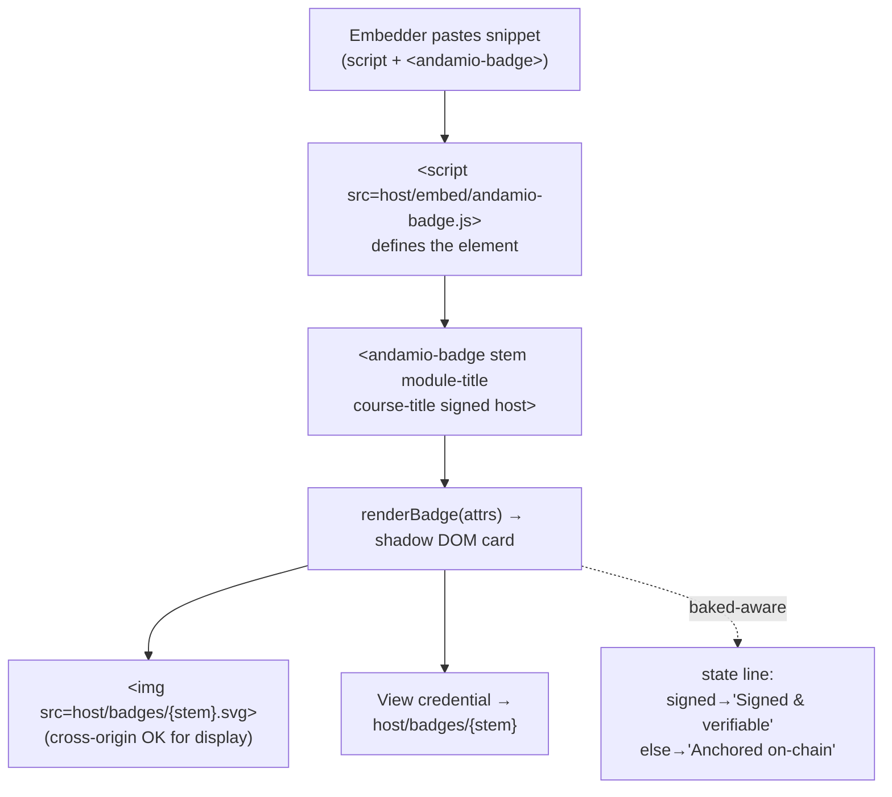
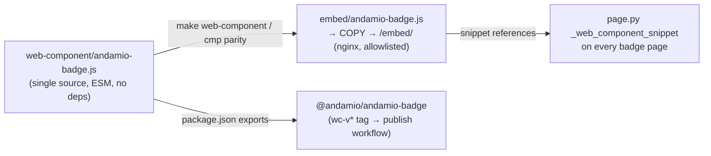

# feat: andamio-badge web component published to npm (#74)

## Summary

An **`<andamio-badge>` custom element**, published to npm as **`@andamio/andamio-badge`** and self-hosted at `https://credentials.andamio.io/embed/andamio-badge.js`, so a third-party site embeds a badge with a `<script>` tag + one element — the upgrade path from the #71 iframe embed. It renders the badge card (badge image + titles + honest verified-state line), and links back to the credential's display page.

**Pivotal constraint:** the component runs on **third-party origins**, so it **cannot `fetch` anything from `credentials.andamio.io`** (our host sends no CORS headers — same wall #73 hit). Cross-origin `` and links are fine for display, so the component is **attribute-driven**: the page.py-generated snippet carries the titles + signed flag as attributes; the element renders from those plus a cross-origin `` of the badge and a link back. No fetch, no CORS, works on any site.

**Verified-state honesty (the load-bearing rule):** the state label derives from the `signed` attribute and mirrors the existing baked-aware wording gate (`_svg_note`/`_verify_note`/`_is_baked`, and the holder viewer's `STATE_LABEL`) — "Signed & verifiable" only for a baked/signed badge (the flagship today), "Anchored on-chain" for the presentation-only majority. Never overclaim; the real trust anchor is the "View credential" link to our host.

This is the last v1.2 Track A issue. It is greenfield on two axes the repo has no precedent for: **npm publishing** (package metadata, token, workflow, provenance) and a **new served `/embed/` path** (Dockerfile + allowlist + nginx, a deliberately-reviewed act under the allowlist doctrine).

---

## Problem Frame

The #71 embed is an `<iframe src="{HOST}/badges/{stem}.embed">` — self-contained but rigid (fixed box, no styling control, an extra document/network round-trip, awkward in modern component-based sites). The web-component upgrade lets an embedder drop a `<script>` once and place `<andamio-badge>` elements inline, styled in shadow DOM, that render the badge and link back to the authoritative display page. The credential's trust never lives in the embed — the embed is presentational and points at `credentials.andamio.io/badges/{stem}` for anything load-bearing.

Two facts shape the whole design:
1. **Third-party origin.** The element executes on sites we don't control, cross-origin to our host. Any design that needs to read data from our host cross-origin is dead on arrival (CORS). Attribute-driven rendering + cross-origin ``/links is the only path that works everywhere without new server surface.
2. **Trust honesty.** A credential embed must not imply a signature that isn't there. Only the flagship is baked/signed; the state label must be baked-aware exactly as the display page and holder viewer already are.

---

## Requirements

Traceability to the issue's scope and "Verified when":

- **R1** — An `<andamio-badge>` custom element published to npm under `@andamio` (scoped, public).
- **R2** — A third-party site embeds a badge via a `<script>` tag + the element; it renders the badge card (image + titles).
- **R3** — The element shows **verified state** — baked-aware, mirroring the existing wording gate; never overclaims a signature for presentation-only badges.
- **R4** — The element **links back** to the credential's display page (`{host}/badges/{stem}`).
- **R5** — The page.py embed control emits the web-component snippet (the upgrade path), with the real per-badge attributes filled in.
- **R6** — The component is delivered from a stable, trusted URL: self-hosted at `{host}/embed/andamio-badge.js` (and available via npm for bundler consumers).
- **R7** — Publishing is automated and repeatable (tag-triggered npm publish on its own deploy lane).

---

## Scope Boundaries

**In scope:** the custom element (pure `renderBadge` + thin registration), its npm package metadata + README, the self-hosted served bundle (`/embed/`) with the coordinated Dockerfile/allowlist/nginx change, the page.py snippet-generator upgrade, the tag-triggered npm-publish workflow, and tests + CI wiring + docker-build smoke.

**Non-goals (this product's identity):**
- **Client-side signature/anchor verification in the component.** Like the holder viewer, the element is presentational; the "View credential" link and the how-to-check explainer (#72) own real verification. The element does not re-implement crypto or fetch chain state.
- **A `stem`-only fetch mode.** Reading titles/signed from our host would require CORS headers on the badge host and only work same-origin. Deferred (see below) — v1 is attribute-driven.
- **A build/bundler toolchain.** The component is dependency-free vanilla JS shipped as an ES module; there is no transpile/minify step (keeps the served copy byte-verifiable against source). Consumers who want a bundle use their own bundler on the npm package.

### Deferred to Follow-Up Work
- **`stem`-only auto-fill mode** (fetch titles/signed from the host) — needs CORS on `credentials.andamio.io` for the registry/asset; revisit if embedders ask for zero-attribute embedding.
- **A jsDelivr/unpkg CDN embed variant** — the npm publish makes this automatic, but the generated snippet deliberately points at our own origin for trust; a CDN-URL variant is a follow-up if wanted.
- **Framework wrappers** (React/Vue thin wrappers) — the custom element already works in every framework; wrappers are additive polish.

### External prerequisites (block only the publish step, not the build)
- The **`@andamio` npm org exists** (confirmed 2026-07-24) and an **`NPM_TOKEN`** with publish rights to it is added as a repo secret. Until the token is set, U5's workflow is inert (tag pushes no-op/fail loudly); U1–U4/U6 ship independently.

---

## Key Technical Decisions

**KTD-1 — Attribute-driven, no fetch.** The element renders entirely from its attributes (`stem`, `module-title`, `course-title`, `signed`, optional `host`) plus a cross-origin `` and a link. Rationale: it runs cross-origin on third-party sites where a `fetch` of our registry is CORS-blocked; ``/`<a>` are not CORS-restricted for display/navigation. The page.py snippet (U4) fills the attributes from the same `_ctx`/`_is_baked` data the display page uses, so the embedder copies a correct, self-contained snippet.

**KTD-2 — Self-host the bundle at `/embed/`, plus npm.** The generated snippet references `{host}/embed/andamio-badge.js` — our own origin — so a credential embed doesn't depend on a third-party CDN's trust or uptime. The npm publish (R1) serves bundler consumers and satisfies the issue's explicit deliverable. Rejected: pointing the snippet at unpkg/jsDelivr (introduces third-party-CDN trust into a credential surface). The served copy lives at `embed/andamio-badge.js`, generated from the `web-component/` source and pinned byte-identical by CI.

**KTD-3 — Source in `web-component/`, served copy in `embed/`, parity-checked.** Following the repo's source-vs-served split (`tools/` source unserved, its output `badges/_holder.js` served; `imaging/` source unserved, its `badges/*.png` served): the authored/publishable source is top-level `web-component/` (added to allowlist `IGNORED_PREFIXES`); the committed served artifact is `embed/andamio-badge.js` (added to `ALLOWED` + Dockerfile `COPY`). `make web-component` copies source→served; a CI `cmp` fails on drift. No transpile — the files are byte-identical vanilla ESM, so "build" is a copy and the parity check is exact.

**KTD-4 — Baked-aware state, no overclaim (wording gate).** The state label is derived from the `signed` attribute and uses the established vocabulary: signed → "Signed & verifiable" (with the DI-capable OB 3.0 / VC verifier framing available via the link), unsigned → "Anchored on-chain". It never asserts a signature for the presentation-only majority — the exact failure `_svg_note`/`_verify_note`/`buildViewModel` were built to prevent. The `signed` attribute is presentational (an embedder could lie); the load-bearing trust is the "View credential" link to our host, which renders the real baked-aware copy and links to how-to-check.

**KTD-5 — Shadow DOM + escape everything.** The element renders into a shadow root for style isolation from the host page. All attribute values are escaped/validated before entering the shadow tree: `stem` is validated against `STEM_RE` (56hex.64hex) and `host` against an https-origin shape; titles are set via `textContent`/escaping; URLs are built from the validated stem/host. A malformed `stem`/`host` renders an inert fallback (or nothing), never breaks out of the shadow tree or emits a `javascript:`/HTML-injection vector.

**KTD-6 — Pure `renderBadge(attrs)` + thin registration (testable without a DOM).** Mirroring the #73 `_holder.js` split: a pure `renderBadge(attrs) → {…}` (or an html/string builder) carries all logic and is unit-tested under `node --test` with no DOM; `class extends HTMLElement` + `customElements.define("andamio-badge", …)` is guarded by `typeof customElements !== "undefined"` and stays thin. The repo has no jsdom/DOM harness by design.

**KTD-7 — Its own deploy lane: `wc-v*` tag.** The npm-publish workflow triggers on `wc-v*` tags — non-overlapping with `v[0-9]*.*.*` (static), `vrender-*` (render), `service-v*` (issuer), per the CONCEPTS "Deploy Lane" rule. It authenticates to npm (not GCP), so the GCP-WIF `refs/tags/v*` constraint is irrelevant; it uses `NODE_AUTH_TOKEN` from the `NPM_TOKEN` secret and publishes with `--access public --provenance` (`id-token: write`).

---

## High-Level Technical Design

### Embed render path (third-party page)



### Source → served → published (three destinations, one source)



---

## Output Structure

```
web-component/                    # source (allowlist IGNORED — not served directly)
  andamio-badge.js                # the element: pure renderBadge + guarded registration
  andamio-badge.test.ts           # node --test: pure-render, escaping, state gate
  package.json                    # @andamio/andamio-badge (public, type module, no deps)
  README.md                       # usage: script-tag + npm
embed/                            # served artifact (allowlist ALLOWED + Dockerfile COPY)
  andamio-badge.js                # byte-identical copy of the source, served at /embed/
.github/workflows/
  publish-web-component.yml       # wc-v* → npm publish --provenance
```

Modified: `generator/page.py` (+ `generator/tests/test_page.py`), `Dockerfile`, `nginx/default.conf.template`, `scripts/ci/check-allowlist.sh`, `Makefile`, `.github/workflows/ci.yml`, regenerated `badges/*.html`.

---

## Implementation Units

### U1. The `<andamio-badge>` custom element

**Goal:** A dependency-free element that renders the badge card from attributes and links back, with a pure, testable render core.
**Requirements:** R2, R3, R4.
**Dependencies:** none.
**Files:** `web-component/andamio-badge.js` (new), `web-component/andamio-badge.test.ts` (new, U6 owns the suite but the file is created here).
**Approach:** Export a pure `renderBadge(attrs)` that, given `{stem, moduleTitle, courseTitle, signed, host}`, validates `stem`/`host`, computes `imgUrl = {host}/badges/{stem}.svg`, `pageUrl = {host}/badges/{stem}`, the baked-aware state label (KTD-4), and returns the escaped shadow-DOM content (string or DOM fragment). Default `host = "https://credentials.andamio.io"`. Then `class AndamioBadge extends HTMLElement` with `observedAttributes`, `connectedCallback`/`attributeChangedCallback` calling `renderBadge` into `attachShadow({mode:"open"})`; `customElements.define` guarded by `typeof customElements !== "undefined"`. Style lives in a shadow `<style>` (isolated), reusing the Andamio palette values inline (resvg-style literals, not `var()`), matching the badge card look. Invalid `stem`/`host` → inert fallback, never injection.
**Execution note:** test-first on `renderBadge` — the escaping + state gate carry the risk.
**Patterns to follow:** `badges/_holder.js` (pure-fn + guarded-DOM split, escaping, host handling); `generator/page.py` `_svg_note`/`_verify_note`/`_is_baked` (baked-aware vocabulary); `generator/gen.py` `PAL_ANDAMIO`, `esc`.
**Test scenarios:** (owned in U6, listed there.)
**Verification:** the element registers in a browser and renders a card for a valid snippet; `renderBadge` returns correct URLs/labels/escaping under node tests.

### U2. npm package metadata + README

**Goal:** Make `web-component/` a publishable `@andamio/andamio-badge` package.
**Requirements:** R1.
**Dependencies:** U1.
**Files:** `web-component/package.json` (new), `web-component/README.md` (new).
**Approach:** `package.json`: `name "@andamio/andamio-badge"`, `version` (start `0.1.0`), `type: module`, `main`/`module`/`exports` → `./andamio-badge.js`, `files: ["andamio-badge.js","README.md"]`, `publishConfig.access: public`, `engines.node >=22`, `repository`/`license`/`keywords`, **no `private: true`**, no dependencies. `README.md`: two usage blocks — the `<script>` + `<andamio-badge>` snippet (pointing at `credentials.andamio.io/embed/…`) and the npm-install/import path — plus the attribute reference and the honesty note (state is presentational; the link is the trust anchor).
**Patterns to follow:** `imaging/package.json` house style (invert `private`, add publish fields).
**Test scenarios:** `Test expectation: none — package manifest + docs (no behavior).` (The publish path is exercised by U5's workflow on a tag; a dry-run check is in U6.)
**Verification:** `npm pack --dry-run` in `web-component/` lists exactly `andamio-badge.js` + `README.md`; `npm publish --dry-run` succeeds locally.

### U3. Self-hosted served bundle at `/embed/`

**Goal:** Serve the component from our own origin, byte-pinned to the source.
**Requirements:** R6.
**Dependencies:** U1.
**Files:** `embed/andamio-badge.js` (new, generated copy), `Makefile` (`web-component` target + `.PHONY`/help), `Dockerfile` (COPY + allowlist-doctrine comment), `nginx/default.conf.template` (`^~ /embed/` cache block), `scripts/ci/check-allowlist.sh` (`ALLOWED` += `embed`, `IGNORED_PREFIXES` += `web-component`).
**Approach:** `make web-component` copies `web-component/andamio-badge.js` → `embed/andamio-badge.js` (deterministic, byte-identical — no transpile). Dockerfile adds `COPY embed/ /usr/share/nginx/html/embed/` under the allowlist header. nginx adds `location ^~ /embed/ { add_header Cache-Control "public, max-age=86400"; try_files $uri =404; }` (`.js` resolves from stock mime.types; mirror the `^~ /status/` block). Allowlist: `embed` joins `ALLOWED`; `web-component` joins `IGNORED_PREFIXES` (source, never served). CI parity (`cmp`) lands in U6.
**Patterns to follow:** `^~ /status/` nginx block; the Dockerfile allowlist-COPY doctrine (lines 1–15); `badges/_holder.js` as the served-JS content-type precedent.
**Test scenarios:** (docker-build smoke + parity in U6.)
**Verification:** `make web-component` produces a byte-identical `embed/andamio-badge.js`; the image serves `/embed/andamio-badge.js` as javascript; allowlist check passes with the new entries.

### U4. page.py embed-snippet upgrade

**Goal:** The badge page offers the web-component snippet (the upgrade path) with real per-badge attributes.
**Requirements:** R5, R3, R4.
**Dependencies:** U1, U3.
**Files:** `generator/page.py` (new `_web_component_snippet(ctx)` + wire into `_share_controls`), regenerated `badges/*.html`, `generator/tests/test_page.py`.
**Approach:** Add `_web_component_snippet(ctx)` emitting the `<script type="module" src="{HOST}/embed/andamio-badge.js"></script>\n<andamio-badge stem="…" module-title="…" course-title="…"[ signed]></andamio-badge>` with values from `_ctx` + `baked` (attribute-escaped). In `_share_controls`, add a second copy button ("Copy embed code (web component)") carrying it in a `data-embed-wc` attribute, revealed by the existing `_SHARE_SCRIPT` clipboard handler (extend the handler to the new button), keeping the iframe button as-is (both offered). Regenerate pages (byte-parity).
**Patterns to follow:** `_embed_snippet`/`_share_controls`/`_SHARE_SCRIPT` (#71), the `data-embed`/clipboard pattern, `esc`/attribute-escaping.
**Test scenarios:** (in `test_page.py`, listed in U6.)
**Verification:** every regenerated badge page carries the web-component snippet with the correct stem/titles/signed; `test_page.py` byte-parity + snippet assertions pass.

### U5. npm-publish workflow (own deploy lane)

**Goal:** Automated, repeatable publish to `@andamio` on a `wc-v*` tag.
**Requirements:** R1, R7.
**Dependencies:** U2.
**Files:** `.github/workflows/publish-web-component.yml` (new).
**Approach:** Trigger `on: push: tags: ["wc-v*"]`. Job: `actions/setup-node` with `registry-url: https://registry.npmjs.org` and `node-version: 22`; `permissions: { contents: read, id-token: write }` (provenance); run `npm publish --access public --provenance` in `web-component/` with `NODE_AUTH_TOKEN: ${{ secrets.NPM_TOKEN }}`. Guard: assert `package.json` version matches the tag (`wc-v1.2.3` → `1.2.3`) before publishing, failing loud on mismatch. Document the `NPM_TOKEN` secret + `@andamio` org prerequisite in the workflow header and DEPLOY.md.
**Patterns to follow:** the deploy-lane tag-prefix discipline (CONCEPTS "Deploy Lane"; `deploy.yml`/`deploy-render.yml` non-overlapping patterns); `actions/setup-node` registry auth.
**Test scenarios:** `Test expectation: none — CI/CD workflow.` Validate by workflow-lint (actionlint if available) and a `--dry-run` publish in U6; a real publish is a tagged release, not a PR check.
**Verification:** pushing a `wc-v*` tag publishes the package (once `NPM_TOKEN` is set); the version-vs-tag guard fails a mismatched tag.

### U6. Tests + CI wiring + smoke

**Goal:** Guard every new surface the same PR that adds it.
**Requirements:** all (verification), R3 (honesty).
**Dependencies:** U1–U5.
**Files:** `web-component/andamio-badge.test.ts` (suite), `.github/workflows/ci.yml` (new `web-component` test job + parity `cmp` + docker-build smoke), `generator/tests/test_page.py` (snippet assertions).
**Approach:**
- `web-component/andamio-badge.test.ts` (`node --experimental-strip-types --test`): pure `renderBadge` — correct `imgUrl`/`pageUrl` from stem+host; default host vs `host` override; **baked-aware state** (signed → "Signed & verifiable", unsigned → "Anchored on-chain"); **no overclaim** (unsigned output never asserts a signature; "DI-capable OB 3.0 / VC verifier" phrasing where verification is mentioned); **escaping** (a title with `<`/`"`/`&` and a `javascript:`-shaped host/stem are neutralized, no shadow-tree breakout); invalid `stem` (bad hex/length) → inert fallback; link-back present and pointing at `{host}/badges/{stem}`.
- CI: add a `web-component` job running `node --experimental-strip-types --test web-component/*.test.ts` (dependency-free, mirrors the tools glob) + a `cmp web-component/andamio-badge.js embed/andamio-badge.js` parity step + a `npm publish --dry-run`/`npm pack --dry-run` sanity step (no token needed). docker-build smoke: assert `/embed/andamio-badge.js` serves as javascript (loose `grep -qi javascript`) with a content marker (e.g. `andamio-badge`), mirroring the `_holder.js` smoke.
- `test_page.py`: assert the regenerated page carries the web-component snippet (`<andamio-badge`, the `/embed/andamio-badge.js` script src, correct stem), the flagship page marks `signed`, a presentation-only page does not, and byte-parity holds.
**Patterns to follow:** `tools/holder-viewer.test.ts` (pure-fn tests, fail-loud/no-overclaim assertions); `ci.yml` `did-pin` glob + `docker-build` `assert_ct` + the `_holder.js` javascript-content-type check; the "unwired suites rot" learning (wire in the same PR).
**Test scenarios:** the assertions above ARE the coverage.
**Verification:** the new job + parity + smoke pass; a planted overclaim (unsigned rendering "signed") or a source/served drift turns CI red.

---

## Risk Analysis & Mitigation

- **npm publish infra is greenfield (high).** No prior `@andamio` publish, token, or provenance in this repo. *Mitigation:* U5 is isolated on its own tag lane and inert without `NPM_TOKEN`; U1–U4/U6 ship and add value independently; the version-vs-tag guard prevents mis-tagged publishes; `--dry-run` in CI catches manifest errors before any real publish.
- **Source/served drift (medium).** Two byte-identical copies (`web-component/` + `embed/`). *Mitigation:* `make web-component` regenerates; CI `cmp` fails on drift — same discipline as the generator byte-parity guards.
- **Overclaim on third-party sites (medium).** The `signed` attribute is embedder-controlled and could misrepresent state. *Mitigation:* the state label is presentational and the "View credential" link is the trust anchor (renders real baked-aware copy on our host); the honesty note is in the README and the wording gate is tested. Consistent with #71/#72.
- **New served `/embed/` surface (medium).** Adds a forever-public path. *Mitigation:* the allowlist doctrine makes it a reviewed act (Dockerfile + `check-allowlist.sh` + nginx + smoke, all in one PR); it serves one static, byte-pinned file.
- **XSS via attributes into shadow DOM (medium).** *Mitigation:* validate `stem`/`host`, escape titles, build URLs from validated parts; tested with hostile inputs (KTD-5, U6).
- **Cross-origin `` availability (low).** The badge SVG loads cross-origin from our host; if our host is down the image breaks but the link still points to the credential. Acceptable; not a fabricated-verified risk.

---

## Deferred to Implementation

- Exact attribute names (`module-title` vs `title`; boolean `signed` presence vs `signed="true"`) — settle in U1 against custom-element attribute conventions.
- Whether `renderBadge` returns an HTML string or a DOM fragment — pick the more testable shape in U1 (string is easiest to assert; DOM fragment is safest for escaping — likely build DOM nodes and assert on their serialization).
- Shadow-DOM styling depth (how close to the full badge card vs a compact chip) — U1 decides against the display-page card look.
- The starting package `version` and whether to publish `0.x` until the API settles.
- `actionlint` availability for workflow-linting U5 (use if present; otherwise a `--dry-run` job is the gate).

---

## System-Wide Impact

- **Served surface:** one new top-level served path (`/embed/`) and one new committed served file; the allowlist/Dockerfile/nginx change is the coordinated reviewed act the doctrine intends.
- **Badge pages:** every `badges/*.html` regenerates to add the web-component snippet (byte-parity guards it); image/credential URLs are untouched (R3 invariant).
- **CI:** a new `web-component` test job + parity + publish-dry-run + a docker-build smoke assertion.
- **Release process:** a new `wc-v*` deploy lane joins the three existing lanes; DEPLOY.md documents it and the `NPM_TOKEN`/org prerequisite.
- **npm:** first package published under `@andamio` — establishes the org's publish/provenance pattern for future packages.

---

## Sources & Research

- **Repo:** `generator/page.py` (`_embed_snippet` :89, `_share_controls` :99, `_SHARE_SCRIPT` :146, `_embed_html` :283, `_ctx` :73, `_is_baked` :59, `_svg_note`/`_verify_note`/`_description` :131–186); `badges/_holder.js` (pure-fn + guarded-DOM split, `STATE_LABEL`); `generator/holder.py` `build_registry` (the `signed` gate); `Dockerfile` (allowlist COPY doctrine :1–61); `nginx/default.conf.template` (`^~ /status/` :104); `scripts/ci/check-allowlist.sh` (`ALLOWED`/`IGNORED_PREFIXES` :11–14); `imaging/package.json` (package house style); `.github/workflows/ci.yml` (`did-pin` glob :36, `docker-build` `_holder.js` smoke :217); `deploy.yml`/`deploy-render.yml`/`deploy-issuer.yml` (tag-lane prefixes); `CONCEPTS.md` (Deploy Lane).
- **Empirical (#73, 2026-07-24):** `credentials.andamio.io` sends no CORS headers → the component cannot `fetch` our host cross-origin → attribute-driven design (KTD-1).
- **Learnings:** `docs/solutions/workflow-issues/unwired-test-suites-silently-rot.md` (wire tests same PR); the baked-aware wording gate across page.py/holder.py (no-overclaim). Auto-memory: `andamioscan-cors-needs-proxy` (the CORS wall), `v1.2-track-a-status` (this is the last Track A issue).

---

## Verification

Complete when: `<andamio-badge>` renders a badge card (image + titles + honest, baked-aware state) and links to `{host}/badges/{stem}` from a `<script>`-tag embed on any origin; the component is served at `credentials.andamio.io/embed/andamio-badge.js` (byte-pinned to source) and packaged as `@andamio/andamio-badge` (publishable via a `wc-v*` tag once `NPM_TOKEN` is set); every badge page offers the web-component snippet with correct per-badge attributes; and CI (`web-component` tests, source/served parity, publish dry-run, docker-build smoke, `test_page.py` byte-parity + snippet assertions) is green, with a planted overclaim or source drift turning it red.
