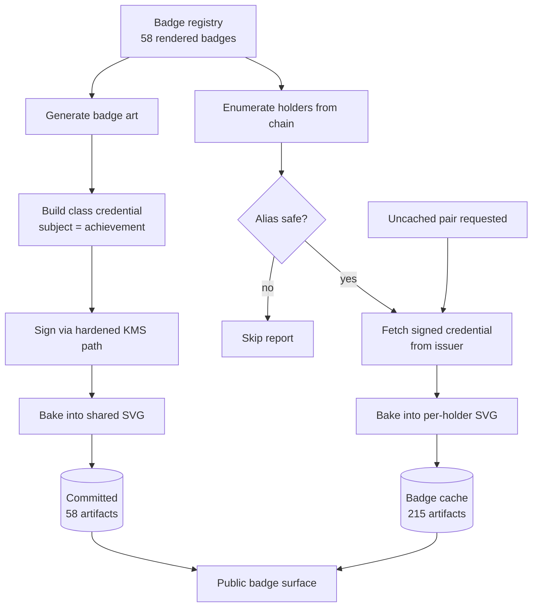

# feat: Fully baked badges — class artifacts and pre-baked holder artifacts

## Summary

Bake every badge twice over: a holder-free class artifact committed to the repo for all 58 rendered badges, and a per-holder artifact for all 215 badge-holder pairs, pre-baked into the badge cache by a sweep that enumerates holders from chain.

---

## Problem Frame

Baking works and has been run once. One of 58 committed badge SVGs carries a signed proof; 57 hold the empty hook; no PNG carries anything. The mechanism is proven and round-trip tested — it was simply never run across the set.

The one baked file is also wrong for most of its holders. The Flagship Badge coordinate has six on-chain holders and the shared file names one of them, so the other five can download a signed assertion about someone else from their own page. That collision is why "bake the other 57" cannot work as stated: a shared file has no holder to name.

Planning surfaced a constraint the brainstorm could not have known. **OB 3.0 has no signed standalone Achievement.** The implementation guide is explicit that signing an achievement definition without claiming anyone earned it falls outside the spec's scope. What the spec does bless is omitting `credentialSubject.id` — the identityless pattern, recommended for exactly our case of badges delivered for URL-based sharing and download. That shape is already what the 57 unbaked hooks contain, so the class artifact looked like the existing payload signed rather than a new object to invent. **Validation refuted that** — the reference validator requires a subject id regardless of what the guide recommends. See KTD-1.

---

## Requirements

Traced from origin (`docs/brainstorms/2026-07-28-fully-baked-badges-requirements.md`).

**Class artifacts**

- R1. All 58 rendered badges carry a signed class artifact. The four registry entries withheld from rendering (`generator/build.py` `SKIP_COURSES`, FCB Fan Engagement) stay withheld — see Scope Boundaries.
- R2. The class artifact names no holder and asserts nobody earned anything.
- R3. Class artifacts are committed and regenerate byte-identically.
- R4. No existing badge URL moves.
- R5. Class artifacts are suspendable by the existing kill-switch, on the same key-epoch list as holder credentials.

**Holder artifacts**

- R6. Every badge-holder pair with a safe alias has an artifact carrying that holder's own signed credential.
- R7. Holder artifacts are cached, never committed.
- R8. An uncached pair still resolves rather than 404ing.
- R9. The shared badge stops carrying any holder-specific credential, and material citing it as a worked example moves at the same time.

**Alias safety**

- R10. The eligible set is derived from chain on every sweep, never hand-maintained.
- R11. Only aliases matching a strict safe charset are baked or routed.
- R12. Every exclusion is reported with the alias and the reason.

**Integrity**

- R13. Both artifact types regenerate from scratch with no manual steps.
- R14. A rotation or suspension re-signs the full artifact set, and the operational material accounts for the real count.

---

## Success Criteria

Carried from origin. These are the signals that the work landed, distinct from the per-unit verification outcomes.

- ✅ **Done.** Every rendered badge carries a signed class artifact — 58 of 58, validated 13/13 against the 1EdTech OB30Inspector.
- Every eligible badge-holder pair is warm after a sweep, and a cold request for a newly-earned pair still succeeds.
- ✅ **Done.** No shared artifact names a holder. Extracting any shared badge yields an object whose subject is the achievement.
- The skip report is empty or actionable: every excluded holder traces to a specific alias problem.
- A full regeneration from scratch reproduces the committed class artifacts byte-for-byte.
- ✅ **Done.** The class shape passes the 1EdTech validator — the one success signal that cannot be self-asserted. It took two attempts; the first shape was rejected (see KTD-1).

---

## Key Technical Decisions

**KTD-1. The class artifact is an `OpenBadgeCredential` whose subject is the achievement.** *(Revised 2026-07-28 — the original decision was refuted by validation.)*

The original decision was an **identityless** credential: `credentialSubject` with no `id`. That is what the OB 3.0 implementation guide explicitly recommends for badges delivered by URL sharing and download, and the published JSON schema permits it outright — `AchievementSubject` requires only `type` and `achievement`. Both were verified directly.

**The 1EdTech reference validator rejects it anyway:**

```
ERROR  "no id in credentialSubject"  — CredentialSubjectProbe
```

Twelve of thirteen probes passed; this was the only failure. The guide and the validator disagree, and the validator is what the ecosystem runs. `credentialSubject.id` is therefore the achievement's own URN — the subject is the thing being *defined*, never a person, so no holder identifier appears anywhere. Re-validated: **VALID, 13/13, 0 errors, 0 warnings**, both on a signed artifact and on a credential extracted from a baked SVG.

Residual wrinkle, recorded rather than hidden: a subject whose id is the achievement reads slightly circularly. It remains the most honest option available, because omitting the id means "an earner we cannot name" — a claim about a person a definition should not make. Evidence: `spike/signer-spike/validation/README.md`.

**KTD-2. Class artifacts are built and signed at build time; holder artifacts at sweep time.** A badge's identity commits to its content (`badge_id` embeds `slt_hash`), so a class artifact is immutable for the life of that badge — sign once, commit, never regenerate except on a key event. Holder artifacts grow with earning and belong to a runtime pipeline.

**KTD-3. Holder artifacts never enter git.** The repo is public and history is append-only; committing 59 people's credentials would make holder identity permanently irremovable. The cache can be purged. (see origin: Key Decisions)

**KTD-4. The sweep rediscovers the eligible set every run.** Course details expose participants and per-holder state exposes claimed credentials, so the set is derivable rather than stored. This is what makes pre-generation safe: there is no snapshot to go stale.

**KTD-5. Aliases are untrusted input, gated by allowlist rather than escaped.** The live holder set contains an XSS payload and an alias with a space. Baking writes aliases into SVG, which browsers execute. An allowlist that refuses anything unexpected is a smaller correctness surface than escaping correctly at every render and path-construction site forever.

**KTD-6. The kill-switch covers class artifacts.** They reference the same key-epoch list, so one bit flip disowns definitions and assertions together under a compromised key. (see origin: Key Decisions)

**KTD-7. Class signing gets its own path; the holder anchor gate stays sealed.** `spike/signer-spike/check-anchor.ts` exposes `checkAnchor` with **no parameters** — sealed by issue #54 finding 4 so the checked subject and the mapped subject cannot diverge — and `sign.ts` writes one hard-coded artifact. A class credential has no subject and no on-chain claim, so that gate is *inapplicable*, not merely inconvenient; unsealing it to accommodate class signing would regress the control that makes holder signing safe. Class signing therefore runs through its own script, gated on **registry membership** — the same refuse-before-any-upstream-read posture `issuer-service/src/badge-registry.ts` already applies — and the pinned-subject path is left untouched.

**KTD-8. Holder artifacts are served at `/badges/{stem}/{alias}.svg`, cache-keyed with the signing key version.** The holder viewer already owns the extensionless `/badges/{stem}/{alias}`, so adding an extension gives the artifact its own address without moving any existing URL (R4). Two mechanical constraints follow. The nginx location must be declared **before** the sibling `location ~ \.svg$`, which otherwise matches first and forwards to a render path whose `BADGE_RE` (`{56hex}.{64hex}.svg`) rejects it with a 400. And the cache key carries the key version — `{stem}.{alias}.{keyVersion}.svg` — so a rotation invalidates naturally instead of serving artifacts signed under a retired key.

---

## High-Level Technical Design

Two pipelines with different lifecycles, converging on one public surface.



The key asymmetry: the left pipeline runs at build time and its output is reviewable in a diff; the right runs on a schedule and its output is disposable. A missing cache entry is a latency event, not a correctness one, because the same bake path serves a miss on demand.

---

## Implementation Units

### U1. Generate the four missing badge artworks

**Goal:** ~~Registry and committed set agree.~~ **DROPPED** — FCB stays withheld; the release scopes to the 58 rendered badges.

**Requirements:** R1

**Dependencies:** none

**Files:** `generator/build.py`, `generator/page.py`, `generator/og.py`, `generator/holder.py`, `generator/reconcile.py`, `service/app.py`, `generator/colors.py`, `badges/` (4 new SVGs + their PNG/OG rasters), `generator/tests/test_reconcile.py`, `generator/tests/test_holder.py`, `generator/tests/test_page.py`, `generator/tests/test_render_parity.py`

**Approach:** The four are all modules of one course — *FCB Fan Engagement* (`5977af64…`), owner `james`, four modules on chain matching four registry entries, **no students and no past students** (so it contributes zero holder artifacts).

They are **not missing — they are deliberately withheld.** `generator/build.py` carries `SKIP_COURSES = {"5977af64…"}` with the comment *"FCB Fan Engagement is done last with a custom Barça palette; remove from this set when that lands."* Running `make badges` today produces exactly 58 and always will.

So this unit is not a re-render; it is retiring a deliberate exclusion, and that exclusion has **twelve consumers**. `page.py`, `og.py`, `holder.py`, and `reconcile.py` each import and filter on it; `service/app.py` mirrors it so the render path cannot publish withheld art; and the test suite asserts on it — `generator/tests/test_reconcile.py` does `next(iter(build.SKIP_COURSES))`, which raises `StopIteration` the moment the set empties.

The palette question the comment defers must be answered first: ship FCB on a custom palette, or on the standard per-course mapping in `generator/colors.py`. That is a product-visible choice about how one org's badges look, not an implementation detail — resolve it before this unit starts.

**Patterns to follow:** The existing `make badges` path; render parity is already asserted in `generator/tests/test_render_parity.py`.

**Test scenarios:**
- Every entry in the registry has a corresponding committed SVG after the run; the counts match exactly, including the four FCB modules.
- Regenerating produces byte-identical output for all 62 (parity suite already covers this shape).
- A registry entry with a malformed course/slt pair is refused rather than producing a badly-named file.

**Verification:** Registry count equals committed SVG count, and the parity suite passes over the enlarged set.

---

### U2. Class credential builder

**Goal:** Produce the class `OpenBadgeCredential` for any registered badge — subject is the achievement, never a person. The object that gets signed and baked into the shared file.

**Requirements:** R2, R5

**Dependencies:** none

**Files:** `generator/gen.py` (the hook payload it emits), `spike/signer-spike/class-credential.ts`, `spike/signer-spike/class-credential.test.ts`

**Approach:** Take the payload `generator/gen.py` already emits and make it correct rather than replacing it. Two changes matter: it must carry no field that could be read as subject identity, and it must gain a `credentialStatus` entry pointing at the current key-epoch list so KTD-6 holds. The achievement description should read as a definition to a human, since the machine-readable shape cannot express "this is a definition" on its own.

Reuse the existing credential-construction conventions rather than inventing a parallel dialect — the flat evidence shape, the anchor block, and the context reference are already settled and validated.

**Execution note:** Build this test-first. The failure mode being defended against is a field that reads as an identity claim, which is much easier to assert absent than to notice present.

**Patterns to follow:** `issuer-service/src/map-credential.ts` for credential construction and the anchor block; `spike/signer-spike/status-list.ts` for the status entry shape.

**Test scenarios:**
- Covers AE4. The built object contains no `credentialSubject.id`, and no other field carrying a holder identifier or alias.
- The object references the current signing context and the current key-epoch status list with the active key's index.
- Two builds for the same badge produce byte-identical output.
- Building for a badge absent from the registry is refused.
- The object validates as an `OpenBadgeCredential` against the vendored OB 3.0 context (JSON-LD expansion succeeds with no dropped terms).

**Verification:** A built class credential for a known badge expands cleanly and carries no identity-bearing field.

---

### U3. Sign, bake, and commit all 62 class artifacts

**Goal:** Every shared badge SVG carries a signed class artifact — including the Flagship Badge's, whose holder credential comes out in this change.

**Requirements:** R1, R3, R4, R9

**Dependencies:** U1, U2

**Files:** `badges/*.svg` (all 62), `spike/signer-spike/sign-class.ts` (new), `spike/signer-spike/expansion-pin.dep-test.ts`, `spike/signer-spike/signed-credential.json`, `tools/bake-signed-vc.ts` (used as-is), `tools/bake-signed-vc.test.ts`, `tools/bake-png-vc.test.ts`, `tools/transcripts/`, `docs/verifier-guidance.md`, `docs/runbooks/key-compromise.md`, `.github/workflows/deploy-issuer.yml`

**Approach:** Class signing runs through a **new script**, not the flagship's `sign.ts` — see KTD-7. Its gate is registry membership rather than the sealed on-chain anchor check, because a class credential has no claim to anchor. Baking uses the existing tool unchanged; the splice is already round-trip tested.

Two committed guarantees must widen with the artifact set. `spike/signer-spike/expansion-pin.dep-test.ts` hand-lists exactly two signed artifacts, so 62 new proofs would land unguarded — a future context edit could silently invalidate them while CI stayed green. Derive the pin set from the badge registry rather than adding 62 hand-written entries, so a new badge cannot land unpinned.

And the flagship fixture needs an explicit disposition: `tools/bake-signed-vc.test.ts` asserts the committed flagship SVG extracts byte-for-byte to `spike/signer-spike/signed-credential.json`, which `bake-png-vc.test.ts` also bakes into the committed PNG and the Rung 7 transcripts pin by sha256. Keep `signed-credential.json` as the holder-credential fixture — it is the only committed holder example the PNG and loopback paths exercise — and repoint the committed-artifact assertion at a new class-credential fixture.

The Flagship Badge is not a special case here: its shared file receives a class artifact like every other badge, which is what removes its holder credential. That satisfies R9 in the same change rather than deferring it, so the shared surface is never in a state where one badge misreports. The material citing that file as a worked example — the verifier guidance example, the kill-switch cross-verifier read step, the deploy verification probe, and the Rung 7 transcripts — must move to a holder artifact URL in this same change, or the guidance will describe an object that no longer exists there.

Because this signs 62 artifacts through the KMS path, the exactly-once signing assertion and the byte-stability check that guard the existing path apply per artifact, not once for the batch.

**Patterns to follow:** `spike/signer-spike` sign scripts and the deterministic re-sign discipline in `docs/solutions/best-practices/deterministic-kms-resign.md`.

**Test scenarios:**
- Covers AE2. A registered badge nobody has earned still carries a signed class artifact after the run.
- Covers AE4. Extracting the embedded payload from any shared SVG yields an object with no holder identifier — asserted across all 62, not a sample.
- Extraction round-trips byte-identical to the signed input for every badge.
- Covers AE5. Re-signing an already-signed class artifact reproduces the same `proofValue` under the same key (byte-stability; a change is a stop-the-line failure), and produces a artifact verifying under the new key after a rotation.
- The flagship's shared file no longer contains its previous holder credential, and no committed file anywhere still references that file as a signed holder example.
- The signed class artifact passes the 1EdTech validator. **Result: VALID 13/13** on the second shape; the first was rejected (KTD-1).
- Every committed class artifact is covered by an expansion pin, and the pin set is derived from the registry so an unpinned badge cannot land.
- Class signing refuses a badge absent from the registry, before any upstream read.
- The holder-credential fixture still round-trips through the PNG bake path after the flagship SVG is re-baked.

**Verification:** All 62 shared SVGs carry signed class artifacts; no shared file names a holder; the external validator is green on the new shape.

---

### U4. Alias safety gate and skip reporting

**Goal:** A single decision point that determines whether an alias may be baked or routed, and a report of everything refused.

**Requirements:** R11, R12

**Dependencies:** none

**Files:** `scripts/alias_gate.py`, `scripts/tests/test_alias_gate.py`, `.github/CODEOWNERS`

**Approach:** The safe charset is **already defined and live in two places**: `issuer-service/src/server.ts` enforces `ALIAS_RE = /^[A-Za-z0-9_-]{1,64}$/` before any chain call, and the nginx holder-viewer route matches the same class. This unit adopts that exact charset and bound rather than inventing a third — a stricter gate would skip holders the issuer will sign for, a looser one would bake artifacts at URLs nginx 404s.

One allowlist predicate, used by every consumer — filename construction, URL construction, and any rendering — so there is no path where an alias reaches an artifact without passing it. Refusal is the default; the charset is the exception list. The report names the alias and which rule refused it, so a human can tell "unsupported character" from "too long" without re-running anything.

Keep the gate independent of the sweep so it can be exercised directly and reused by the serving path.

**Execution note:** Test-first, with the two live-set aliases as fixtures. These are known-hostile inputs and the gate exists specifically for them.

**Test scenarios:**
- Covers AE1. The live XSS-shaped alias is refused, and nothing derived from it is produced.
- The alias containing a space is refused.
- Ordinary aliases from the live set pass unchanged.
- An alias exceeding the length bound is refused.
- An empty or whitespace-only alias is refused.
- The report distinguishes refusal reasons rather than emitting one generic message.
- The gate refuses before any string concatenation into a path or URL occurs.
- The Python gate and the issuer's `ALIAS_RE` agree on every alias in the live set — same fixtures, same pass/fail outcome.

**Verification:** Both known-bad live aliases are refused with distinct reasons; every other live alias passes.

---

### U5. Make the bake splice available to the serving path

**Goal:** The byte-exact splice is callable from wherever holder artifacts are produced.

**Requirements:** R6, R8

**Dependencies:** none

**Files:** depends on the fork below — `service/bake.py` + `generator/tests/test_bake.py` if ported, or `issuer-service/src/` + `issuer-service/test/` if served from the issuer

**Approach:** Baking is byte-exact — the signed credential is inserted verbatim, never parsed and reserialized, because any mutation breaks the signature. Today that logic is TypeScript; the render path is Python. Two candidate homes, and this fork is open (see Open Questions):

1. Port the splice into the render path, which fetches the signed credential from the issuer over HTTP. Keeps image serving off the process holding signing permission. Costs a second implementation of trust-critical code.
2. Serve baked artifacts from the issuer, reusing the existing implementation. No port, but it widens the trust surface of the one process holding KMS sign permission.

Whichever is chosen, both sides must be held to the same contract: extraction round-trips byte-identical, and a payload containing the CDATA terminator is refused rather than escaped.

**Patterns to follow:** `tools/bake-signed-vc.ts` — its refusal behaviour and framing rules are the specification for any port.

**Test scenarios:**
- Round-trip: extraction of a baked artifact returns the exact input bytes, for a corpus including a real signed credential.
- A payload containing the CDATA terminator is refused, not escaped or truncated.
- Baking preserves every byte outside the credential element, including the presentation metadata block.
- An SVG with no credential hook, or more than one, is refused.
- If ported: the ported implementation and the existing one produce byte-identical output for the same inputs.

**Verification:** The round-trip property holds on both implementations if two exist, proven against a real signed credential rather than a synthetic one.

---

### U6. Holder sweep — enumerate, bake, cache

**Goal:** A run that discovers every eligible badge-holder pair and leaves a baked artifact in the cache for each.

**Requirements:** R6, R7, R10, R12, R13 — realizes origin flow F1 (the pre-bake sweep)

**Dependencies:** U4, U5

**Files:** `scripts/cache-admin.py` (new verb alongside `invalidate` and `reconcile`), `scripts/tests/test_cache_admin_warm.py`, `docs/cache.md`

**Approach:** Enumeration runs registry → course participants → per-holder claimed credentials, intersected back against the registry so only registered badges are produced. The sweep then filters through the alias gate, obtains each signed credential from the issuer, bakes, and writes to cache.

Cache keys must include the signing key version, mirroring how the issuer keys its own artifact cache — otherwise a rotation would serve artifacts signed under a retired key indefinitely.

This belongs beside the existing cache verbs rather than as a standalone script: `docs/cache.md` already documents TTL and invalidation, and warming is the missing third leg of that story.

The sweep must be safely re-runnable and must not fail the whole run because one holder failed — a single unreachable upstream read is a per-pair failure, reported, not a run abort.

**Patterns to follow:** `scripts/cache-admin.py` for verb structure and its fail-loud posture on inconclusive upstream errors; `service/cache.py` for the cache interface.

**Test scenarios:**
- Enumeration against recorded fixtures yields exactly the expected pair set, and excludes claimed credentials outside the registry.
- Covers AE1. A holder failing the alias gate produces no artifact and one report entry.
- A pair already cached under the current key version is not re-signed.
- Covers AE5. A pair cached under a superseded key version is re-signed and replaced, and verifies under the new key.
- A single failing upstream read fails that pair only; the run completes and reports it.
- Re-running immediately is a no-op — same artifacts, no additional signing calls.
- A badge with no holders contributes nothing and is not an error.

**Verification:** A sweep against fixtures produces the expected artifact set, and a second run performs no signing.

---

### U7. Serve per-holder artifacts

**Goal:** A holder artifact resolves whether or not the sweep has reached it.

**Requirements:** R6, R7, R8 — realizes origin flow F2 (someone opens a badge)

**Dependencies:** U5, U6

**Files:** `nginx/default.conf.template`, `service/app.py`, `service/cache.py`, `scripts/cache-admin.py`, `generator/tests/test_holder_artifact_serving.py`

**Approach:** Extend the existing static-first-with-fallback shape rather than inventing a new one: cache hit serves directly, miss falls through to the same bake path the sweep uses. This is what makes warmth an optimisation rather than the source of truth, and it means a holder who earned a badge after the last sweep is never told their badge does not exist.

The URL and cache key are fixed by KTD-8: `/badges/{stem}/{alias}.svg`, keyed `{stem}.{alias}.{keyVersion}.svg`. Three shipped contracts must widen to accept that shape — `service/app.py`'s `BADGE_RE`, its sibling in `scripts/cache-admin.py`, and the nginx location set, where the new location must be declared **ahead of** `location ~ \.svg$` or first-match-wins routes the request into a 400.

The extensionless holder-viewer route is untouched, so the artifact address is additive rather than a collision. The alias gate applies before any upstream work.

**Patterns to follow:** The `try_files $uri @render` fallback already used for badge SVGs; `service/app.py`'s cache-first, never-cache-a-failure posture.

**Test scenarios:**
- Covers AE3. A pair absent from cache is produced on request and served.
- A cached pair is served from cache with no upstream calls.
- An alias failing the gate is refused before any upstream call.
- A pair that does not exist on chain returns a refusal, and nothing is cached.
- An upstream failure is never cached and never surfaces as "this badge does not exist".
- The artifact route does not shadow the existing holder viewer route, and the extensionless viewer URL still serves the shell.
- A holder artifact URL is matched by the new location rather than falling through to the sibling `.svg` route.
- `cache-admin` recognises a holder cache key rather than skipping it as unparseable.

**Verification:** A cold pair resolves end to end; a warm pair costs no upstream calls; a bogus pair is refused without polluting the cache.

---

### U8. Rotation and kill-switch regeneration

**Goal:** A key event can be carried out against 273 artifacts rather than one, with the operational material to match.

**Requirements:** R5, R13, R14

**Dependencies:** U3, U6

**Files:** `docs/runbooks/key-compromise.md`, `docs/runbooks/issuer-provisioning.md`, `scripts/cache-admin.py`, `scripts/tests/test_cache_admin_purge.py`

**Approach:** Both runbooks currently assume the artifact population is the flagship. Rotation now means re-signing and re-committing 58 class artifacts and purging plus re-warming the holder cache, in an order that respects the existing constraint that the static host publishes before the issuer boots against it.

The kill-switch gains a cache-purge step: warmed artifacts embed credentials signed under a key whose status bit has flipped, and while verifiers re-read the status list independently, leaving artifacts signed under a suspended key in a serving cache is a needless liability.

Two things here are mechanism, not documentation. The purge step needs a tool that can actually perform it: both existing cache verbs skip any key failing `parse_badge_key`, so every warmed holder artifact is currently un-purgeable — a runbook step no tool can execute is worse than none, because it reads as covered during an incident.

And the kill-switch's **detection baseline breaks**. Its trigger criterion is "a KMS sign not attributable to a known, transcribed run", which works only because signing today is a population of one, manually observed. A scheduled sweep issuing hundreds of signs makes forged calls indistinguishable from routine traffic. The sweep must emit an attributable run record, and the runbook's criterion must become "signing outside a recorded sweep window or build-time class-signing run" rather than "signing at all".

**Test scenarios:**
- A holder cache key is parsed and purged rather than skipped as unrecognised.
- Purge scoped to one key version removes only artifacts signed under it, leaving current-version artifacts intact.
- A purge run reports what it removed and what it skipped, distinguishing the two.
- Purging an empty cache is a clean no-op, not an error.

**Verification:** Both runbooks state the real artifact count and the regeneration order, and the kill-switch procedure includes cache purge.

---

## Scope Boundaries

### Deferred to Follow-Up Work

- PNG baking. No PNG carries anything today; this plan is SVG-only per origin scope.
- Event-triggered generation on earn (#36), which would shrink the warm gap from a sweep interval to seconds.
- Presentation work explaining to holders what sharing a badge discloses about their on-chain identity.
- Registry drift: one on-chain claim points at an unregistered badge, and 36 registered badges have no holder. Surfaced by enumeration, not fixed here.

### Outside this work

- Issuing authority and per-org issuer identity. Explicitly future.
- Changing what the credential asserts or who signs it.
- Any mechanism letting holders opt into a permanently committed badge — considered and rejected upstream.

---

## System-Wide Impact

- **Retiring a deliberate exclusion.** `SKIP_COURSES` is a single source of truth consumed by twelve call sites across the generator, the render service, and the test suite. Emptying it changes what the public host serves and breaks a test that assumes the set is non-empty — a wider blast radius than "render four files".
- **Signing volume.** The KMS path goes from one artifact to 273 (58 class + 215 holder). The exactly-once assertion and byte-stability checks that guard the current path now run per artifact.
- **Public surface semantics.** Every shared badge becomes a signed object. A verifier that previously saw one signed badge now sees 58, all holder-free — which is why the external re-validation in U3 is load-bearing rather than a formality.
- **Cache growth and cost.** The cache gains an artifact class that grows with earning rather than with the badge set.
- **Operational blast radius.** Any key event becomes a bulk operation. U8 exists specifically so that is written down before it is true.
- **Failure propagation.** The sweep depends on the issuer and two upstream read surfaces. A failure in any of them must degrade to "this pair stays cold" rather than "this pair does not exist" — the serving path already distinguishes those, and the sweep must not invert it by caching a refusal.

---

## Risks & Dependencies

- ~~**The identityless shape has never been externally validated.**~~ **Retired — it was validated and it failed.** The shape was revised and re-validated to VALID 13/13 (KTD-1). The risk was real and the sign-one-then-batch gate is what caught it, for the cost of a single signature.
- **A verifier could read the class credential as a weak claim about an unnamed person.** Reduced but not eliminated: the subject is now explicitly the achievement rather than absent, and no identity-shaped field appears anywhere, but the machine-readable shape still has no way to say "definition". The human-readable prose carries that meaning.
- **Enumeration depends on two upstream surfaces** (course participants, per-holder claimed credentials) with no by-holder claim index to fall back on.
- **Access Token transferability is unresolved.** If an alias can change hands, a permanent baked artifact naming it means something subtly different than it appears to. Carried from origin; not answerable in this repo.
- **Alias hostility is proven, not theoretical.** The gate in U4 is the only thing standing between a live XSS payload and a generated SVG.
- **Routine signing destroys the compromise-detection baseline.** The kill-switch trigger "a KMS sign not attributable to a transcribed run" holds only while signing is rare and manually observed. Scheduled sweeps make it useless unless sweep runs become attributable — addressed in U8, flagged here because it is a security control degrading as a side effect of a throughput change.
- **A silently failing sweep is invisible.** Warmth is an optimisation, so a sweep that stops running degrades into slower responses rather than errors — nothing breaks loudly. Whatever cadence is chosen needs a signal that the last run completed and what it produced, or this decays unnoticed. Named here because the plan otherwise has no monitoring surface.

---

## Open Questions

**Resolved during execution**

- ~~The FCB palette (U1)~~ — **resolved: FCB stays withheld.** U1 is dropped and the release scopes to the 58 rendered badges. The palette question is deferred with the course.
- ~~Where the splice runs (U5)~~ — **resolved: ported to Python in the render path.** Keeping image serving off the sign-permissioned process outweighed avoiding a second implementation; drift is closed by a byte-identical parity test against the TypeScript original.

**Deferred to implementation**
- Sweep cadence, and whether a key event triggers an immediate run.
- How the skip report reaches a human — CI output, a committed artifact, or a notification.

---

## Sources & Research

- **OB 3.0 implementation guide** — the decisive input to KTD-1. There is no normative mechanism for signing an Achievement definition standalone; omitting `credentialSubject.id` is explicitly recommended for download-shared badges. This changed the class artifact from "a new signed object" to "the existing payload, signed".
- **Live enumeration, 2026-07-28** — 22 courses, 73 aliases, **215 badge-holder pairs** across 59 holders; 26 of 62 badges have at least one holder. Two aliases are unusable, one an XSS payload. Recorded in origin with the endpoints used.
- **Committed artifact state** — 58 badge SVGs, 1 with a proof, 57 with the empty hook; 116 PNGs, none baked.
- `docs/solutions/best-practices/deterministic-kms-resign.md` — byte-stability discipline that U3 must hold to across 58 artifacts.
- `docs/solutions/workflow-issues/unwired-test-suites-silently-rot.md` — relevant to U6/U7, whose suites are new and must be wired into CI to count.
- `CONCEPTS.md` — Class Achievement, Holder Artifact, Baking, Flagship Badge are the canonical terms used throughout.
