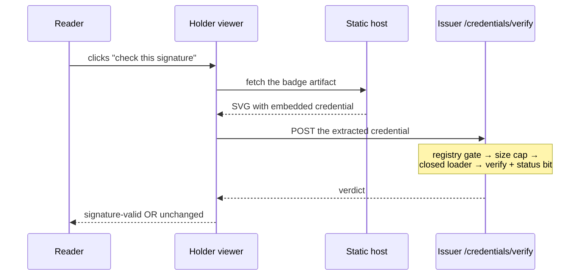
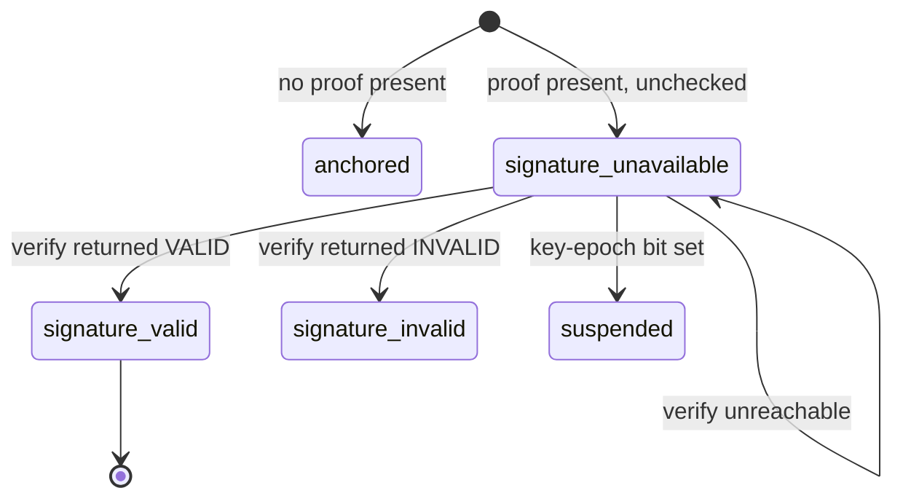

# feat: Close the v1.1 phase — deploy, pin coverage, and real signature verification

## Summary

Finish the v1.1 phase: deploy the 58 baked class artifacts that currently exist only in git, extend the expansion pin to cover them, and add a verify endpoint that lets the holder viewer say a signature is valid because it was *checked* — not because a proof was present.

---

## Problem Frame

Three things stand between the repo and a v1.1 phase that is honestly complete.

**Nothing is live.** 58 badges carry signed class artifacts on `main`; the public host still serves the unbaked versions. The work is done and unshipped.

**Those 58 proofs are unguarded.** `spike/signer-spike/expansion-pin.dep-test.ts` pins the canonical RDF form of committed signed artifacts so no context change can silently invalidate them. It hand-lists **two**. We just committed 58 more, so 58 proofs now sit outside the guard that exists precisely to protect them — and the failure mode is silent: CI stays green while the proofs die.

**The viewer cannot say a signature is valid, and says so honestly.** Its state vocabulary carries `signature-unavailable` — "a proof is present, and THIS PAGE DOES NOT CHECK IT." That was correct, and its own comment names the fix: a server-side verify endpoint on the issuer, which already verifies with a closed document loader. The comment says that endpoint is "blocked on the Phase 2 ops gate." **That is stale** — the gate closed 2026-07-23, and the LB already routes `/credentials/*` to the issuer, so no ops change is needed at all.

One state stays absent permanently. `revoked-signal` requires distinguishing "the pair left the holder's state" from indexer lag, and the upstream exposes neither a freshness signal nor a by-holder claim index (both probed, both 404). It is not pending work; it is blocked upstream, and the roadmap should say so.

---

## Requirements

**Ship what exists**

- R1. The 58 baked class artifacts are served by the public host.
- R2. A badge fetched from the deployed host extracts to a credential that still validates externally.

**Integrity**

- R3. Every committed signed artifact is covered by an expansion pin.
- R4. The pin set is derived, not hand-maintained — a newly signed badge cannot land unpinned.

**Verification**

- R5. A caller can submit a credential and receive a cryptographic verdict from the issuer.
- R6. The endpoint's abuse surface is bounded by input constraints, not by trusting callers.
- R7. The holder viewer can show `signature-valid`, and only ever from a real verify result.
- R8. A failed or unreachable verification never upgrades a state, and never blocks the page.

**Honest records**

- R9. `revoked-signal` is recorded as blocked upstream rather than pending.
- R10. No code comment or roadmap line still describes the verify endpoint as ops-gated.

---

## Success Criteria

The phase is closed when all of these hold. They are deliberately stated as observations, not as work completed.

- A badge fetched from `credentials.andamio.io` carries a proof, and its extracted credential returns VALID with 0 errors and 0 warnings from the external validator.
- Deleting any single pin entry makes CI fail — the guard covers what it claims to cover.
- A reader can move one badge to `signature-valid`, and no input without a real verdict can produce that state.
- Every remaining v1.1 line in `ROADMAP.md` is either ticked or carries a reason it cannot be built.
- Nothing in the repo still describes the verify endpoint as blocked on the ops gate.

The last two matter as much as the first three. A phase that reads as closed while a line silently rots is the failure this repo spent 2026-07-28 correcting.

---

## Key Technical Decisions

**KTD-1. Verification runs on the issuer, mounted under `/credentials/`.** The LB already routes that prefix there — proved live: `/credentials/verify` returns the *issuer's* JSON 404, not nginx's HTML. A separate verifier service would need an LB URL-map change in the private ops repo, the same dependency class that left this endpoint blocked for months. The cost is real and accepted: the process holding KMS sign permission gains a public read-only route. KTD-3 is how that cost is bounded.

**KTD-2. The endpoint verifies a submitted credential, not a coordinate.** The issuer already loopback-verifies everything it signs, so a coordinate endpoint would re-derive a credential and check its own fresh output — proving Andamio can sign and then check its own work, which is close to circular. A reader seeing "signature valid" understands it to mean *this artifact is genuine*. Only verifying submitted bytes supports that claim.

**KTD-3. Abuse is bounded by input constraints, not service-level rate limiting.** `issuer-service/README.md` states there is no service-level rate limiting *by design* — enforcement belongs at the LB / Cloud Armor layer. Adding rate limiting here would contradict a deliberate posture. Instead the endpoint constrains what it will accept at all:

1. **A streamed payload cap.** Enforced *while reading*, aborting the connection once accumulated bytes exceed the limit — not after buffering. The issuer reads no request body today, so this is new code; a cap checked after the body is fully read is not a cap, and an unbounded body would exhaust the one process holding sign permission.
2. **A registry gate**, mirroring `badge-registry.ts`'s refuse-before-any-upstream-read posture.
3. **The closed document loader**, unchanged — zero fetches, allowlist only, so an unknown context is refused rather than becoming an outbound request. This is what stops the endpoint being used as a fetch proxy.
4. **An explicit canonicalization work bound.** This one is not obvious and is the reason the others are insufficient alone: **RDFC cost is driven by non-unique blank nodes in the expanded graph, not by payload bytes.** A small, cap-compliant credential using only allowlisted vocabulary can carry a pathological blank-node structure. `rdf-canonize` exposes `maxWorkFactor`/`timeout` precisely for this, and the cryptosuite passes options straight through without setting them — so the verify path must set them explicitly rather than inherit a library default nobody chose.

Those bound the work per request rather than the requests per caller. Byte size alone would *look* like a bound while leaving the actual cost driver unconstrained.

**KTD-4. The viewer verifies on demand, per badge.** A holder page can list a dozen badges, and verifying all of them on load turns one page view into a dozen expensive calls. On-demand also makes the claim an explicit act a reader asked for rather than a background assertion.

**KTD-5. The overclaim guard is sharpened, not deleted — and it is three assertions, not one.** `tools/holder-viewer.test.ts` guards the claim in three places: no state name matches `/valid/i`, every verdict has designed copy, and no copy matches `/signature is valid|signature valid|verified signature/i`. Adding `signature-valid` trips all three, and honest copy for a genuinely-verified signature trips the third by construction.

Two traps follow. `/valid/i` also matches **`signature-invalid`**, so the naive fix silently permits the state it was written to catch. And `VERDICTS` is a spread of `BADGE_STATES`, so adding a badge state also mints an arrival verdict that U4 says can never occur — requiring designed copy for an unreachable state, or decoupling the two vocabularies.

The replacement guard must be stronger, not absent: `signature-valid` is unreachable unless a real verify result was supplied, asserted by sweeping the state matrix with no verdict present.

**KTD-6. `revoked-signal` is recorded as permanently blocked, not pending.** Leaving an unbuildable item unticked is the same stale-tracker failure this repo spent 2026-07-28 correcting. It needs a status that says "blocked upstream, here is what would unblock it."

---

## High-Level Technical Design

Verification is a request the reader initiates, and its result may only ever move a badge in one direction.

The state machine is deliberately one-way. `signature-unavailable` is the resting state for a badge carrying a proof; a confirmed verification upgrades it, and **nothing else can**.

The three verify outcomes are **not** two. "Valid", "invalid", and "could not check" are distinct, and collapsing the last two would report a network failure as a broken signature — the inverse of the overclaim, but equally a lie.

---

## Implementation Units

### U1. Deploy the baked class artifacts

**Goal:** The 58 signed badges are live, and a badge fetched from the host still validates.

**Requirements:** R1, R2

**Dependencies:** none

**Files:** none — this is a tag and a verification pass

**Approach:** Tag the static host release. Naming matters: the repo went `v1.0.9` → `v1.2.0`, so **`v1.1` was never cut** and is a roadmap phase name; the next static-host release is **`v1.3.0`**.

The deploy workflow already runs post-deploy probes against the public host. What it does not check is the thing this release is *about* — that a served badge carries a working proof. Verify by hand per `docs/runbooks/class-artifact-signing.md`: fetch a badge from the deployed host, extract its credential, and re-run the external validator against those bytes. Extraction from the *served* artifact is the point; validating the local file proves nothing about the deploy.

**Patterns to follow:** `docs/solutions/conventions/cloud-run-deploy-verification-probes.md` — probe the public hostname, not internal service URLs.

**Test scenarios:** `Test expectation: none -- a release action; its verification is the live checks below rather than a suite.`

**Verification:** A badge fetched from `credentials.andamio.io` contains a `proofValue`; its extracted credential returns VALID, 0 errors, 0 warnings; the badge page and holder viewer still render.

---

### U2. Derive the expansion pin from the registry

**Goal:** Every committed signed artifact is pinned, and a new one cannot land unpinned.

**Requirements:** R3, R4

**Dependencies:** none

**Files:** `spike/signer-spike/expansion-pin.dep-test.ts`, `spike/signer-spike/class-expansion-pins.json`, `spike/signer-spike/gen-class-pins.ts`, `spike/signer-spike/package.json`, `.github/workflows/ci.yml`

**Approach:** The pin currently hand-lists two artifacts. Replace the literal map with a derived set: the two existing entries plus every committed class artifact. Hand-listing 58 entries would work once and rot on the next badge; deriving means the guard extends itself.

**Iterate `spike/signer-spike/class-artifacts/*.json` directly, not a registry.** The two candidate registries disagree — `generator/credentials.json` has 62 entries, `badges/_registry.json` has 58 — and neither is the set that exists on disk. The artifact directory is self-defining and cannot drift from what is committed. (Pinning the JSON rather than the credential embedded in each SVG is sufficient because `tools/bake-signed-vc.test.ts` already asserts the served SVG extracts byte-for-byte to its artifact; that test is the link between the two.)

The pins must be **generated once and committed**, not computed at test time — a test that recomputes both sides of a comparison proves nothing. The test's job is to detect drift between committed pins and current canonicalization.

That needs somewhere to live and a way to refresh it. Pins go in a committed sidecar file, written by a generator script with an npm entry beside `sign:class` and `bake:class`. Without a generator, the first legitimate re-sign leaves someone hand-computing 58 hashes, and the existing pin contract — update pins in the same commit as the re-sign — becomes unworkable in practice.

Consider what should happen when a class artifact exists with no pin: that is the exact gap this unit closes, so it must **fail**, not skip.

**Execution note:** Add a failing case first — a class artifact absent from the pin set — so the guard is proven to catch the condition it exists for.

**Patterns to follow:** `spike/signer-spike/expansion-pin.dep-test.ts`'s existing canonicalization and comparison; `spike/signer-spike/class-credential.dep-test.ts` for reading the registry from a dep-test.

**Test scenarios:**
- Every committed class artifact has a pin, and the count matches the artifact count.
- A class artifact with no corresponding pin fails the suite, naming the artifact.
- A pin that no longer matches the artifact's canonical form fails, naming which.
- Canonicalization runs against the **committed** context, not a fetched one — a context change is what the pin exists to catch.
- The two pre-existing pins are unchanged by the derivation.
- The suite fails if it discovers zero artifacts — a vacuous pass is worse than no guard.
- Re-running the generator on unchanged artifacts reproduces the committed pin file byte-for-byte.

**Verification:** The suite covers 60 artifacts rather than 2, and deleting a pin entry makes it fail.

---

### U3. Verify endpoint on the issuer

**Goal:** A caller can submit a credential and get a cryptographic verdict, on a surface narrow enough to sit beside the signing path.

**Requirements:** R5, R6

**Dependencies:** none

**Files:** `issuer-service/src/server.ts`, `issuer-service/src/verify.ts`, `issuer-service/test/verify.test.ts`, `issuer-service/README.md`

**Approach:** Mount under `/credentials/` so the existing LB route reaches it (KTD-1). The route must not collide with the four-segment credential route.

**The seam is the method gate, not the 404.** `server.ts` refuses any non-GET *before* it matches a path, so a POST to `/credentials/verify` returns 405 today and never reaches the JSON 404. The live probe in Sources was a GET — it confirms LB path routing, not POST traversal. So this unit widens the method gate for the verify path specifically, leaving GET-only everywhere else, and must probe a real POST through the LB before building on the assumption that a body arrives at all.

The verdict has **three** outcomes, not two: valid, invalid, and could-not-check. Collapsing the last two would report an unreadable status list as a forged signature.

Bounding (KTD-3), applied in order, cheapest first:
1. **Payload size cap** — refuse oversized bodies before parsing.
2. **Registry gate** — the credential's badge coordinate must be a registered badge, mirroring the refuse-before-any-upstream-read posture already in `badge-registry.ts`.
3. **Closed loader** — reuse the existing one unchanged. Its zero-fetch, allowlist-only behaviour means a credential referencing an unknown context is refused rather than becoming an outbound request. This is the property that stops the endpoint being used as a fetch proxy.

Reuse the verification machinery in `issue.ts` rather than writing a second path — two implementations of "is this signature good" is how they drift. But it cannot be reused as-is: `verifyWith` returns `Promise<void>` and collapses every failure into one thrown `Error` built by string concatenation, and `makeCheckStatus` returns an identical negative for a set suspension bit and an unreadable list. Distinguishing the outcomes by regex-matching error strings is exactly how "status unreadable" becomes "forged signature".

So `verifyWith` is refactored to return a discriminated result — valid / invalid / suspended / could-not-check — with the existing throw-on-failure behaviour preserved for its current post-sign loopback caller, which must not change semantics.

Note what "could-not-check" can actually be triggered by: the status list is **boot-injected** from committed bytes, so there is no per-request status read to fail. The genuine triggers are malformed input reaching the verifier and canonicalization aborting on the work bound. That set must be enumerated rather than assumed.

The README states this service serves `/credentials/{…}/{recipient}` and `/healthz` **only**. That claim changes here and the README must change with it, including the rate-limiting section, since this is the first endpoint whose per-request cost is attacker-controlled.

**Execution note:** Build test-first. The failure modes worth defending against — a tampered proof accepted, an unknown context triggering a fetch — are far easier to assert than to notice.

**Patterns to follow:** `issuer-service/src/server.ts` for routing, refusal shape, and error contract; `issuer-service/src/issue.ts` (`verifyWith`, `makeCheckStatus`); `issuer-service/src/badge-registry.ts` for the registry gate.

**Test scenarios:**
- A genuine class artifact returns valid.
- A credential with one byte of the `proofValue` altered returns invalid — not an error, and not valid.
- A credential whose subject or claim text was edited after signing returns invalid.
- A credential signed under a key not in the live DID document returns invalid.
- A credential whose badge is not in the registry is refused before any verification work.
- An oversized payload is refused before parsing.
- Malformed JSON, an empty body, and a non-credential JSON object each refuse cleanly rather than throwing.
- A credential referencing a context outside the allowlist is refused, and **no outbound fetch is attempted**.
- A credential that aborts canonicalization on the work bound returns could-not-check — never invalid.
- A credential with a pathological blank-node structure, within the size cap, is refused by the work bound rather than consuming disproportionate CPU.
- A body exceeding the cap is aborted mid-stream, including when sent without a Content-Length.
- POST reaches the verify route; GET-only behaviour is unchanged on every other path.
- A credential whose key-epoch bit is set returns suspended rather than valid.
- The existing `/credentials/{network}/{policyId}/{sltHash}/{recipient}` route and `/healthz` still behave exactly as before.

**Verification:** A real signed artifact verifies; a one-byte mutation of it does not; an unregistered coordinate never reaches verification.

---

### U4. On-demand verification in the holder viewer

**Goal:** A reader can check one badge's signature and see a state that means it.

**Requirements:** R7, R8

**Dependencies:** U3

**Files:** `badges/_holder.js`, `generator/holder.py`, `tools/holder-viewer.test.ts`, `badges/_holder.html` (regenerated)

**Approach:** Add **two** states — `signature-valid` and `signature-invalid` — plus a per-badge control that fetches the badge artifact, extracts its credential, submits it, and applies the verdict to that badge only. Both the artifact and the endpoint are same-origin, so no proxy is needed, unlike the Andamioscan reads.

Adding a state touches more than one map. `BADGE_STATES`, `STATE_LABEL`, and — because `VERDICTS` spreads `BADGE_STATES` — the arrival-verdict vocabulary and `VERDICT_COPY` too. Since U4 holds that verification never affects the arrival verdict, **decouple `VERDICTS` from the spread** rather than shipping unreachable verdicts with placeholder copy.

The viewer also needs its own credential extractor. `extractVc` in `tools/bake-signed-vc.ts` imports `node:fs` at module top level and `tools/` is never served, so it cannot be loaded in a browser. `_holder.js` gains a string-based extractor mirroring the same single-element and CDATA rules, with a test asserting parity against a committed baked badge — the alternative, adding a shared served module, would require allowlist and Dockerfile changes for one function.

Three viewer-side rules, each load-bearing:

- **One-way only.** A verdict may upgrade `signature-unavailable` to `signature-valid`, or report invalid. An unreachable endpoint leaves the badge exactly as it was. This extends the existing rule that soft dependencies may downgrade or omit but never upgrade.
- **No artifact is not a bad signature.** A `/badges/*.svg` miss falls through to `@render`, which renders from the generator core with no bake step — so it serves the *unsigned* hook. Submitting that would return not-valid and, under the one-way rule, brand a perfectly good credential `signature-invalid` because its baked file was not on disk. An artifact with no credential payload, or a payload with no proof, must be treated as **could-not-check** and leave the state untouched. A serving problem is not a signature verdict.
- **A 404 or 405 is unreachable, not invalid.** The viewer ships on the static-host tag and the endpoint on the issuer lane; if the viewer lands first, the control hits the issuer's JSON 404. That must read as could-not-check.
- **Per badge.** One badge's verdict never changes another's, and never changes the arrival verdict, which answers a different question — *does this holder hold this badge* — that verification does not bear on.
- **The guard gets stronger.** The negative test asserting no state matches `/valid/i` must become: `signature-valid` is unreachable unless a real verify result was supplied. Deleting the guard rather than sharpening it would restore exactly the overclaim it was written to prevent (`docs/solutions/conventions/never-delete-a-qualifier-that-bounds-a-claim.md`).

The module comment currently says the endpoint is "blocked on the Phase 2 ops gate." That is stale and must be corrected in this unit — it is the reason this work looked unavailable.

**Execution note:** Test-first, starting from the negative: prove `signature-valid` cannot be produced without a verify result, before making it producible at all.

**Patterns to follow:** `badges/_holder.js`'s existing state vocabulary, soft-dependency and fail-loud rules; its pure exported functions with injected `fetch`, which is what makes this testable under `node --test`.

**Test scenarios:**
- A verified badge shows `signature-valid`; the others on the page are unchanged.
- Covers KTD-5. With no verify result supplied, no input produces `signature-valid` — swept across the state matrix.
- An unreachable endpoint leaves the badge at `signature-unavailable` and the page usable.
- An invalid verdict is shown as invalid, distinct from both unchecked and unreachable.
- An artifact with an empty or unsigned hook leaves the badge unchanged — never `signature-invalid`.
- A 404 or 405 from the endpoint is treated as unreachable, not as a negative verdict.
- No state name matches `/valid/i` except the two deliberate additions, and `signature-invalid` is not admitted by a loosened guard.
- Every verdict in the arrival vocabulary still has designed copy after the vocabularies are decoupled.
- A suspended badge does not become valid, whatever the verdict says.
- The arrival verdict is unaffected by any badge's verification.
- `revoked` still appears in no state name (existing guard, unchanged).
- Verifying one badge twice does not double-apply or flicker state.

**Verification:** A badge can be moved to `signature-valid` only via a real verdict; every failure path leaves the page honest and usable.

---

### U5. Correct the records

**Goal:** The roadmap and code comments describe what is true, including what can never be built.

**Requirements:** R9, R10

**Dependencies:** U1, U4

**Files:** `ROADMAP.md`, `badges/_holder.js`, `docs/plans/2026-07-28-003-feat-phase3-verification-states-plan.md`

**Approach:** Tick the signature-bearing states line, and record `revoked-signal` as **blocked upstream** with what would unblock it — a freshness or confirmation-depth signal and a by-holder claim index, both probed absent. An unbuildable item left unticked reads as a backlog item and quietly rots; this repo spent 2026-07-28 correcting exactly that class of drift.

Sweep for remaining "blocked on the ops gate" references now that the claim is false in two ways: the gate closed, and the endpoint exists.

**Test scenarios:** `Test expectation: none -- documentation; the behaviour it describes is covered by U3 and U4.`

**Verification:** No file claims the verify endpoint is ops-gated, and `revoked-signal` reads as blocked-with-a-reason rather than pending.

---

## Scope Boundaries

### Deferred to Follow-Up Work

- Per-holder baked artifacts — the holder half of `docs/plans/2026-07-28-004-feat-fully-baked-badges-plan.md` (sweep, serving, rotation widening).
- PNG baking; the four withheld FCB badges.
- Signing-key lifecycle (#87), whose prerequisite is that the DID generator cannot emit two keys.
- Verification for badges reached from the per-badge share page rather than the holder viewer.

### Outside this work

- `revoked-signal` — cannot be built against the current upstream, at any effort.
- Service-level rate limiting — a deliberate posture (KTD-3); enforcement belongs at the LB.
- Third-party verifier tooling. External validators already work; this endpoint is a convenience, not a replacement.

---

## System-Wide Impact

- **The issuer's route contract changes.** It has served `/credentials/{…}` and `/healthz` only. This is its first endpoint whose per-request cost is attacker-controlled, and the first accepting a caller-supplied body.
- **The trust surface of the signing process widens.** Accepted deliberately (KTD-1) because the alternative carries an ops dependency, and bounded by input constraints rather than trust.
- **The viewer gains a state that makes a strong claim.** Every guard around it exists because the weaker claim was the honest one until now.
- **Deploy ordering.** The static host must publish the badges before the viewer can verify them; U1 precedes U4 in the world even though they are independent in the repo.

---

## Risks & Dependencies

- **A CPU-expensive unauthenticated endpoint on the signing process.** Canonicalization is not cheap and there is no service-level rate limiting by design. Mitigated by size cap, registry gate, and the zero-fetch loader — bounding work per request rather than requests per caller. If that proves insufficient, the answer is Cloud Armor at the LB, not a rate limiter in this process.
- **`signature-valid` is the strongest claim this product makes.** A path that produces it without a real verdict is worse than having no state at all, because the honest label already exists. KTD-5 is the guard, and it must be sharpened rather than removed.
- **Verification proves the artifact, not the earning.** A valid signature says Andamio signed these bytes; the on-chain anchor is what says the credential was earned. Copy must not let the stronger-sounding cryptographic claim eclipse the chain-level one.
- **Byte-size caps do not bound canonicalization cost.** The cost driver is graph structure, not payload length, so the size cap and the work bound are solving different problems and both are required. Treating the cap as sufficient would leave the expensive path open on the one process holding sign permission.
- **`signature-valid` on a class artifact says the same thing for every holder.** The class artifact is holder-independent by design, so verifying it proves the badge definition is genuine — not that this holder earned it. That distinction is carried by the on-chain anchor, and the copy must not let the cryptographic claim eclipse it.
- **No detection threshold for the accepted DoS risk.** The plan accepts the risk and names Cloud Armor as the fallback, but defines no signal for when that threshold is crossed — so degraded issuance would surface as a complaint rather than an alert.
- **The pin derivation could pass vacuously.** A test that discovers zero artifacts and reports success is worse than no test. It must assert a non-zero expected count.

---

## Open Questions

**Deferred to implementation**

- Whether the verify route reads as a sub-path of the credential route or a sibling under `/credentials/`. Both reach the issuer; the choice is contract clarity.
- Where the payload cap is set — large enough for a real credential with room to grow, small enough to be a meaningful bound.
- Whether an invalid verdict gets its own designed copy or reuses the indeterminate treatment with different wording.

---

## Sources & Research

- **Live probe, 2026-07-28** — `/credentials/verify` returns the issuer's JSON 404 (`"this service serves GET /credentials/{…} and /healthz only"`), not nginx's HTML. This is the finding that removes the ops dependency from KTD-1 and makes the whole endpoint tractable.
- `badges/_holder.js` state-vocabulary comment — names `anchored+signature-valid` as belonging in a server-side endpoint on the issuer, and `revoked-signal` as blocked by absent upstream signals. Its "blocked on the Phase 2 ops gate" clause is stale (gate closed 2026-07-23).
- `issuer-service/src/document-loader.ts` — zero network fetches, allowlist-only. The property that makes accepting submitted credentials safe.
- `issuer-service/README.md` "Rate limiting & abuse" — no service-level rate limiting by design; the basis for KTD-3.
- `spike/signer-spike/expansion-pin.dep-test.ts` — the hand-listed two-artifact map that U2 replaces.
- `docs/solutions/conventions/never-delete-a-qualifier-that-bounds-a-claim.md` — why KTD-5 sharpens the guard rather than dropping it.
- `docs/runbooks/class-artifact-signing.md` — the live-verification procedure U1 follows.
