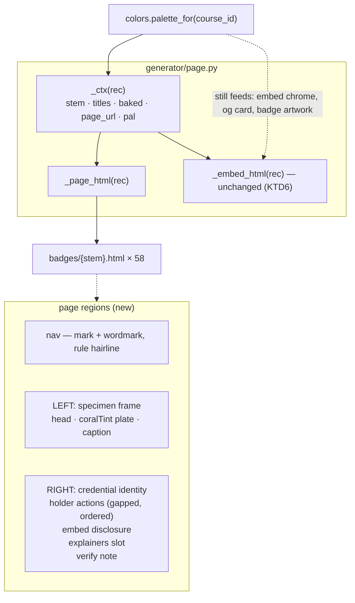

# feat: Bring the share page to the Andamio canon and give it one holder path

**Target repo:** `credential-badges`
**Origin:** `#99` (product parent: `Andamio-Platform/product-circle#150`, internal)

---

## Summary

The per-badge share page at `/badges/{stem}` is generated by `generator/page.py` in a visual language of its own — a per-course radial-gradient dark ground, Archivo / Spline Sans Mono, 8px button radius — and presents nine identically-styled actions in one flex row with no hierarchy. This plan restyles it to the Andamio canon (paper/ink, Inter / JetBrains Mono, square containers) and regroups those nine actions into a holder group and a collapsed embed group, in a two-column layout that fits one screen.

**Nothing the page currently claims changes.** The wording-gated copy (`_verify_note`, `_svg_note`, `_description`) is moved and re-styled, never rewritten; the existing wording-gate suite is the guard and must stay green. One line of content is added: the course id, labelled as the value the verification explainer asks a reader to match (KTD8).

---

## Problem Frame

A credential is the most public artifact this repo produces. It is what a holder puts in front of an employer, and what a stranger lands on with one question: is this real? The landing surfaces use the brand system; this page does not, so two Andamio pages do not read as the same company — and on a trust surface, inconsistency reads as unfinished.

Underneath that, the page has no information hierarchy. Seven of its nine actions serve someone who earned the credential; two serve a developer embedding a badge. Those are different visits, and they currently compete for the same attention in a single narrow centred column that leaves most of a wide viewport empty while still overflowing vertically on a laptop.

**This change trades one inconsistency for a smaller one, temporarily.** The explainer pages, the holder viewer, the embed variant and the Open Graph card all keep the current dark language, so a canon-paper share page will sit among four off-canon siblings until they follow. The Open Graph card is the sharpest case: it is the first Andamio surface anyone sees when a credential link is shared. See Scope Boundaries.

---

## Requirements

| ID | Requirement |
|---|---|
| R1 | The page draws colour, spacing and component treatment from the Andamio canon — paper/ink neutrals, square containers, canon hairlines. Type conformance is bounded by the font-delivery decision in KTD7 |
| R2 | The accent discipline holds: orange appears only in the canon's whitelisted roles — brand mark, a single primary action, live-pulse dot, verified stamp — and never on headings, body, labels or decoration. Blue is never a fill |
| R3 | A holder landing on the page sees the credential and one obvious next step without scrolling, at 1440×900 and 1280×800 |
| R4 | Holder actions and developer embed actions are visibly and programmatically separate groups, with the embed group not competing for attention |
| R5 | The layout uses available width rather than one narrow centred column, and collapses to a single column below 900px |
| R6 | Any identifier the page displays is shown in full — wrapping, never truncated, no ellipsis |
| R7 | Every claim the page makes is unchanged in meaning: the verification ceiling, the baked-aware branching, and the no-cryptographic-validity-assertion rule all survive verbatim in substance |
| R8 | Every existing progressive-enhancement affordance keeps working — copy link, Web Share, both copy-embed buttons stay hidden until their API is confirmed present, and no control is exposed that resolves to nothing |
| R9 | The downloads on this page read as the class artifact, never as the holder's own, and the action region is structured so a per-holder artifact affordance can be added later without re-laying out the page (`#99` hard constraint 4, `#89`, `#95`) |
| R10 | Every text-bearing element meets AA contrast on the new paper ground, and every interactive control has a visible focus state |

---

## Key Technical Decisions

**KTD1 — Current landing source is canon for this page, not the brand guide as written.**
*(session-settled: user-directed — chosen over building to the guide's v1.1 text, and over syncing the guide first.)*
The guide (`docs/design-system/andamio-brand-guide.md` in `landing-page-and-blog`) has not been touched since its v1.1 draft, and many landing commits have landed since with no sync note. Two contracts this page would naturally implement have been **reversed in code**:

- **The mono-uppercase kicker is retired.** `kickerCls` was deleted with the comment *"it was pok.tech's exact eyebrow treatment. No all-caps tracked eyebrows"* — `tokens.ts:178` carries the dated tombstone. Current treatment is Inter 13px semibold sentence case, `inkMuted`, led by a 2×2 orange square tile.
- **`Stitch` is deleted.** `ButtonRow` replaced it: *"Replaces the old border-stitched treatment; rows of buttons always get a gap, never touch"* — `gapButtons: gap-3` (12px). Zero occurrences of `Stitch` remain in `src/`.

Build to the code. The reference mockup implements both retired treatments and is wrong on exactly these two points.

**This overrides an explicit governance clause, deliberately.** The guide's §11 states that where the guide and `tokens.ts` disagree *"this file is canonical and the others are bugs."* We are inverting that on the strength of the dated `kickerCls` tombstone, which shows the divergence is a considered decision rather than drift. **Consequence to accept:** if landing later reverts either divergence to match the guide, this page goes stale in the opposite direction with no signal. U1 records the source commit ref so that drift is detectable by diff.

**KTD2 — The page ground becomes canon paper for every credential; the badge artwork keeps its per-course palette.**
*(session-settled: user-directed — chosen over deriving canon-shaped per-course page tokens.)*
`colors.palette_for(course_id)` stops feeding the **full page's** chrome. It continues to feed three things this plan does not touch: the badge SVG artwork (built by `build.py` / `render.py`, not here), the embed variant's own chrome (`_embed_html` reads `pal["ink"]`, `pal["bone"]`, `pal["sec"]` — KTD6), and the Open Graph card (`og.py:45`). Do not remove the import or the `_ctx` palette entry.

A per-course page accent cannot coexist with R2 — the canon has one paper per theme and a fixed accent whitelist. The landing's `.sys-light` forced-light island, used for its own badge specimen, is the established precedent for rendering a credential on a light plate.

**KTD3 — Colour values are transcribed as literals from the canon's `:root` block, and the page is light-only.**
There is no shared token package (`@andamio/tokens` is deferred in the guide's §11), so the values are copied from `globals.css`. **Only the light `:root` values are transcribed.** That file also defines a full `.dark` theme (`--sys-paper:#0f1419`, `--sys-orange:#ff7a52`, `--sys-blue:#5b8bff`, `--sys-coral-tint: rgb(255 122 82 / 0.1)`); this page ships **no** `prefers-color-scheme` block and renders light at every system theme, per the `.sys-light` precedent.

Two transcription traps: `coralTint` is **not** a tint of brand orange `#FF6B35` (`rgb(255,107,53)`) — the source writes it as `rgb(255 107 74 / 0.055)` and the page emits the equivalent `rgba(255,107,74,.055)`; re-deriving it from the orange shifts the credential plate. And the landing repo still carries a second live blue, `#004E89` "Foundation Blue", in its legacy shadcn layer, so a grep-based transcription can pick up the wrong one. The canon blue is `#2F6BFF`.

**KTD4 — No promoted primary action; hierarchy comes from grouping *and* ordering.**
Which share action a holder actually wants is unmeasured, and the canon permits one orange primary per view which KTD4 declines to spend. Both mechanisms must therefore be used — U3 states an explicit action order and tests it, rather than inheriting the accretion order of `#71`. Independent of that: add-to-profile must not be promoted while it still writes the wrong issuing organisation.

**KTD5 — The page resolves and displays no holder identity.**
The share page is keyed `(course_id, slt_hash)` and does not resolve a holder; that is the holder viewer's job at `/badges/{stem}/{alias}`. The reference mockup shows a `HOLDER  jamesdunseith` row, which this page structurally cannot render. Drop it. This forbids holder *identity* — an alias, a per-holder field, a `HOLDER` data row. It does not forbid the word "holder" in a group label.

**KTD6 — Only the full page changes. The embed variant does not.**
`_embed_html` renders into third-party sites at 340×380 and was corrected for centring in `#81`. It shares `_ctx` with the page but not its chrome. Restyling it is a separate decision with its own blast radius across every embedded badge in the wild. It is regenerated by the same `main()` run and must come out byte-identical.

**KTD7 — Font delivery is a decision this plan must make, not inherit.**
Neither Inter nor JetBrains Mono is a system font on macOS, Windows, iOS or Android, and the page loads no webfont — the no-external-assets invariant forbids a `<link>` or an external stylesheet. Declaring the stack alone therefore renders the page in `system-ui` / `ui-monospace` for nearly every visitor, and the canon's display metrics (Inter 600, tracking −0.045em) are calibrated to Inter. Note the current page has the same defect with Archivo, so this is pre-existing, not introduced.

The repo already has the machinery: `generator/embed_fonts.py` builds a base64 `@font-face` block into `generator/fonts.css`, and `gen.py` inlines it for the SVG path. Two options, and U1 must pick one:
1. **Subset-embed** Inter 600 + JetBrains Mono 400 as base64 `@font-face` in the page `<style>`, extending the existing mechanism. Preserves the one-file invariant; costs page weight across 58 pages.
2. **Accept the fallback** and narrow R1's type clause to "declares the canon stack".

Whichever is chosen goes in the Verification Contract. Do not leave R1 asserting type conformance the page does not deliver.

**KTD8 — The page displays the course id, labelled as the value the verification explainer asks you to match. It does not display `slt_hash`.**
The page shows no identifiers today, and `#99`'s constraint about identifiers wrapping is framed as a preservation clause — *"correctness properties the current page gets right"* — not as a request to add content. So a data list of both hashes was never actually asked for, and two facts argue against it: both identifiers already appear in full in the URL of every visit, so a data list duplicates the address bar; and the how-to-check explainer asks a reader to match the **course id** against an on-chain record while `slt_hash` appears nowhere in that procedure.

So the test is not presence-versus-absence but whether the string does work for the visitor. One identifier does. It is rendered adjacent to the "How this badge is checked" link rather than in a decorative block, so its purpose is visible at the point of use. Raw hex with no stated use is a claim of rigour, and this page's failure mode is looking technical while answering nothing.

**KTD9 — The single orange accent marks the verification affordance.**
R2 is a role whitelist rather than a count, so the brand mark and a stamp are not mutually exclusive in principle. The question is what the page's strongest attention instrument should point at, and there are three candidates:

- The nav brand mark — the one element that answers neither visitor's question.
- A "Verified" stamp on the specimen — carries direct R7 exposure. The page does not check a signature and must not imply that it does. This is what the mockup does.
- **The verification affordance** — the "How this badge is checked" route.

The third marks the *path* without asserting the *conclusion*, so it carries no R7 exposure, and it points at the stranger's entire reason for being on the page. The nav mark renders in ink; there is no stamp.

**KTD10 — The nav wordmark links to `https://www.andamio.io`.**
A nav band that looks like a nav and is inert is its own small irritation, and the visitor most likely to click a company mark is precisely the stranger asking whether this credential is real. The link is cross-host (this page is served from `credentials.andamio.io`) and opens in the same tab. It is the only outbound link the nav carries.

---

## High-Level Technical Design

The page is one self-contained HTML file per credential with inline CSS and no external assets — that constraint is load-bearing (the web root is a pure static trust surface) and does not change. What changes is the region structure inside it.

At a laptop viewport the two columns sit side by side inside `calc(100svh - nav)`; below 900px they stack, specimen first. The specimen frame is the canon's own credential contract — square ink hairline, a `coralTint` plate behind the artwork, a caption rule beneath.

**The one-screen guarantee binds the credential plus the first holder action, not the whole document.** That is what R3 and `#99` ask for, and a fixed full-page height budget is what would leave no room for the per-holder artifact R9 requires.

*Directional guidance for review, not implementation specification.*

---

## Implementation Units

### U1. Replace the page theme with canon tokens

**Goal:** the page's colour and type come from the canon, and per-course palette no longer reaches the page chrome.
**Requirements:** R1, R2, R10, KTD7
**Dependencies:** none
**Files:** `generator/page.py`, `generator/tests/test_page.py`

**Approach:**
1. Replace the `:root` custom-property block in the page `<style>` with the canon light literals per KTD3 — `paper`, `ink`, `rule` (solid ink, full-bleed dividers), the ink alpha ramp (`.60` muted / `.45` faint / `.30` ghost / `.15` cell / `.10` hairline / `.05` grid), `orange`, `blue`, `coralTint`. Record the `landing-page-and-blog` commit ref the values came from in a comment beside them, so drift is detectable by diff.
2. Drop the radial-gradient body background and the `--deep/--ink/--raised/--prim/--sec/--bone/--slate/--hair` bindings **from the page path only**. Leave `colors.palette_for` imported and `_ctx`'s `pal` entry intact — `_embed_html` reads it (KTD2, KTD6).
3. Resolve KTD7 and implement it. If embedding, extend `generator/embed_fonts.py`; if accepting fallback, say so in a comment and narrow R1.
4. Set the display treatment: Inter weight 600, tracking −0.045em. Labels are Inter 13px semibold sentence case per KTD1 — **not** the retired mono-uppercase kicker.
5. Remove `border-radius` from panels, plates, frames, buttons and inputs. The canon squares its *containers*; it does not ban radius outright (its live-pulse dot is a circle).
6. Set `<meta name="theme-color">` to the canon paper value. This replaces the per-course binding and supersedes `test_theme_color_matches_palette`.
7. **Text may only use `ink` or `inkMuted` (.60).** The `.45`, `.30`, `.15`, `.10` and `.05` steps are for rules, hairlines and non-text marks — on white, `.45` lands near 3.5:1 and fails AA. The reference mockup gets this wrong, setting 10–11px labels in `inkFaint`.
8. **Preserve the class hooks the tests split on.** The verification note stays `
` and the download note stays `
` — single class token, `
` element, no added attributes. `generator/tests/test_page.py::_slot` does `html.split(f'
')[1]`, so a class rename raises IndexError with the copy untouched.

**Patterns to follow:** the inline-`<style>`-in-an-f-string shape already in `_page_html`; keep every `{{` / `}}` escape correct. Do not introduce an external stylesheet.

**Test scenarios:**
- A generated page's body background is the canon paper value, and is identical across two credentials with different `course_id` values.
- `theme-color` is the canon paper value rather than a per-course colour.
- No panel, plate, frame, button or input rule declares `border-radius`.
- Neither `Archivo` nor `Spline Sans Mono` appears in page output; the canon stacks do.
- Whichever KTD7 option was chosen is asserted — an inlined `@font-face` for Inter is present, or a comment records the accepted fallback.
- The blue in link styling is `#2F6BFF`; `#004E89` appears nowhere.
- `coralTint` renders as `rgba(255,107,74,.055)` exactly — a regression guard against re-derivation from `#FF6B35`.
- No text-bearing rule uses an ink alpha below `.60`.
- `
` and `
` survive verbatim; the `_slot`-based wording-gate tests pass unmodified.

---

### U2. Restructure the page into nav + two columns

**Goal:** the layout uses available width, fits one screen, and collapses cleanly.
**Requirements:** R3, R5, R9
**Dependencies:** U1
**Files:** `generator/page.py`, `generator/tests/test_page.py`

**Approach:**
1. Add the nav band — brand mark plus wordmark, with a full-bleed `rule` hairline beneath, at the canon's `5rem` clearance. The wordmark links to `https://www.andamio.io` in the same tab (KTD10); note in a comment that this is deliberate cross-host navigation off the static trust surface. **The mark renders in ink, not orange** — the accent belongs to the verification affordance (KTD9).
2. Replace `main.card` (a 560px centred column) with a two-column grid capped at the canon's 1320px measure, with a `cell` hairline between columns. Nav divider uses `rule` (solid), the specimen frame edge uses `hairline` (.10), the inter-column divider uses `cell` (.15).
3. Left column: the specimen frame — square ink hairline, a header row, the badge image on a `coralTint` plate, a caption row beneath. The badge `` keeps its `width`/`height` attributes and stays horizontally centred. (Note: `#81` fixed the *embed* variant, whose docstring says it mirrors this page's `.badge` rule. Do not label page-side work as an `#81` guard — `test_embed_badge_image_is_horizontally_centred` reads the embed and must stay green untouched.)
4. Right column, in order: an identity region (U4), an actions region and embed disclosure (U3), the **explainers slot**, then the verify note. The containers are built here; U3 and U4 fill them.
5. **The explainers slot is a live region this restructure must carry.** `_page_html` renders `
` with "How do I share this?" and "How do I check this?" — it is not one of the nine actions and it is the stranger's only nav-level route to the verification explainer. Keep the `data-slot="explainers"` marker and both links as direct children with no intervening `
`: `test_explainer_links_present` splits on that marker and asserts an `<a ` inside. Keep it visually separated from the inline caveat link, whose label is deliberately different (`test_inline_caveat_link_differs_from_explainer_label`).
6. **The verification affordance carries the page's single orange accent** (KTD9) — applied to the "How do I check this?" route, not to the stamp and not to the nav mark. Mark the path, never the conclusion: no treatment here may read as an assertion that a signature was checked (R7).
7. Add the single-column collapse below 900px, specimen first.

**Execution note:** the without-scrolling claim in R3 is the part most likely to be wrong in practice — a unit test can assert the CSS is present but not that the content fits inside it. Generate a page and check it at 1440×900 and 1280×800 before considering this unit done. Also check the 900px-and-below stack: leading with a full specimen frame can push every action below the fold on a phone, which is the holder's most likely visit.

**Test scenarios:**
- A generated page contains the nav band, the wordmark links to `https://www.andamio.io`, and the mark is not orange.
- The orange accent appears on the verification affordance and nowhere else on the page.
- The badge `` retains its `width` and `height` attributes and its centring rule.
- The layout declares a two-column grid and a single-column fallback under a `max-width: 900px` query.
- Both explainer links are present, the `data-slot="explainers"` marker survives, and its links are direct children — `test_explainer_links_present` passes unmodified.
- `test_well_formed_html` passes against the restructured document.
- The page contains exactly one `<h1>`.

---

### U3. Split the nine actions into an ordered holder group and a collapsed embed group

**Goal:** holder actions and developer embed actions read as different things, in a deliberate order, with no promoted primary.
**Requirements:** R4, R8, R9, R10, KTD4
**Dependencies:** U2
**Files:** `generator/page.py`, `generator/tests/test_page.py`

**Approach:**
1. In `_share_controls`, split the single `div.actions` into two regions, each with a visible label that is also programmatically associated with its group. Give both labels and the disclosure summary as verbatim strings; treat them per KTD1 (Inter 13px semibold sentence case, **not** the retired mono kicker the mockup uses). They are new user-facing copy — keep them free of verification claims.
2. **State the holder-group order and test it.** The current order is the accretion order of `#71`, never designed. KTD4 spends hierarchy on grouping *and* ordering, so this is the half that carries R3's "one obvious next step". Put add-to-LinkedIn-profile last while it still writes the wrong issuing organisation.
3. Put the embed group behind a native `
`/`
`, default closed. Native, not a JS toggle: anchors must work with JS off, and `_SHARE_SCRIPT` is frozen byte-identical. If the marker is suppressed, replace it with a glyph that changes on `[open]` — the mockup removes the marker without replacing it, so the control gives no feedback that it opened.
4. **Handle the disclosure's empty state.** Both embed controls ship `hidden` and are revealed only when `navigator.clipboard` exists. Behind a disclosure that degrades *visibly*: the summary invites a click and opens onto nothing. The existing code solves this class of problem with `.actions:empty,.explainers:empty{display:none;}` — carry an equivalent to the new container, or have the disclosure reveal itself alongside its buttons.
5. Buttons get a gap, never touching borders — `ButtonRow`, not `Stitch`, per KTD1. Square, `cell` hairline, Inter, no radius. No orange fill on any action. Minimum 44px control height at and below the collapse breakpoint.
6. Add a visible `:focus-visible` treatment for buttons, anchors and the disclosure summary — an offset outline in ink. The page currently has **no** focus rule at all, only `:hover`, and removing radius makes the UA default ring fit worse. Never `outline:none` without a replacement.
7. **Preserve every `data-*` hook exactly, including attribute order.** `test_progressive_enhancement_buttons_hidden_and_script_present` asserts the literal substrings `'data-share-copy hidden'`, `'data-share-web hidden'`, and `'data-share-embed data-embed='`. Inserting a `class` or `aria-*` attribute *between* a hook and `hidden` fails the test with every hook intact. Put new attributes **before** the `data-*` hook. Hooks: `data-share-copy`, `data-share-web`, `data-share-embed`, `data-share-embed-wc`, `data-embed`, `data-slot="share-actions"`, `data-slot="explainers"`.
8. Keep `_svg_note` attached to the download affordance, making no verification claim, and reading as the class artifact rather than the holder's own (R9).

**Test scenarios:**
- Holder actions and embed actions are in separate containers; the embed container is a `
` and the group label is programmatically associated.
- The holder actions appear in the stated order.
- All four progressive-enhancement controls remain `hidden` — `test_progressive_enhancement_buttons_hidden_and_script_present` passes unmodified, adjacency intact.
- `_SHARE_SCRIPT` is byte-identical across two credentials — `test_share_script_is_a_constant_no_per_badge_interpolation` passes unmodified.
- The disclosure is not exposed when both its controls are `hidden`.
- No action carries an orange accent.
- A `:focus-visible` rule exists for buttons, anchors and the summary; no rule sets `outline:none` without a replacement.
- The escaped embed snippets survive attribute context — `test_embed_data_attribute_escaped` and `test_share_encoding_no_attribute_breakout` pass unmodified.
- All nine actions are present and point at the same URLs as before.
- The download copy contains no possessive framing ("your badge", "your credential") — R9.

---

### U4. Credential identity block

**Goal:** the page shows what the credential is, with any identifier complete and wrapping.
**Requirements:** R6, KTD5
**Dependencies:** U2
**Files:** `generator/page.py`, `generator/tests/test_page.py`

**Approach:**
1. Render the identity block in the right column: issuer line, module title as `<h1>`, course title.
2. Render the **course id** (56 hex characters, in full) adjacent to the "How this badge is checked" route, labelled as the value that explainer asks a reader to match — not in a standalone data block (KTD8). **Do not render `slt_hash`**; the verification procedure does not use it and it is already in the URL.
3. Any identifier is mono, `inkMuted`, and wraps with `overflow-wrap:anywhere`. No `text-overflow`, no `white-space:nowrap`, no ellipsis, no slicing, no Python-side truncation anywhere on the page path. These guards apply page-wide, not just to the one identifier now shown — they are the forward guarantee for the identifiers that arrive with the per-holder artifact (R9).
4. **No holder identity** (KTD5) — no alias, no `HOLDER` row, no per-holder field.
5. The issuer line stays *"Issued by Andamio"*. Changing it is `Andamio-Platform/product-circle#181` (internal), which is unplanned and carries a data dependency.

**Test scenarios:**
- The course id appears in full, asserted by equality against the record field rather than a hard-coded length (it is 56 characters — a Cardano policy id, not 64).
- The course id is rendered adjacent to the verification route and carries a label naming what it is for.
- `slt_hash` does not appear in the rendered body (it remains in URLs and the stem, which is expected).
- No page-path rule declares `text-overflow` or `white-space:nowrap` on an identifier-bearing element.
- No holder identity is rendered — no alias, no `HOLDER` label row, no per-holder field.
- The issuer line still reads "Issued by Andamio" — a guard that this restyle did not quietly absorb `#181`.
- A hostile course title never renders raw — `test_hostile_title_never_renders_raw_anywhere` passes unmodified.

---

### U5. Regenerate the committed pages and re-baseline the golden test

**Goal:** the 58 committed pages match the new generator, and the byte-parity guard is meaningful again.
**Requirements:** all
**Dependencies:** U1, U2, U3, U4
**Files:** `badges/{stem}.html` × 58 (generated), `generator/tests/test_page.py`

**Approach:**
1. `test_main_output_byte_identical_to_committed_pages` **will fail for all 58 pages** by design once U1–U4 land. Re-baseline it by regenerating, never by loosening the assertion. The `.embed.html` variants are regenerated by the same `main()` run and must come out **byte-identical** — that is the KTD6 guard, not a deliverable. Do not use a `badges/*.html` glob: that tree also holds 58 embed variants, `_holder.html`, and the two explainer pages, all out of scope.
2. Run the generator, commit the regenerated share pages, confirm byte-parity passes.
3. Confirm the wording-gate suite is green *without modification*: `test_wording_gate`, `test_verifier_class_mentions_stay_qualified`, `test_caveat_appears_once_in_plain_language`, `test_caveat_keeps_its_compatibility_bound`, `test_baked_download_note_makes_no_check_claim`, `test_verifiability_copy_is_baked_aware`, `test_unbaked_copy_never_claims_a_signature_in_any_phrasing`, `test_inline_caveat_link_differs_from_explainer_label`, `test_verify_note_differs_by_baked_state`.

**Execution note:** if a wording-gate test fails, distinguish two causes before touching anything. **A copy claim moved** — R7 forbids it; fix the markup, not the test. **Or a class hook moved** — five of those tests reach the copy through `_slot()`, which splits on the literal `
` / `
` opening tags, so a class rename raises IndexError with the copy entirely intact. U1 step 8 forbids that rename precisely so this ambiguity cannot arise; if it does, restore the class rather than re-point the helper. `docs/solutions/conventions/never-delete-a-qualifier-that-bounds-a-claim.md` records why the first class of edit is dangerous, and `docs/solutions/runtime-errors/stale-pycache-bytecode-masks-source-edits.md` is worth reading before concluding a source edit had no effect.

**Test scenarios:**
- Byte-parity passes against the regenerated tree.
- 58 share pages regenerated; all 58 `.embed.html` variants unchanged.
- The full `generator/tests/` suite passes with no test file modified other than those this plan names.

---

## Verification Contract

- `generator/tests/` passes in full.
- No wording-gate test was modified to make it pass.
- All 58 embed variants are byte-identical to their committed versions.
- A generated page at 1440×900 and 1280×800 shows the credential and the first holder action without scrolling.
- A generated page below 900px stacks to one column, specimen first, with no horizontal overflow and 44px minimum control heights.
- The course id is visible in full and wrapped, with no ellipsis, at every viewport.
- Orange appears once, on the verification affordance, and nowhere else.
- Every interactive control has a visible focus state; no text uses an ink alpha below `.60`.
- Whichever KTD7 font-delivery option was chosen is in effect and asserted.

## Definition of Done

R1–R10 hold; the 58 committed share pages are regenerated and byte-parity is green; the embed variant, holder viewer, explainer pages and OG card are untouched; and the page makes no claim it did not make before. The one content addition is the labelled course id beside the verification route (KTD8).

---

## Scope Boundaries

**In scope:** the full share page rendered by `_page_html` in `generator/page.py`, and the tests covering it.

**Not in scope:**
- `_embed_html` — the third-party embed variant (KTD6).
- The holder viewer (`generator/holder.py`) and the explainer pages (`generator/explainers.py`).
- The Open Graph card (`generator/og.py`) — see the deferred note below.
- The badge SVG artwork and `colors.palette_for`, which keeps serving it.
- Issuer attribution — `Andamio-Platform/product-circle#181` (internal), unplanned.
- Whether holder actions require a connected wallet — `Andamio-Platform/product-circle#151` (internal). This plan builds the grouping; that issue owns the visibility rule.
- The per-holder Holder Artifact and its download (`#89`), which lands on the holder viewer. **R9 keeps a place for it in this layout.**

### Deferred to Follow-Up Work
- **The Open Graph card (`og.py`).** It builds a 1200×630 per-course dark field in Archivo, and it is *this page's own* `og:image` — the first Andamio surface anyone sees when a credential link is shared. After this change it previews a page it no longer resembles. Accepted as an interim cost; worth doing next, before the explainers.
- Restyling the explainer pages and the holder viewer, both reachable in one click and both still dark.
- Restyling the embed variant, as its own change with its own blast radius.
- Adding a Credential Badges row to the brand guide's §10 checklist — bookkeeping, not a prerequisite (see Risks).
- Syncing the brand guide to current landing source. Its own §11.1 mandates a sync note per landing change and none has been filed; that is a `landing-page-and-blog` problem.

---

## Open Questions

**Q1 — Which font-delivery option does U1 take? (KTD7.)**
The only decision this plan deliberately leaves to implementation, because it turns on a measurement nobody has taken: the per-page byte cost of a subset-embedded Inter 600 + JetBrains Mono 400 across 58 self-contained files. Subset and measure first, then choose. If the cost is acceptable, embed; if not, accept the system fallback and narrow R1's type clause in the same commit rather than leaving R1 overclaiming.

*Three questions that were open at first review are now settled as KTD8 (the course id is the one identifier shown, labelled at the point of use), KTD9 (the orange accent marks the verification affordance), and KTD10 (the nav wordmark links to `https://www.andamio.io`). Their reasoning is recorded there.*

---

## Risks

| Risk | Mitigation |
|---|---|
| The wording-gated copy is subtly altered while being re-styled, weakening a claim | The wording-gate suite is the guard, and U5 forbids editing it to pass. A qualifier is a ceiling — removing it *widens* the claim rather than narrowing it |
| A class-hook rename makes wording-gate tests fail for a reason that is not a copy change, and the stop rule misfires | U1 step 8 pins `
` and `
`; U5's execution note names both causes so they cannot be confused |
| The golden byte-parity test gets loosened rather than re-baselined | U5 states the re-baseline explicitly; the assertion is the point of the test |
| The canon is transcribed from the guide rather than the code, shipping the retired kicker and the reversed stitch | KTD1 is explicit on both, and U1/U3 carry the specific treatments |
| Hand-copied literals drift as landing changes, with no token package and no sync obligation to this repo | U1 step 1 records the source commit ref so drift is detectable by diff. A shared token package is the real fix and is upstream's call |
| Conforming a surface the brand guide's §10 checklist does not list | Low. The guide's header declares itself *"Canon for: every Andamio surface"* and the enumeration that follows reads as illustrative, so no governance gate is triggered. Adding a §10 row is optional bookkeeping, deferred above |
| A `.pyc` cache masks a source edit and a change appears to have no effect | `docs/solutions/runtime-errors/stale-pycache-bytecode-masks-source-edits.md` |

---

## Sources & Research

- `#99` — the origin issue, with the four hard constraints.
- `docs/mockups/2026-07-27-share-page/` — reference mockups and their README. **Layout only.** Their copy predates the current release; `brand-conformant.html` additionally renders a holder row this page cannot produce, an issuer attribution that has not shipped, labels in the retired mono kicker, stitched buttons, `inkFaint` body text below AA, and no focus states.
- `docs/design-system/andamio-brand-guide.md` in `landing-page-and-blog` — the canon text. Read alongside the source below, not as a frozen spec.
- `landing-page-and-blog`: `src/styles/globals.css` (the only place canon hexes live, light `:root` and `.dark`), `src/ui/system/tokens.ts` (semantic layer; `:178` carries the dated `kickerCls` tombstone), `src/ui/system/kit.tsx` (`ButtonRow` replacing `Stitch`).
- `generator/tests/test_page.py` — `_slot()` at `:383`, the adjacency assertions at `:305-315`, and the byte-parity guard are the three couplings this restyle has to respect.
- `docs/solutions/conventions/never-delete-a-qualifier-that-bounds-a-claim.md`
- `docs/solutions/runtime-errors/stale-pycache-bytecode-masks-source-edits.md`
- `#89` and `#95` — why the share page carries a class artifact and does not know a holder.
