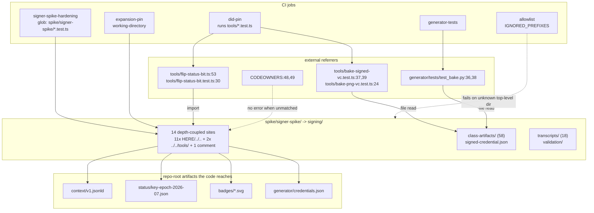
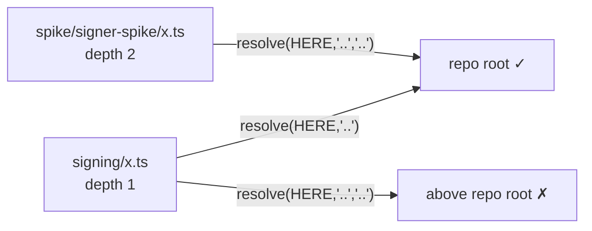

# Retire the Spike Directory - Plan

## Goal Capsule

**Objective.** Separate production from evidence inside `spike/`, move the production half to a top-level `signing/`, and rename the remainder to `archive/`. Structural change only. No signed artifact may be altered.

**Authority hierarchy.** The Verification Contract outranks convenience: if a pinned expansion hash changes, stop and report — do not update the pin. The classification in `## File Classification` is the agreed Step-1 deliverable; deviate from it only with evidence, and say so.

**Stop conditions.**
- Any `proofValue` anywhere in the repo changes.
- Either `canonicalSha256` in `expansion-pin.dep-test.ts` needs editing to pass.
- Any file under `class-artifacts/`, `badges/`, or `status/` shows a content diff rather than a pure rename.
- A classification turns out to be a judgment call rather than a fact.

**Execution profile.** Two commits on `chore/retire-spike`: a pure `git mv` commit, then a repairs commit. Open a PR. Do not merge.

**Tail ownership.** The implementer owns commit, push, and PR open. Merge is James's.

---

## Product Contract

### Summary

Move `spike/signer-spike/` — 108 tracked files, of which 85 are production — to a new top-level `signing/`, rename the remaining 75 files of `spike/` to `archive/`, and repair every reference the move breaks — CI, CODEOWNERS, the served-file allowlist, two `tools/` imports, three cross-language test file-reads, and the live docs. Prove nothing changed by byte-identity, not by CI green alone.

### Problem Frame

`spike/` is a lie by name. It holds the KMS signing path, the kill-switch status-list builder, the 58 signed Class Achievement credentials that back every served badge, and the audit trail of every KMS run. Two CI jobs execute out of it. CODEOWNERS gates two files inside it. `tools/` imports from it. A spike is a thing you throw away; the name will eventually be believed by someone with commit rights.

The name is also load-bearing in the wrong direction: `MOC.md:134` and `CONTRIBUTING.md:45` both cite `spike/` as the example of "repo material that is not served", and `scripts/ci/check-allowlist.sh` hard-codes the string `spike` in `IGNORED_PREFIXES`. The word is wired into the repo's own explanation of itself.

### Requirements

**Classification and evidence**

- R1. Every tracked file under `spike/` is classified as production, evidence, dead, or infrastructure, each with a concrete citation. Files that fit no bucket are reported as such rather than forced.
- R2. The classification is derived from imports, CI, and CODEOWNERS — not from the sketch in the handoff, which is checked rather than adopted.

**The move**

- R3. `spike/signer-spike/` moves whole to `signing/` at the repo root, via `git mv`, with rename detection preserved for all 108 files.
- R4. `spike/` is renamed to `archive/`, carrying the evidence and dead halves unchanged.
- R5. No file under `class-artifacts/`, `badges/`, or `status/` is edited. Moved, yes; edited, never.
- R6. Nothing is deleted. Superseded code is archived.

**Reference repair**

- R7. The depth-coupled references inside the moved tree resolve correctly at the new depth: 11 repo-root resolutions, 2 imports into `tools/`, 1 path comment, and the relative links in the package's own README.
- R8. Both CI jobs that execute out of `spike/signer-spike/` run the same assertions against the new path.
- R9. The two CODEOWNERS entries gating `status-list.ts` and `status-list.test.ts` still match a tracked file after the move.
- R10. `scripts/ci/check-allowlist.sh` accounts for both new top-level directories, and the `allowlist` CI job passes.
- R11. The seven external code references across five files are repointed: two imports in `tools/flip-status-bit*.ts`, three file-reads in `tools/bake-*.test.ts`, and two in `generator/tests/test_bake.py`.
- R12. Live documentation that instructs a reader where to go is updated. Dated records of what was true when written are not.

**Proof**

- R13. Every signed artifact is byte-identical before and after, proven by a sha256 manifest independent of CI.
- R14. Both expansion-pin hashes verify without edit.
- R15. A guard prevents a silently-wrong repo-root resolution in the two write paths CI does not exercise.

### Scope Boundaries

**In scope.** The classification, both directory moves, every reference repair, the depth guard, and the live-doc updates.

**Deferred to follow-up work.**
- Extending the expansion pin to cover the 58 class artifacts ([#116](https://github.com/Andamio-Platform/credential-badges/issues/116)). Separate PR, deliberately — a pure move is reviewable, a move plus a behaviour change is not.
- Reviewing `CORNERS-CUT.md` for corners that shipped. That is a product question.
- Promoting `archive/mapping.md` and `archive/credential-imagery.md` into `docs/` ([#117](https://github.com/Andamio-Platform/credential-badges/issues/117)). They are cited as current authority by `docs/badge-registry.md` while living in an archive — a real tension, recorded in Open Questions, not resolved here.
- Adding a `make` entry point for the signing path. It was never wired into `Makefile`; adding one is new surface, not a port.
- Reviewing CODEOWNERS coverage of `signing/`. The move concentrates the KMS signing entry points, the kill-switch writer, the 58 unpinned class artifacts, and `expansion-pin.dep-test.ts` (which holds both hash pins) into one directory, while only `status-list.ts` and its test stay gated. The repo gates the equivalent pin files elsewhere — `.github/CODEOWNERS:18-19` and `:30-32` cover `did-pin.test.ts` and `context-freeze.test.ts` on exactly that reasoning. The gap is pre-existing and widening the gates here would be the behaviour change this PR excludes; it is recorded so it is not lost.
- Renaming the npm package. `signing/package.json` keeps `"name": "signer-spike"` after the move. Renaming it churns the lockfile the `expansion-pin` job installs from, which is a content change to a file this PR should only move.

Each deferred item needs a tracked issue before this PR merges — the repo's own convention, per commit `db2dc3f`, is that an unfinished surface names the issue that tracks it.

**Outside this change's identity.** Any behaviour change. Any re-signing. Any edit to a dated plan or brainstorm. If a move tempts a fix, note it in the PR and leave it.

---

## File Classification

The Step-1 deliverable. 183 tracked files under `spike/`, excluding `node_modules/`. Derived from imports, CI job definitions, and CODEOWNERS.

**The three buckets do not account for every file.** Four `.gitignore` files are neither product, record, nor dead — they are infrastructure that must travel with whatever they govern. Reported as a fourth bucket rather than forced into a fit.

| Bucket | Files | → `signing/` | → `archive/` |
|---|---|---|---|
| production | 85 | 85 | — |
| evidence | 76 | 22 | 54 |
| dead | 18 | — | 18 |
| infrastructure | 4 | 1 | 3 |
| **total** | **183** | **108** | **75** |

The buckets do not map 1:1 to destinations, because of KTD4: the 22 evidence files inside `spike/signer-spike/` — 18 transcripts, 3 validation captures, and the package README — are that tool's audit trail and move with it. Directory-wise this stays simple: `git mv spike/signer-spike signing` (108 files), then `git mv spike archive` (75 files).

### Production — 85 files, all in `spike/signer-spike/`

| Path | Evidence |
|---|---|
| `status-list.ts` | Imported by `tools/flip-status-bit.ts:53` and `tools/flip-status-bit.test.ts:30`; CODEOWNERS-gated at `.github/CODEOWNERS:48`; builds the served `status/key-epoch-2026-07.json` |
| `status-list.test.ts` | CI job `signer-spike-hardening`; CODEOWNERS-gated at `.github/CODEOWNERS:49`; holds `COMMITTED_STATUS_FILE_SHA256` |
| `document-loader.ts` | 9 intra-package importers; reads the served `context/v1.jsonld` |
| `sign.ts` | The KMS signing path; imports `../../tools/gen-did-json.ts` |
| `sign-status-list.ts` | Writes the served `status/key-epoch-2026-07.json` — the kill-switch artifact |
| `sign-class.ts` | Produces all 58 class artifacts |
| `bake-class.ts` | Writes `badges/*.svg`; imports `../../tools/bake-signed-vc.ts` |
| `check-anchor.ts`, `check-status.ts`, `slt-hash.ts`, `issue-error.ts`, `map-credential.ts`, `class-credential.ts` | Intra-package importers plus CI coverage via their `*.test.ts` siblings |
| `resign-check.ts`, `verify-loopback.ts`, `validate-1edtech.ts` | Named as live steps in `docs/runbooks/class-artifact-signing.md` and `docs/runbooks/key-compromise.md` |
| `*.test.ts` (the 6 not listed separately above) | CI job `signer-spike-hardening`, glob `.github/workflows/ci.yml:46` |
| `expansion-pin.dep-test.ts`, `class-credential.dep-test.ts` | CI job `expansion-pin`, `.github/workflows/ci.yml:56-60` |
| `signed-credential.json` | Read by **three** CI jobs: `expansion-pin`, `did-pin`, `generator-tests` |
| `class-artifacts/*.json` (58) | 1:1:1 with `badges/_registry.json` and `badges/*.svg` — verified, exact set equality both directions, zero diff |
| `package.json`, `package-lock.json` | `npm ci` in CI job `expansion-pin` |

### Evidence — 76 files

`spike/signer-spike/transcripts/` (18), `spike/signer-spike/validation/` (3), `spike/signer-spike/README.md`, `spike/verifier-spike/` (all), `spike/samples/` (10), and the seven top-level `.md` records plus `sample-credential.jsonld`.

Six evidence files carry a `proofValue` and land in `archive/`: the four `spike/samples/*-real.{jsonld,html}` round-trip proofs and the two `spike/verifier-spike/publish/` pre-flight artifacts. They are not production, but the Goal Capsule's stop condition covers every `proofValue` in the repo, so U1's baseline manifest spans all of `spike/`, not just the production half.

Two entries carry an ambiguity, reported rather than resolved: `mapping.md` and `credential-imagery.md` are historical in origin but are cited five times by `docs/badge-registry.md` as current authority for `slt_hash` semantics and the imagery decision. They archive with the rest; the tension is in Open Questions.

`spike/verifier-spike/src/` (12 files) is code, not a record — but imported by nothing, run by no CI job, and its only purpose is to regenerate the `publish/` artifacts the committed evidence rests on. Classified evidence as a reproduction harness.

### Dead — 18 files

All of `spike/src/` (14) plus `spike/package.json`, `spike/package-lock.json`, `spike/tsconfig.json`, `spike/.env.example`.

`spike/src/` is a genuinely isolated island: no file anywhere in the repo imports it. `tools/gen-did-json.ts:14,48` says it *mirrors* `spike/src/keys.ts` — a prose comment, not an import edge. Every module is superseded: `mapper.ts` by `map-credential.ts`, `sign.ts` (VC-JWT) by the Data Integrity path, `keys.ts` by `tools/gen-did-json.ts`, `verify.ts` by `issuer-service/src/anchor.ts`.

Dead as code, but it is the only reproduction harness for the `spike/samples/` evidence and `validation-results.md`. Archived, not deleted, per R6.

### Infrastructure — 4 files

`spike/.gitignore`, `spike/signer-spike/.gitignore`, `spike/verifier-spike/.gitignore`, `spike/verifier-spike/verifiers/spruce/.gitignore`. The last one's *comment* is itself a decision record (why `Cargo.lock` is tracked). Each travels with its directory.

---

## Planning Contract

### Key Technical Decisions

- KTD1. **Destination is a top-level `signing/` at depth 1.** (session-settled: user-directed — chosen over `scripts/signing/` and `signing/signer/`: both preserve `../..` and allow a pure `git mv`, but `scripts/` understates the KMS signing path the same way `spike/` did, and a wrapper directory that exists only to hold depth is a contrivance the README would have to admit to.) Governs R3.

- KTD2. **Accept the 14 one-segment path edits; guard the six the CI does not cover.** Depth 1 means 11 repo-root resolutions lose a segment, 2 imports into `tools/` lose one, and the output-path comment at `sign-status-list.ts:19` loses one. Only seven sites are exercised by a test that actually *reads* the resolved path — constructing a wrong path throws nothing, so a site is only self-checking when something reads it. Verified by the test-import graph: no test file imports `sign.ts`, `sign-class.ts`, `bake-class.ts`, or `validate-1edtech.ts`, which leaves six sites latent — `sign.ts:64`, `sign-class.ts:54`, `sign-status-list.ts:47`, `bake-class.ts:30`, `bake-class.ts:35`, and `validate-1edtech.ts:33`. Two of those are write paths reached only by a live signing run or a kill-switch flip. KTD3 covers all six. Governs R7, R15.

- KTD3. **The depth guard is two mechanical assertions, not a refactor.** First: from the package directory, `resolve(HERE, "..")` contains `context/v1.jsonld`, `status/key-epoch-2026-07.json`, `badges/_registry.json`, and `generator/credentials.json`. Every module in the package sits flat in `signing/` and shares that `HERE`, so one assertion covers the shared arithmetic. Second: no `.ts` file in the package still contains `"..", ".."` or `../../`, scanning comments as well as code. The second is what catches a *missed* edit, which the first cannot. Scope both assertions precisely, or the guard reddens against a correct tree: read only the top-level `*.ts` entries of `signing/` with `readdirSync` and no recursion, so `node_modules/` (which the `expansion-pin` job installs into the same directory) is out of scope; and skip the guard file itself, which must contain both needles in order to search for them. Build the needles by string concatenation so they do not match the source that defines them. Both assertions stay hermetic and run in the no-install job. Rejected: introducing a shared `repo-root.ts` helper — that is a refactor, and this PR is a move. Governs R15.

- KTD4. **All of `spike/signer-spike/` moves, including `transcripts/` and `validation/`.** They are evidence by classification, but they are *this tool's* audit trail. `AGENTS.md` requires every KMS signing run to be transcribed, and `docs/runbooks/key-compromise.md` treats a KMS `asymmetric-sign` not attributable to a recorded run as a compromise trigger. Splitting the tool from its transcript directory breaks the attribution chain and leaves the runbook pointing at two places. This also makes the move one `git mv` of one directory. Governs R3, R6.

- KTD5. **The evidence half is renamed in place: `spike/` becomes `archive/`.** (session-settled: user-approved — chosen over relocating it under `docs/`: one move rather than two, and the historical doc references stay structurally truthful.) Nothing inside depends on the directory name: `spike/src/` and `spike/verifier-spike/src/` anchor on `process.cwd()`, and the one traversal that does reach the repo root — `verifier-spike/verifiers/spruce/src/main.rs:51`, an `include_str!` five levels up — is depth-preserving under an in-place rename. Governs R4.

- KTD6. **Commit one carries both `git mv` operations and nothing else; commit two carries the repairs.** A rename-only commit is the only way a reviewer can confirm no signed artifact was touched, and that argument applies to the archive half too — six evidence files there carry a `proofValue`. So `spike/signer-spike` → `signing/` and `spike` → `archive/` both land in commit one; every content edit, including the two README edits and `.gitignore`, lands in commit two. CI need not be green on commit one — the PR is what must be green. Governs R3, R4, R13.

- KTD7. **Byte-identity is proven by an independent sha256 manifest, not by CI green.** The expansion pin covers exactly two artifacts — `signed-credential.json` and `status/key-epoch-2026-07.json` — as `SIGNED_ARTIFACTS` in `expansion-pin.dep-test.ts` shows. The 58 class artifacts all carry a `proofValue` and none is pinned. The `expansion-pin` job will go green after this move without ever having canonicalized 58 of the 60 signed artifacts. Treating it as sufficient proof would be a guard passing for the wrong reason. Governs R13, R14.

- KTD8. **CI job ids are renamed along with their paths.** `signer-spike-hardening` becomes `signing-hardening`. Verified safe: `main` has no branch protection, so no required-check context is un-required by the rename. Leaving a job named after a directory that no longer exists reintroduces the problem this PR fixes. Governs R8.

- KTD9. **Doc updates are split by instruction versus record.** A reference that tells a reader or operator where to go is updated. A reference that records what was true on a date is not. In scope: `MOC.md`, `README.md`, `ROADMAP.md`, `CONTRIBUTING.md`, `docs/badge-registry.md`, the three runbooks, the live pointers in all five `docs/solutions/` entries, `tools/README.md` (its line 104 states a current bake invariant), and the moved package's own `README.md`. Left untouched as records: 205 hits across 15 dated files in `docs/plans/` and `docs/brainstorms/`, all transcripts including `tools/transcripts/`, all validator captures, and the `Origin: spike/signer-spike/...` provenance headers across `issuer-service/src/` — those name what a port was copied from on a date. The one deliberate exception is `issuer-service/README.md:7`, which says the spike "stays in place" in live present-tense prose; that is an instruction about the current repo and is updated. `AGENTS.md` states dated plans keep decisions "left legible on purpose", including refuted ones. Governs R12.

### High-Level Technical Design

The reference graph, and what the move breaks. Solid edges are hard breaks that fail loudly; dashed edges are soft breaks that fail silently.

Depth is the constraint. Every module in `spike/signer-spike/` sits at depth 2, so `HERE/../..` is the repo root. At depth 1 that arithmetic is off by one directory and resolves *above* the repo. Constructing a wrong path throws nothing, so only the seven sites whose path a test actually reads fail loudly. The other six — including both write paths — are silent until a live signing run or a kill-switch flip. That gap is what U3's guard exists to close.

### Assumptions

- The `chore/retire-spike` worktree at `.worktrees/chore/retire-spike` is the intended workspace. It sits at `db2dc3f`, same as `main`, with no work started.
- The uncommitted `+.worktrees` line in `.gitignore` is unrelated to this work and ships separately or is left alone.
- `spike/signer-spike/out/` is gitignored and empty in a clean checkout; nothing needs to move.

### Open Questions

- **Deferred.** `docs/badge-registry.md` cites `archive/mapping.md` five times as current authority for `slt_hash` semantics and `archive/credential-imagery.md` once for the imagery decision. After this move a live reference doc cites an archive as normative. Options are to promote both into `docs/`, or to inline what `badge-registry.md` needs and let the archive keep the full record. Not blocking: the links work either way once repointed.

---

## Implementation Units

### U1. Move both directories

- **Goal:** Both directories move — `spike/signer-spike/` to `signing/` and `spike/` to `archive/` — with full rename detection and zero content changes.
- **Requirements:** R3, R4, R5, R6.
- **Dependencies:** none.
- **Files:** `spike/signer-spike/` (108 files) → `signing/`; `spike/` (75 remaining files) → `archive/`.
- **Approach:**
  1. Record a pre-move sha256 manifest of every tracked file under `spike/`, `badges/`, and `status/`. Key each entry by its path relative to its own root, not by basename — `spike/signer-spike/README.md` and `spike/signer-spike/validation/README.md` share a basename, and a basename-keyed map silently drops one of them. Paths inside the package are preserved by the move, so a package-relative key survives it. This is the U8 baseline and must be taken before anything moves.
  2. `git mv spike/signer-spike signing` — one directory move, per KTD4.
  3. `git mv spike archive` — U6's move, taken here so both renames share one clean commit, per KTD6.
  4. Commit. Renames only; no content edits in this commit.
- **Execution note:** Verify rename detection *before* committing anything else. `git diff --cached -M --stat` must show renames at 100% similarity for all 183 files. If any file reads as delete+add, `--follow` history is lost on signed artifacts and KMS transcripts — stop and investigate rather than proceeding.
- **Patterns to follow:** `scripts/verify-live/` (PR #100) established the shape of a promoted self-contained package. Its promotion was not a `git mv` — the source was untracked — so it is a precedent for shape, not mechanics.
- **Test scenarios:**
  - `git diff --cached -M --stat` reports 183 renames, 0 insertions, 0 deletions.
  - `git diff --cached -M --numstat` shows `0	0` for every path. Run it with no pathspec, or with `-- spike/ signing/ archive/` — a pathspec naming only the destination filters the delete side out before rename detection runs and reports every file as an addition.
  - `git ls-files signing | wc -l` is 108; `git ls-files signing/class-artifacts | wc -l` is 58; `git ls-files signing/transcripts | wc -l` is 18.
  - `git ls-files archive | wc -l` is 75; `git ls-files spike` is empty.
- **Verification:** The commit contains only renames. No file content differs.

### U2. Repair the 14 depth-coupled references inside `signing/`

- **Goal:** Every path that resolved through depth 2 resolves correctly at depth 1.
- **Requirements:** R7.
- **Dependencies:** U1.
- **Files:** `signing/bake-class.ts`, `signing/check-status.ts`, `signing/class-credential.ts`, `signing/class-credential.test.ts`, `signing/document-loader.ts`, `signing/document-loader.test.ts`, `signing/expansion-pin.dep-test.ts`, `signing/sign-class.ts`, `signing/sign-status-list.ts`, `signing/status-list.test.ts`, `signing/validate-1edtech.ts`, `signing/sign.ts`.
- **Approach:**
  1. Replace the 11 repo-root resolutions: `"..", ".."` becomes `".."`. Sites are `bake-class.ts:35`, `check-status.ts:36`, `class-credential.ts:59`, `class-credential.test.ts:24`, `document-loader.ts:35`, `document-loader.test.ts:26`, `expansion-pin.dep-test.ts:38`, `sign-class.ts:54`, `sign-status-list.ts:47`, `status-list.test.ts:31`, `validate-1edtech.ts:33`.
  2. Replace the 2 outbound imports: `bake-class.ts:30` and `sign.ts:64` change `../../tools/` to `../tools/`.
  3. Replace the output-path comment at `sign-status-list.ts:19` — `// Output: ../../status/key-epoch-2026-07.json` becomes `../status/...`. It is a comment, not code, but it is the in-code statement of where the kill-switch signer writes, and U3's guard scans comments.
  4. Change nothing else. No renames, no reformatting, no drive-by fixes.
- **Execution note:** Six of the fourteen sites are reached by no test — `sign.ts:64`, `sign-class.ts:54`, `sign-status-list.ts:47`, `bake-class.ts:30`, `bake-class.ts:35`, `validate-1edtech.ts:33` — because no test file imports those four modules. Two of them write served artifacts. Treat all six with more care than the rest, and let U3's guard prove them rather than inspection. Note that U3's guard checks the *shape* of the path, not that the two `../tools/` specifiers resolve; a wrong-but-different edit such as `./tools/` passes every gate, so read those two by eye.
- **Test scenarios:**
  - The `signing-hardening` job passes: `node --experimental-strip-types --test signing/*.test.ts`.
  - `document-loader.test.ts` resolves and reads the committed `context/v1.jsonld`.
  - `status-list.test.ts` resolves `status/key-epoch-2026-07.json` and its committed-file sha256 assertion passes.
  - `class-credential.test.ts` resolves and reads `generator/credentials.json`.
  - `expansion-pin.dep-test.ts` resolves `context/v1.jsonld` and both pinned artifacts.
  - The diff for this unit is exactly 14 changed lines across 12 files.
- **Verification:** Both signing CI jobs green with no pin edits.

### U3. Add the repo-root depth guard

- **Goal:** A wrong repo-root resolution fails in CI instead of during an incident.
- **Requirements:** R15.
- **Dependencies:** U1. Write it before U2 so its failure against the un-repaired tree is observed, not reconstructed.
- **Files:** `signing/repo-root.test.ts` (new).
- **Approach:** Two assertions, per KTD3. First, `resolve(HERE, "..")` contains all four marker files the package reaches: `context/v1.jsonld`, `status/key-epoch-2026-07.json`, `badges/_registry.json`, `generator/credentials.json`. Second, no `.ts` file in the package contains the depth-2 patterns `"..", ".."` or `../../` — this is what catches an edit U2 missed, which the first assertion cannot. Scope the second assertion per KTD3: `readdirSync` over the top level of `signing/` only (no recursion, so the 296 `.ts` files `npm ci` drops into `node_modules/` are excluded), skip the guard file itself, and build both needles by string concatenation so the file does not match its own source. Keep it dependency-free so it runs in the no-install job.
- **Execution note:** Write this test first and watch it fail against the un-repaired tree, then let U2's edits turn it green. A guard that has never failed has not been shown to guard anything.
- **Patterns to follow:** `tools/*.test.ts` — dependency-free, `node --experimental-strip-types`, hermetic.
- **Test scenarios:**
  - Fails against the un-repaired tree (observed before U2 lands, per the dependency above).
  - Passes against the repaired tree.
  - Passes when run after `npm ci` has populated `signing/node_modules/` — confirming the scan does not recurse.
  - Does not flag itself, despite containing both needles.
  - Fails when the marker-file assertion is pointed one directory too high (confirm by temporary local edit, revert after).
  - Fails when a `"..", ".."` is reintroduced into any package `.ts` file, including inside a comment.
  - Runs with no `npm install` — the file imports only `node:` builtins.
- **Verification:** Included in the `signing-hardening` glob and green.

### U4. Repoint the external code references

- **Goal:** The five files outside the moved tree that reach into it resolve at the new path.
- **Requirements:** R11.
- **Dependencies:** U1.
- **Files:** `tools/flip-status-bit.ts`, `tools/flip-status-bit.test.ts`, `tools/bake-signed-vc.test.ts`, `tools/bake-png-vc.test.ts`, `generator/tests/test_bake.py`.
- **Approach:**
  1. Imports: `tools/flip-status-bit.ts:53` and `tools/flip-status-bit.test.ts:30` change `../spike/signer-spike/status-list.ts` to `../signing/status-list.ts`.
  2. File reads: `tools/bake-signed-vc.test.ts:37,39` and `tools/bake-png-vc.test.ts:24` change `join(REPO, "spike", "signer-spike", …)` to `join(REPO, "signing", …)`.
  3. Python: `generator/tests/test_bake.py:36,38` change `os.path.join(REPO, "spike", "signer-spike", …)` to `os.path.join(REPO, "signing", …)`.
  4. `tools/flip-status-bit.ts:236-252` prints operator instructions containing `spike/signer-spike` paths and a `cd` command. Update the printed text — it is an instruction, not a record.
- **Approach note:** These break in the `did-pin` and `generator-tests` jobs, not in either signing job. The handoff's ground truth did not list them.
- **Test scenarios:**
  - `did-pin` job green: `node --experimental-strip-types --test tools/*.test.ts`.
  - `generator-tests` job green: `python3 generator/tests/test_bake.py`.
  - `tools/flip-status-bit.test.ts` imports and exercises `signing/status-list.ts` with no install — confirming `status-list.ts` is still dependency-free after the move.
  - The kill-switch dry-run output contains no `spike/` path.
  - `git grep -n 'spike/signer-spike' -- tools/ generator/ ':!tools/transcripts/'` returns only the dated provenance comments in `tools/gen-did-json.ts` and `tools/issuer-profile.test.ts`.
- **Verification:** Both jobs green; no executable path or operator instruction in `tools/` or `generator/` still names `spike/signer-spike`. `tools/transcripts/` is exempt — those are verbatim captures, and rewriting them would falsify the attribution chain per KTD9.

### U5. Update CI, the allowlist, and CODEOWNERS

- **Goal:** Every guard that pointed at the old path points at the new one, and the new top-level directories are accounted for.
- **Requirements:** R8, R9, R10.
- **Dependencies:** U1.
- **Files:** `.github/workflows/ci.yml`, `.github/CODEOWNERS`, `scripts/ci/check-allowlist.sh`.
- **Approach:**
  1. `ci.yml:38` rename job id `signer-spike-hardening` to `signing-hardening`, per KTD8; `ci.yml:46` change the glob to `signing/*.test.ts`; `ci.yml:45` and `:55` update the step descriptions, which name the spike in prose.
  2. `ci.yml:56` change `working-directory` to `signing`.
  3. `.github/CODEOWNERS:48,49` repoint to `/signing/status-list.ts` and `/signing/status-list.test.ts`.
  4. `scripts/ci/check-allowlist.sh:14` — replace `"spike"` in `IGNORED_PREFIXES` with `"signing"` and `"archive"`. Both new top-level directories are repo-only, never served.
- **Execution note:** CODEOWNERS is the one guard here that fails *silently*. GitHub emits no error, no warning, and no CI signal for a pattern that matches nothing — the gate keeps appearing to exist while protecting nothing. Add a positive check to the test scenarios rather than trusting the edit.
- **Test scenarios:**
  - `allowlist` job passes — it enumerates every top-level entry and fails on an unrecognised one.
  - Every path glob in `.github/CODEOWNERS` matches at least one tracked file (assert by iterating the globs against `git ls-files`).
  - `signing-hardening` and `expansion-pin` both green against the new paths.
  - Temporarily removing `"signing"` from `IGNORED_PREFIXES` makes the `allowlist` job fail — confirming the gate is live, not vacuous.
  - No workflow file still contains the string `spike`.
- **Verification:** All five affected CI jobs green; no unmatched CODEOWNERS glob.

### U6. Settle the archive half

- **Goal:** What remains of `spike/` is named for what it is, and its ignore rules and README follow it.
- **Requirements:** R4, R6.
- **Dependencies:** U1 (which performs the `git mv archive` rename itself, per KTD6).
- **Files:** `.gitignore`; `archive/README.md`.
- **Approach:**
  1. Root `.gitignore:37-49` — repoint the eight `spike/`-prefixed rules to `archive/`. Five are redundant with the global `node_modules/`, `dist/`, `out/`, and `*.env*` rules, but `:47-49` are not: `spike/end-user-ux-research.md`, `spike/DEMO.md`, and `spike/screencast-script.md` have no global counterpart, and their own comment says their canonical home is the private orchestration vault, "never committed here." A missed repoint leaves that material committable under `archive/` in a public repo. Those three are required, not cosmetic.
  2. Add a header to `archive/README.md` stating what the directory now is: the OB 3.0 prototype and the Phase 0 verifier pre-flight evidence, retained as history, superseded by `signing/` and `issuer-service/`. Name where the production code went.
  3. In the same header, name the exception: `mapping.md` and `credential-imagery.md` remain current authority — `docs/badge-registry.md` cites them six times for `slt_hash` semantics and the imagery decision — and are archived by location only. Without this the rename recreates the problem it exists to fix, one directory over.
- **Approach note:** Nothing inside depends on the directory name. `archive/src/` and `archive/verifier-spike/src/` anchor on `process.cwd()`, not `..` traversal, so their behaviour is unchanged as long as the operator runs them from the package directory as before.
- **Test scenarios:**
  - No content diff under `archive/` outside `archive/README.md`.
  - `git check-ignore -v archive/DEMO.md` reports a match; the three private-material rules are live at the new path.
  - `archive/README.md` names `mapping.md` and `credential-imagery.md` as still-current authority.
  - The `allowlist` job passes with `archive` in `IGNORED_PREFIXES`.
  - `archive/verifier-spike/verifiers/spruce/Cargo.lock` is still tracked (its `.gitignore` comment records why).
- **Verification:** `spike/` no longer exists; no private-material rule went stale; CI green.

### U7. Update the live documentation

- **Goal:** Every doc that tells a reader where to go is correct. Every doc that records what was true stays as written.
- **Requirements:** R12.
- **Dependencies:** U1, U6.
- **Files:** `MOC.md`, `README.md`, `ROADMAP.md`, `CONTRIBUTING.md`, `docs/badge-registry.md`, `docs/runbooks/class-artifact-signing.md`, `docs/runbooks/key-compromise.md`, `docs/runbooks/issuer-provisioning.md`, all five `docs/solutions/` entries — `best-practices/deterministic-kms-resign.md`, `conventions/validate-one-artifact-before-batching.md`, `conventions/never-delete-a-qualifier-that-bounds-a-claim.md`, `conventions/never-mutate-published-jsonld-context.md`, `workflow-issues/unwired-test-suites-silently-rot.md` — plus `tools/README.md`, `issuer-service/README.md`, and `signing/README.md`.
- **Approach:**
  1. `MOC.md` — the largest edit. Line 19 names the status-list builder; line 29 and 134 describe `IGNORED_PREFIXES`; lines 99-127 are an index of the whole spike tree that now needs splitting into a `signing/` section and an archive section. Line 93 describes the deployment plan and is a historical statement — leave it.
  2. `README.md:126`, `ROADMAP.md:179,188,189`, `CONTRIBUTING.md:45` — repoint links and the not-served example.
  3. `docs/badge-registry.md:22,159,219,243,295,296` — repoint to `archive/mapping.md` and `archive/credential-imagery.md`, including the two relative links.
  4. The three runbooks — these carry live operator commands (`cd spike/signer-spike`, `npm run sign:status`) and relative links. Update every command and link. `key-compromise.md` has 12 sites plus 2 relative links; `class-artifact-signing.md` has 6 plus 2; `issuer-provisioning.md` has 3 plus 1.
  5. All five `docs/solutions/` entries — update the `Related` and Sources links and any command a reader would run. Leave the narrative bodies describing past events. Two of the five cite `spike/verifier-spike/` paths that land in `archive/`, not `signing/`.
  6. `tools/README.md:104` repoints to `signing/signed-credential.json` — it states a current bake invariant. `issuer-service/README.md:7` says the spike "stays in place as the reference implementation and CLI harness"; rewrite that present-tense sentence to name `signing/`. The `Origin:` provenance headers in `issuer-service/src/` stay as records, per KTD9.
  7. `signing/README.md` — repair its own broken paths first: line 13's markdown link `../../status/key-epoch-2026-07.json` and line 124's output note both lose a segment; line 117's `cd spike/signer-spike` becomes `cd signing`; and lines 143-144's spruce reproduction crosses into the archive half, so `cd ../verifier-spike/verifiers/spruce` becomes `cd ../archive/verifier-spike/verifiers/spruce` with the `run.sh` argument re-derived for the new depth. Then, following the PR #100 precedent, add a section explaining why the package lives at top level and not in `tools/` (dependency-free by contract) or `scripts/`, a sentence separating it from `issuer-service/` — this is the operator-run batch CLI that produces the class artifacts and builds the key-epoch status list; that is the long-running per-holder signing service — and a Provenance section naming `archive/` and the rungs it came from. Note in Provenance that transcripts record commands against the pre-rename path and are never rewritten, so a future auditor is not left doing git archaeology under incident pressure.
- **Execution note:** Do not run a repo-wide find-and-replace. 205 of the ~250 remaining hits are in dated files that must not change, and the transcripts are verbatim command captures whose rewriting would falsify the attribution chain the key-compromise runbook depends on.
- **Test scenarios:**
  - `git diff --stat docs/plans docs/brainstorms` is empty.
  - `git diff --stat` shows no change under `signing/transcripts/`, `signing/validation/`, or `archive/verifier-spike/results/`.
  - Every relative markdown link in every file this unit touches resolves to an existing file — not only the links it changed. A link that was never touched is exactly the one that rots.
  - `grep -rnE '(^|[^A-Za-z0-9_-])spike/' README.md ROADMAP.md MOC.md CONTRIBUTING.md docs/runbooks/ docs/badge-registry.md docs/solutions/ tools/README.md issuer-service/README.md signing/README.md` returns nothing. Matching the bare `spike/` prefix rather than `spike/signer-spike` is what catches the `spike/verifier-spike/` and `spike/mapping.md` references that move to `archive/`.
  - Each runbook's commands can be followed literally from a clean checkout.
- **Verification:** No live doc points at a path that no longer exists; no dated record was touched.
- **Known staleness, recorded not fixed:** `signing/validation/README.md:92-93` carries two relative links that break at the new depth, but the Definition of Done freezes `signing/validation/` as a validator capture. The freeze wins; note the stale links in the PR body rather than editing a record.

### U8. Prove nothing changed

- **Goal:** Byte-identity of every signed artifact, established independently of CI.
- **Requirements:** R13, R14, R5.
- **Dependencies:** U1, U2, U3, U4, U5, U6, U7.
- **Files:** none committed — this unit produces evidence for the PR body.
- **Approach:**
  1. Compare the post-move sha256 manifest against the U1 baseline, keyed by root-relative path. Every one of the 58 class artifacts, `signed-credential.json`, `status/key-epoch-2026-07.json`, every file under `badges/`, and the six `proofValue`-bearing evidence files now under `archive/` must match. `signing/README.md` and `archive/README.md` are the only expected mismatches, from U6 and U7.
  2. `git diff -M origin/main --numstat -- spike/ signing/ archive/ badges/ status/` must show `0	0` for every signed artifact. The pathspec must name `spike/` alongside the destinations: `git diff -M` applies the pathspec before rename detection, so a destination-only pathspec hides the delete side and reports all 58 class artifacts as fresh additions.
  3. Confirm `expansion-pin.dep-test.ts` still carries both original `canonicalSha256` values, unedited: `181d2f4e0b93675fa173e551c2f6d9ac6f680674d86e209f26df5bbcfe67535a` and `e6d38e020632a178cfa43039cee46f0bac1117d70255d028d4249f1d8b7a40bb`.
  4. Paste the manifest comparison into the PR body. Per KTD7, the expansion pin covers 2 of 60 signed artifacts; the manifest is what covers the other 58. State plainly that the manifest is produced and compared by the same operator performing the move, so the independently checkable control is the `git diff -M` blob identity in step 2 and the manifest is the corroborating second reading.
  5. Note in the PR body that this structural PR lands on five CODEOWNERS-gated surfaces: `scripts/ci/check-allowlist.sh`, `tools/flip-status-bit.ts`, `tools/flip-status-bit.test.ts`, `docs/runbooks/key-compromise.md`, and `.github/CODEOWNERS` itself.
- **Execution note:** If a pinned hash needs editing to pass, stop. That means a signed artifact was altered, and it is a stop-the-line failure rather than a pin update.
- **Test scenarios:**
  - Manifest diff is empty across all 60 signed artifacts, all of `badges/`, and the six `proofValue` files under `archive/`.
  - `grep -rl proofValue signing/class-artifacts | wc -l` returns 58, matching the pre-move count. Scope the grep to `class-artifacts/` — run over all of `signing/` it also matches the signer sources, the README, and six transcripts.
  - Both `canonicalSha256` string literals are unchanged from `origin/main`.
  - All ten CI jobs green.
  - `git log --follow signing/class-artifacts/<any-stem>.json` reaches back past the move.
- **Verification:** Manifest identical, pins unedited, CI green, history follows.

---

## Verification Contract

Run from the repo root unless noted.

| Gate | Command | Passes when |
|---|---|---|
| Signing hermetic | `node --experimental-strip-types --test signing/*.test.ts` | All pass, no install needed |
| Expansion pin | `cd signing && npm ci && npm run test:expansion-pin && npm run test:class-expansion` | Green with **no pin edits** |
| Tools | `node --experimental-strip-types --test tools/*.test.ts` | All pass |
| Generator bake | `python3 generator/tests/test_bake.py` | Passes |
| Allowlist | `bash scripts/ci/check-allowlist.sh` | No DISALLOWED output |
| Rename integrity | `git diff -M origin/main --numstat -- spike/ signing/ archive/` | `0	0` for every path except U2's 14 lines, `signing/repo-root.test.ts` (new file), `signing/README.md`, and `archive/README.md` |
| Signed-artifact identity | sha256 manifest vs. U1 baseline | Identical across all 60, plus the 6 `proofValue` files in `archive/` |
| CODEOWNERS liveness | every glob in `.github/CODEOWNERS` vs. `git ls-files` | Every glob matches ≥1 file |
| Records untouched | `git diff --stat docs/plans docs/brainstorms signing/transcripts signing/validation archive/verifier-spike/results tools/transcripts` | Empty |

The rename-integrity pathspec must include `spike/`. `git diff -M` applies a pathspec before rename detection, so naming only the destinations reports every moved file as an addition — the gate would fail on a perfectly clean move.

Full CI is the ten jobs in `.github/workflows/ci.yml`. Five are affected: `allowlist`, `did-pin`, `signing-hardening`, `expansion-pin`, `generator-tests`. The other five — `orphan-guard`, `issuer-service`, `imaging`, `web-component`, `docker-build` — touch nothing that moves and must stay green unchanged.

---

## Definition of Done

**Global**

- All ten CI jobs green on the PR.
- Both `canonicalSha256` literals in `signing/expansion-pin.dep-test.ts` are unchanged from `origin/main`.
- The sha256 manifest for all 60 signed artifacts, all of `badges/`, and the six `proofValue` files under `archive/` is identical before and after.
- `spike/` does not exist. `signing/` and `archive/` do.
- No file under `docs/plans/`, `docs/brainstorms/`, `signing/transcripts/`, `signing/validation/`, `archive/verifier-spike/results/`, or `tools/transcripts/` was modified.
- No dead-end or experimental code remains in the diff. If an approach was tried and abandoned, it is gone, not commented out.
- Two commits on `chore/retire-spike` — commit one both renames, commit two every content edit; PR open; **not merged**.
- The PR body carries the classification summary, the manifest comparison, and a note on the KTD7 limitation — that the expansion pin proves 2 of 60, and the manifest proves the rest.

**Per unit**

- U1 — 183 renames at 100% similarity across both moves, zero content lines.
- U2 — exactly 14 changed lines across 12 files.
- U3 — guard present, wired into the hermetic job, observed failing before U2 and passing after, and not flagging itself.
- U4 — `did-pin` and `generator-tests` green; no executable path or operator instruction in `tools/` or `generator/` names `spike/signer-spike`, with `tools/transcripts/` exempt.
- U5 — `allowlist` green; every CODEOWNERS glob matches a tracked file.
- U6 — the three private-material ignore rules are live at `archive/`; `archive/README.md` states what the directory is, where production went, and which two files remain current authority.
- U7 — no live doc points at a nonexistent path; every dated record untouched; `signing/README.md`'s own links resolve.
- U8 — manifest identical; pins unedited; `git log --follow` reaches past the move.

**Anything noticed but not fixed** goes in the PR body as a note. This PR changes no behaviour.

---

## Sources & Research

- `.github/workflows/ci.yml:38-60` — the two jobs executing out of `spike/signer-spike/`; `:34` and `:91` for the two indirect jobs.
- `.github/CODEOWNERS:48-49` — the only two spike paths under review gate.
- `scripts/ci/check-allowlist.sh:14,42` — matches top-level directory names against `IGNORED_PREFIXES`; a new top-level directory fails the first CI job until registered.
- `spike/signer-spike/expansion-pin.dep-test.ts:41-52` — `SIGNED_ARTIFACTS` holds exactly two entries. Basis for KTD7.
- `spike/signer-spike/package.json` — the 14 scripts and 5 runtime dependencies that make this a `npm ci` package rather than a `tools/` resident.
- PR #100 (`346b30d`) — promoted the live-badge check to `scripts/verify-live/`. 582 insertions, no rename: the source was untracked. A precedent for the shape of a promoted package and its README obligations, not for `git mv` mechanics.
- `docs/solutions/workflow-issues/unwired-test-suites-silently-rot.md` — names relocation explicitly as a trigger for tests falling out of CI globs.
- `docs/solutions/best-practices/deterministic-kms-resign.md` — the predict-then-gate discipline this plan's Verification Contract adopts: pins verify the operation rather than being updated by it.
- `AGENTS.md` — every KMS signing run must be transcribed; tests must be wired into CI to count; the served-file allowlist is a deliberate reviewed act. Basis for KTD4 and KTD9.
- `MOC.md:131` — allowlist changes require `Dockerfile`, `check-allowlist.sh`, and `.dockerignore` together. Verified not to apply here: neither `Dockerfile` nor `.dockerignore` nor the nginx template contains any `spike/` reference, and `.dockerignore`'s `*` default-deny already excludes both new directories.
- Verified 2026-08-07: `badges/_registry.json` (58) = `class-artifacts/*.json` (58) = `badges/*.svg` (58), exact set equality in both directions.
- Verified 2026-08-07: `main` has no branch protection, so renaming a CI job cannot un-require a status check. Basis for KTD8.
- Verified 2026-08-07: `spike/signer-spike/status-list.ts` imports only `node:zlib`. It stays importable by dependency-free `tools/` after the move, so KTD1's depth-1 destination does not disturb the `did-pin` job's no-install contract.
- Verified 2026-08-07: `Dockerfile`, `.dockerignore`, `nginx/default.conf.template`, and `Makefile` contain zero `spike` references. None needs editing.
- Verified 2026-08-07: `git ls-files` counts — `spike/` 183 tracked (excluding `node_modules/`), `spike/signer-spike/` 108, remainder 75.
- Verified 2026-08-07 by reproduction in a scratch repo: `git diff -M HEAD~1 --numstat` prints `0	0	{spike/signer-spike => signing}/f1.json`, but the same commit with `-- signing/` prints `1	0	signing/f1.json`. A destination-only pathspec defeats rename detection. Basis for the Verification Contract's rename gate and U8 step 2.
- Verified 2026-08-07: `.github/workflows/ci.yml` defines ten jobs. `orphan-guard` is unaffected — `scripts/ci/check-orphans.sh` reads only `badges/` and `generator/credentials.json`, neither of which moves.
- Verified 2026-08-07 from the test-import graph: no test file imports `sign.ts`, `sign-class.ts`, `bake-class.ts`, or `validate-1edtech.ts`. Basis for KTD2's seven-exercised / six-latent split.
- Verified 2026-08-07: `git ls-files spike/signer-spike | xargs -n1 basename | sort | uniq -d` returns exactly `README.md`. Basis for U1's root-relative manifest key.
