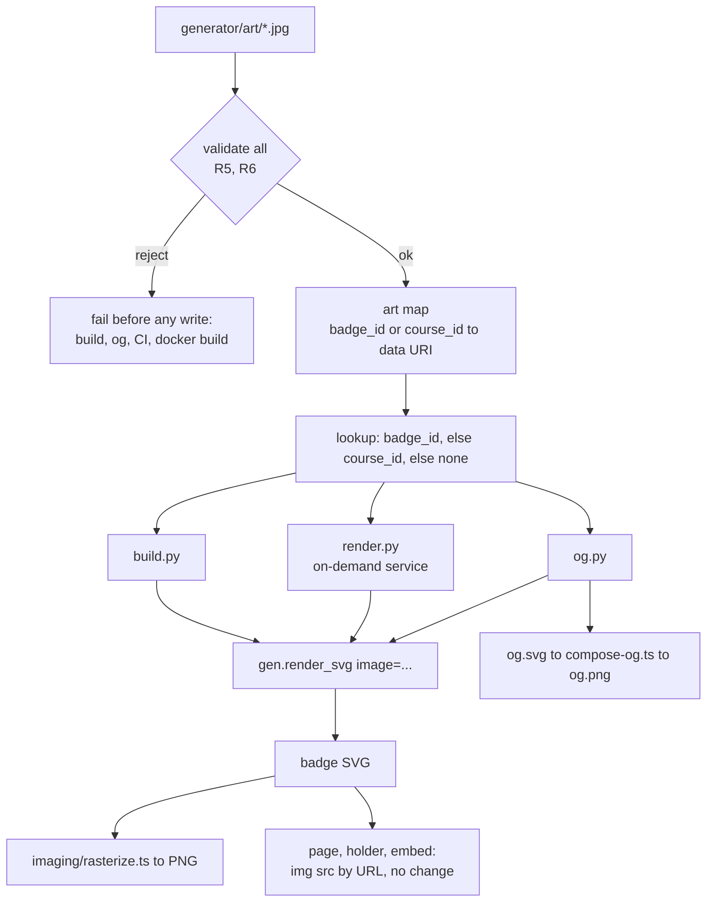
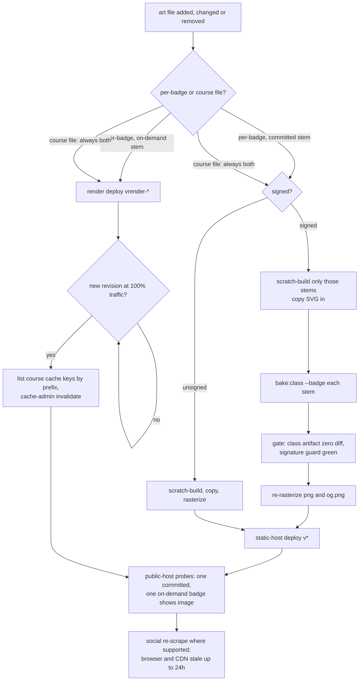

# Badge Plate Image - Plan

## Goal Capsule

**Objective.** Andamio can give any badge, or every badge in a course, its own picture. Holders, share pages, embeds, PNGs and social cards show that picture. Badges without one look exactly as they do today, and no signature is lost.

**Means.** A hand-set JPEG drawn inside the existing core plate behind a legibility scrim, resolved by one lookup keyed by `badge_id` with a course-level fallback (KTD1, KTD2).

**Authority hierarchy.** Requirements (R-IDs) win on product behavior. KTDs win on mechanism within those limits. Units add only local detail. credential-badges#131 is the originating brief.

**Stop conditions.**
- Any `signing/class-artifacts/*.json` file changes. Art never requires a re-sign (R9).
- Any committed badge SVG changes in this PR. No real art ships here (see Scope Boundaries).
- `generator/tests/test_render_parity.py` needs an expectation edit to pass.
- A WebP, PNG or SVG image reaches a rendered badge.

**Execution profile.** Standard depth, five units, one PR. Stdlib-only Python, same as today's generator. No new dependencies.

**Who finishes.** `ce-work` implements and opens the PR. James reviews and merges. Giving a real course art is a later operator task that follows the runbook this plan produces (U5).

---

## Product Contract

### Summary

Add an optional JPEG image to the badge face, set by Andamio per badge or per course, with raster-only validation and a size ceiling. It is wired through the build, the on-demand render service and the OG card. Add guards so that adding art can't silently drop a baked signature. Write a runbook for giving a live course art.

### Problem Frame

Badge art today is a per-course palette, the two proof rings and the titles. Some cohorts want a picture: a course whose credentials form a series may want each credential to show its own stage of one scene. There is no way to do that.

A throwaway spike against `94f1d0f` showed the mechanics work: the ring decoder ignores an embedded raster, and the pinned rasterizer draws a JPEG. It also showed the limits. The plate is mostly text, so art behind a readable scrim reads as a tint. Byte weight depends heavily on format. Research since then found that the pinned `@resvg/resvg-js` 2.6.2 has no WebP decoder and draws a WebP data URI as blank with no error.

A second problem sits beside the feature. `docs/badge-registry.md` I3 says signed credentials carry `achievement.image`. None do (no class artifact, and neither mapper, sets it). Art is therefore drawn in the badge only, and changing it means rebuild plus re-bake, not re-sign. This is the first feature whose normal operation rewrites signed SVGs. Nothing today catches a rewrite that forgets the re-bake: the parity test compares an unbaked SVG byte-for-byte and passes.

### Requirements

**Rendering**
- R1. A badge can carry one raster image, drawn inside the core plate (r≤411) beneath the titles, with a scrim that keeps every text element legible at 1024px.
- R2. The image is resolved by one lookup: per-badge art for `<course_id>.<slt_hash>`, else course art for `<course_id>`, else no image. The build, the on-demand render service and the OG card all use this same lookup.
- R3. A badge with no image renders byte-identical to today's output.
- R4. The image never enters the credential JSON (`<metadata>` or the `<openbadges:credential>` hook), and it never appears as a `<line>` element or anywhere else the ring decoder reads.

**Art input**
- R5. Accepted art is JPEG only: 8-bit baseline or progressive, grayscale or YCbCr, square, 824–1024px per edge, at most 160 KiB on disk, with no EXIF, XMP, ICC or comment segments. It is embedded as a base64 `data:image/jpeg` URI.
- R6. Art that breaks R5, art whose filename does not match the per-badge or per-course key pattern exactly, and art for a `SKIP_COURSES` course are all rejected. The rejection is loud and happens before any output is written, never as a silent fallback to no image.

**Safety of signed badges**
- R7. CI fails if any badge that has a committed class artifact no longer carries that artifact, byte-exact, in its committed SVG.
- R8. `make verify` decodes a freshly built badge that carries placeholder art, as well as a committed badge.
- R9. Adding, changing or removing art never changes a signed class artifact.

**Documentation and operation**
- R10. `docs/badge-registry.md` I3 rests its permanence rule on URLs shared in the wild, not on a signed `achievement.image`.
- R11. The customization brainstorm records that per-badge grain is allowed for Andamio's hand-set image, and still rejected for issuer self-serve.
- R12. A runbook explains how to give a live course art, change it and remove it. It keeps baked signatures, clears cached on-demand SVGs only after the new render revision serves all traffic, and says what stays stale (browsers, CDNs, social scrapers).

### Key Decisions

- **Per-badge grain for Andamio's hand-set art only.** Issuer self-serve stays per-course, as the 2026-06-27 brainstorm ruled. The course-level fallback lets a later self-serve feature replace the hand-set input without changing any `badge_id`. Governs R2, R11.
- **Art sits in the existing plate as a tint.** A face built around the art is a design decision, not a flag. (session-settled: user-approved — chosen over designing an art-forward layout variant now: plumbing first, layout later once a cohort's art exists.) Governs R1.
- **JPEG only.** WebP renders blank in the pinned rasterizer. PNG makes the SVG roughly five times heavier. Governs R5.
- **`make verify` builds its image badge fresh.** Placeholder art never enters `badges/`, which is publicly served. (session-settled: user-approved — chosen over committing a placeholder-art badge: the repo and host are public.) Governs R8.
- **No per-badge opt-out of course art.** Removing a per-badge file falls back to the course art, not to no image. Governs R2.

### Scope Boundaries

- No `achievement.image` in any signed credential. That would change signed documents and require a re-sign.
- No issuer self-serve authoring, upload path, IPFS storage or per-org art.
- No real course art ships in this PR. A course's art lands in the same change that releases or updates its badges.
- No art-forward layout variant.

#### Deferred to Follow-Up Work

- A public-host probe in `.github/workflows/deploy-render.yml` that checks an on-demand badge of an art-bearing course for `<image`. It only becomes meaningful once real art exists. The runbook covers it manually until then.
- A course-prefix mode for `scripts/cache-admin.py invalidate`. The runbook lists keys with a bucket prefix listing for now.
- Wiring the existing `service/tests/` into CI (it runs nowhere today). This plan adds no service tests.
- A PNG re-bake step, needed only once `tools/bake-png-vc.ts` bakes committed PNGs (none are baked today).
- credential-badges#128's contributor-doc warnings. U5's runbook contains the single-badge scratch-build procedure, and #128 can link to it.

---

## Planning Contract

### Key Technical Decisions

- KTD1. **One art module, `generator/art.py`, owns lookup and validation.** It sits beside `colors.py` as the single source that `build.py`, `render.py` and `og.py` import. It cannot live in `build.py`, because `og.py` imports from `build` and `build` already avoids an import cycle with `reconcile`. The module loads a directory into an immutable `badge_id | course_id → data URI` map. The per-request lookup is a pure dict read, safe under gunicorn's eight threads. It follows the `page.py` `LOGO_DATA_URI` precedent for raster-to-data-URI.
- KTD2. **Art files are named by key under `generator/art/`.** `<course_id>.<slt_hash>.jpg` is per-badge and `<course_id>.jpg` is per-course, matched against the exact lowercase-hex patterns already in `service/app.py` and `scripts/cache-admin.py`. There is no manifest: the filename is the mapping, and git review shows any binary add, swap or removal. `generator/` already ships in the render image (`service/Dockerfile` copies it whole) and is never served by the static host (root `Dockerfile` allowlist). Art must never go under `badges/`.
- KTD3. **`gen.render_svg` takes an explicit `image=None` keyword.** Callers resolve the image; `render_svg` never reads the filesystem, which keeps its explicit-inputs, concurrency-safe contract. When `image` is None, no new element or `<defs>` child is emitted, which is what keeps R3 true. `og.py` needs its own lookup call, correcting #131's "no changes of its own" claim.
- KTD4. **Plate composition.** The `<image>` is clipped by a circle clipPath with fixed geometry, followed by a scrim circle, inserted right after the plate circle and before the text block. Use a clipPath, not a `<pattern>` fill: an id collision between two inlined badges is harmless for identical circles, but would swap pictures for patterns. The scrim uses `fill="var(--core1, <literal>)"` with `fill-opacity`, never `rgba()`, because `imaging/rasterize.ts` `inlineCssVars` rejects a fallback that contains parentheses. The scrim strength is tuned during U2 against a worst-case image (fine noise or a hard checker, synthesized in the test and never committed), not only the flat placeholder, because busy art is what defeats legibility. Loosening the scrim later would change every art-bearing SVG and force a re-bake of each signed one. Legibility at 1024px is the bar, and a tint at 128px is accepted.
- KTD5. **The validator is a stdlib JPEG marker walk, not Pillow.** It reads SOI, walks segments against an allowlist, and checks the SOF0/SOF2 header for precision, component count and dimensions. It checks the on-disk size against the 160 KiB ceiling. Pillow would break the generator's stdlib-only, no-`pip install` CI and grow the render image. The allowlist starts at SOI, APP0 (JFIF), DQT, DHT, DRI, SOF0/SOF2, SOS, RSTn and EOI. Whether APP14 (Adobe) must also be allowed is settled during U1, by the export path the runbook recommends.
- KTD6. **Validation fails closed at three points, and service import is never the gate.** `build.py` and `og.py` validate the whole art directory before their first write, so a failure cannot leave `badges/` half rewritten. The CI generator-tests job validates the committed art directory, including art for badges served only on demand, which no build touches. `service/Dockerfile` runs the same check as a `RUN` step, so bad art fails the image build. A raise at worker import would pass Cloud Run's TCP startup probe and then crash-loop, because gunicorn binds the port before workers boot and there is no `--preload`. `render.py` still loads through the same validating loader at import. It never catches the error or falls back to an empty map (R6). Because the image build already rejected bad art, that load cannot meet it in a built image.
- KTD7. **The art directory is injected by parameter, never by environment variable.** Tests and `make verify` pass their own directory. An environment-variable override could leak a placeholder into a production build. The same seam style as `render_badge`'s `fetch_titles`.
- KTD8. **The signature guard compares bytes with the existing Python splice port.** For every `signing/class-artifacts/<badge_id>.json`, `service/bake.py`'s extractor must return the committed artifact's bytes from `badges/<badge_id>.svg`. This catches the likeliest runbook mistake, a scratch-built SVG copied over a signed one without `bake:class`. The parity test cannot catch that: it compares an unbaked committed SVG exactly, so it passes.

### High-Level Technical Design

Art resolution and where each output picks it up:

The operator runbook's branch structure, which U5 documents:

A course file always takes the render lane as well, even when every current badge of the course is committed. A module credential added later is served on demand, and without the render deploy it would render and cache without the art.

Try new course art on one badge first with a per-badge file. Then promote it to the course file. A course file changes every badge of the course at once.

### Assumptions

- The 160 KiB ceiling fits art like the spike's: an 824px JPEG at quality 80 of detailed art added about 123 KB to the SVG. If real cohort art needs more, raising the constant is a reviewed one-line change.
- The four placeholder renders for the PR come from a course that already has at least four credentials in `generator/credentials.json` (several have 5–7). They are built in a scratch directory and attached to the PR, never committed.

---

## Implementation Units

### U1. Art module: lookup and validation

**Goal:** One stdlib module that loads, validates and resolves badge art.

**Requirements:** R2, R5, R6. KTD1, KTD2, KTD5, KTD7.

**Dependencies:** none.

**Files:**
- `generator/art.py` (new)
- `generator/tests/test_art.py` (new)
- `generator/tests/fixtures/art/placeholder.jpg` (new: a flat or simple-gradient 824px JPEG, a few KB, committed as test-only placeholder art)
- `.github/workflows/ci.yml` (add `test_art.py` to the enumerated generator-tests list)

**Approach:**
1. The default art directory is `generator/art/`, anchored from the module file the way `gen.py` anchors `fonts.css`. A missing directory means no art, not an error.
2. A load function validates every entry and returns an immutable map, or raises one error that names every bad file. A lookup applies the R2 precedence.
3. A `--check` CLI validates a directory, prints each art file with the `credentials.json` badges it reaches, and exits non-zero on any R6 violation. A file that reaches no known credential is reported but not failed, because on-demand-only courses are absent from `credentials.json`.
4. Import `SKIP_COURSES` lazily inside the check, so `art` never imports `build` at module load.

**Patterns to follow:** `generator/page.py` `LOGO_DATA_URI`. `generator/colors.py` as a shared single-source module. `imaging/rasterize.ts` `pngDims` as a tiny header reader. The `generator/tests/*` stdlib runner with `✅` lines.

**Test scenarios:**
- Per-badge and course files both present → the per-badge file wins for its `badge_id`, and other badges of the course get the course file.
- Only a course file → every `slt_hash` of that course resolves to it.
- A missing art directory → the lookup returns none for every key, and `--check` passes with zero files.
- A valid fixture copied under a real key → the data URI starts with `data:image/jpeg;base64,` and decodes back to the file's exact bytes.
- A file one byte over 160 KiB, built by padding the fixture in the test → rejected, and the error names the file and the ceiling.
- A WebP header, a PNG header and an SVG text file each named `.jpg` → all rejected by magic bytes.
- The fixture with an injected APP1 (EXIF) segment, and separately a COM segment → rejected.
- A non-square fixture, one at 823px and one at 1025px → rejected. These are synthesized by rewriting SOF dimensions, so they need no image library.
- A 12-bit precision SOF and a 4-component (CMYK) SOF → rejected.
- Filenames `ABC….jpg` (uppercase hex), `<course_id>.JPG`, `<course_id>.jpeg` and `<course_id>.<slt_hash>.v2.jpg` → rejected as bad keys.
- A `course_id` in `SKIP_COURSES` → rejected.
- Several bad files → one error that lists all of them, not just the first.
- Mutation check while developing: disable each rule, confirm its test fails, then restore.

**Verification:** `test_art.py` passes in the generator-tests job. `python3 generator/art.py --check` passes on the repo, which has no committed art.

### U2. Render path: plate image through build, service and OG

**Goal:** `render_svg` draws an optional image, and every producer passes the resolved art.

**Requirements:** R1, R2, R3, R4, R6. KTD3, KTD4, KTD6.

**Dependencies:** U1.

**Files:**
- `generator/gen.py` (the `image` keyword and the plate composition)
- `generator/build.py` (validate before writing, resolve per record, add `--art-dir` and `--only <badge_id>` options)
- `generator/render.py` (module-level art map, resolve per request)
- `generator/og.py` (validate before writing, resolve per record)
- `generator/tests/test_render_parity.py` (extend)
- `generator/tests/test_render.py` (extend)
- `generator/tests/test_og.py` (extend)

**Approach:**
- `gen.py`: when `image` is set, emit the clipPath, the image and the scrim immediately after the r=412 plate circle (KTD4). When it is None, output is unchanged byte-for-byte.
- `build.py`: `--only` scratch-builds selected stems for the runbook. `--art-dir` exists for tests and `make verify`, and is never read from the environment (KTD7). The existing reconcile prune step still runs against the output directory.
- `render.py`: load the art map once at import from the default directory, through U1's validating loader and without catching its error (KTD6). `render_badge` gains an injectable art lookup next to `fetch_titles`.
- Tune the scrim opacity until every title and hash line is legible at 1024px over both the placeholder and a worst-case synthesized image (KTD4). Attach the worst-case render to the PR with U3's four renders.

**Patterns to follow:** the keyword-only `render_svg` API, the `fetch_titles` injection seam, and `gen.FONT_FACE` loaded once at import.

**Test scenarios:**
- Byte identity: `render_svg(**kw)` equals `render_svg(**kw, image=None)`, and the output has no `<image`, `clipPath` or scrim element (R3). This does not depend on repo state.
- Existing parity: `build.py` output still matches every committed badge, with no expectation edits.
- With injected placeholder art: the SVG contains exactly one `<image`, and its data URI is not inside either CDATA block. `decode.py` still round-trips both rings (R4).
- The `<metadata>` JSON is identical with and without an image.
- `render_badge` with an injected art lookup returns an SVG with the image, and an uncovered course returns today's SVG.
- The concurrency-safety test is extended: parallel renders with and without art each match their serial output.
- `og.py` with injected course art: the nested badge carries the image, and the card outside it is unchanged.
- `build.py` with an art directory containing one invalid file: exits non-zero and writes no file to the output directory.
- `build.py --only <badge_id>`: writes exactly that stem and nothing else.
- Every scrim `var()` fallback is a paren-free literal. Assert on emitted output, mirroring `_assert_no_foreign_subresource`.

**Verification:** all generator tests pass, and the parity test needs no expectation edits.

### U3. Raster proof and PR evidence

**Goal:** Prove the committed rasterizer actually draws the art, and produce the four placeholder renders #131 asks for.

**Requirements:** R1, R5.

**Dependencies:** U2.

**Files:**
- `imaging/rasterize.test.ts` (extend)
- `imaging/fixtures/` or an inline generated SVG, whichever `rasterize.test.ts` conventions favour. Decide during implementation.

**Approach:**
- Render one badge SVG with placeholder art and one without, both from U2's code path, and rasterize both.
- Assert that plate-region pixels differ between the two renders and that ring-region pixels do not. `check-artifacts.ts`'s 40 KB floor cannot catch a silently dropped image.
- For the PR description, scratch-build the SVG, PNG and OG for four credentials of one course, each with a distinct placeholder image, and record the file sizes against the no-image baseline. These are not committed.

**Patterns to follow:** `aRealBadge()` and the size tripwire in `imaging/rasterize.test.ts`, and `RenderedImage.pixels`.

**Test scenarios:**
- A JPEG-art badge → the plate region's mean pixel differs measurably from the no-image render, and the ring band is unchanged.
- The same badge with its data URI's MIME changed to `image/webp` over WebP bytes → the plate matches no-image. This documents the silent-drop behaviour that justifies R5 and fails if a future resvg bump starts decoding WebP, prompting a revisit.

**Verification:** the `imaging` CI job passes, and four renders with sizes are attached to the PR.

### U4. Guards: signature bytes, `make verify`, image build

**Goal:** Make the runbook's likeliest mistakes fail loudly.

**Requirements:** R6, R7, R8, R9. KTD6, KTD8.

**Dependencies:** U1, U2.

**Files:**
- `generator/tests/test_baked_signatures.py` (new)
- `Makefile` (the `verify` target)
- `generator/decode.py` (exit non-zero when either ring mismatches; today it prints the mismatch and exits 0, so `make verify` cannot fail)
- `service/Dockerfile` (an art-check `RUN` step)
- `.github/workflows/ci.yml` (add `test_baked_signatures.py` and an `art.py --check` step to generator-tests)

**Approach:**
- The signature guard checks every class artifact against its committed SVG through `service/bake.py`'s extractor (KTD8). It also fails when an artifact has no committed SVG.
- `make verify` keeps decoding the first committed badge. It also builds one badge with the placeholder fixture, injected through a temp art directory, and decodes it. It asserts that the badge carries an `<image` and both rings round-trip. Both decodes fail the target through `decode.py`'s exit code.
- The Dockerfile step runs after `COPY generator/` and fails the image build on invalid art.

**Patterns to follow:** `generator/tests/test_bake.py` for the Python splice. The Makefile's `PYTHONDONTWRITEBYTECODE=1` convention.

**Test scenarios:**
- The current repo → every class artifact extracts byte-equal from its SVG, and the 5am.earth badge, which has no artifact, is not required to be baked.
- Mutation: an unbaked scratch build copied over one signed SVG in a temp copy of the tree → the guard fails and names that `badge_id`.
- Mutation: one byte changed inside an embedded proof → the guard fails.
- `make verify` on a clean checkout → decodes both badges and reports the image badge as carrying art.
- Mutation: a ring tick flipped in a temp copy of a badge → `decode.py` exits non-zero and `make verify` fails.
- A Docker build with an invalid file under `generator/art/` fails at the check step. Verify this once by hand during implementation and record it in the PR, not in CI.

**Verification:** generator-tests passes with both new entries, and `make verify` passes locally.

### U5. Docs and runbook

**Goal:** Correct the record and document how to give a live course art.

**Requirements:** R10, R11, R12.

**Dependencies:** U2, U4. The runbook cites their flags and guards.

**Files:**
- `docs/badge-registry.md` (I3)
- `docs/brainstorms/2026-06-27-issuer-badge-customization-requirements.md` (one line beside the per-badge rejection)
- `docs/runbooks/badge-art.md` (new)
- `generator/README.md` (the art directory and a link to the runbook)
- `CONCEPTS.md` (a "Badge Art" entry under Credential artifacts: hand-set, drawn only, outside every signature)
- `MOC.md` (link the runbook, if the MOC lists runbooks)

**Approach:**
- I3: state the permanence rule's real premise, that URLs are shared, embedded and unfurled everywhere. Say that no signed credential carries `achievement.image` today. Leave I4 ("the name is frozen, the picture is not") as it is.
- Runbook: follow the second HTD diagram, including its rule that a course file always takes both lanes. Include the art spec (R5) and a recommended export recipe that strips metadata. Start with a per-badge trial, then promote to the course file. Before `bake:class`, check that every title and hash line of a scratch-built badge is legible at 1024px over the real art. Include the gates from `docs/solutions/best-practices/deterministic-kms-resign.md`: zero class-artifact diff and a green signature guard. Include the deploy order: render lane at full traffic before invalidation, then the static lane. Add public-host probes and staleness notes: `max-age=86400`, and manual social re-scrape where the platform offers one. Cover removal: rebuild, re-bake and invalidate the same way, with fallback to course art. Include the public-repo rule: art lands with its badge's release, never before.

**Test expectation:** none. This unit is documentation. The Wording Gate still applies: no copy may imply that art is signed or verifiable.

**Verification:** a reader can run the runbook against a scratch course without asking what to do next. The registry and brainstorm edits read correctly in context.

---

## Verification Contract

| Gate | Command or check | Proves |
|---|---|---|
| Generator suite | each file in the `ci.yml` generator-tests list, run as `python3 generator/tests/<file>.py`, including the new `test_art.py` and `test_baked_signatures.py` | R2–R9 |
| Art check | `python3 generator/art.py --check` | R5, R6 |
| Imaging | `cd imaging && npm test`, then `check-artifacts.ts` as in CI | R1, and the JPEG drawn |
| Decode | `make verify` | R8 |
| No signed change | the branch diff against `main` touches nothing under `signing/class-artifacts/` or `badges/` | R9, stop conditions |
| Docker | a local `service/Dockerfile` build passes, and fails with a bad art file (manual, once) | KTD6 |
| Other suites unaffected | the `tools`, `signing` and `web-component` jobs in CI stay green | no regression |

Clear `generator/__pycache__` before any local build whose output is compared (`docs/solutions/runtime-errors/stale-pycache-bytecode-masks-source-edits.md`).

## Definition of Done

- Every unit's Verification holds, and CI is green.
- The PR attaches four placeholder renders (SVG, PNG, OG) for one course with sizes, and records the Docker bad-art failure.
- No file under `badges/`, `signing/class-artifacts/` or `generator/art/` changed.
- Every new test file appears in `ci.yml`.
- No abandoned experiments, scratch outputs or unused helpers remain in the diff.
- #131's acceptance criteria are ticked. The PR notes the two places this plan corrects the issue: `og.py` needed its own lookup, and WebP is excluded.

## Sources

- credential-badges#131 (brief and spike), credential-badges#128 (`make badges` strips signatures), credential-badges#126 (single-badge scratch build).
- `generator/gen.py` `render_svg` (plate circle r=412, text block after it). `generator/decode.py` (reads only `<line>` in the r 424–486 band). `generator/page.py` `LOGO_DATA_URI`.
- `imaging/package.json` pins `@resvg/resvg-js` 2.6.2, which draws PNG and JPEG data URIs and draws WebP as transparent. `imaging/rasterize.ts` `inlineCssVars` rejects fallbacks with parentheses.
- `scripts/cache-admin.py` protects every committed badge name. `nginx/default.conf.template` serves `badges/` from disk before `@render`.
- `service/Dockerfile` (no gunicorn `--preload`; copies `generator/` whole). Root `Dockerfile` allowlist (no `generator/`).
- `docs/solutions/conventions/assert-the-artifact-not-the-source.md`, `docs/solutions/workflow-issues/unwired-test-suites-silently-rot.md`, `docs/solutions/conventions/cloud-run-deploy-verification-probes.md`, `docs/solutions/conventions/validate-one-artifact-before-batching.md`.
